# Bhawana LMS — Architecture & Deployment Documentation Package

**Status:** Draft for internal review · **Date:** 2026-06-14 · **Owner:** Platform / Architecture
**Type:** Consolidated reference (architecture + deployment + operations + security + roadmap)
**No code changes were made to produce this document.** It is a synthesis of the live codebase plus existing docs.

## How to use this document

This package consolidates and cross-references the existing source-of-truth docs rather than replacing them:

- `docs/architecture/lms-blueprint.md` — original design intent
- `docs/architecture/deployment-strategy.md` — cloud-agnostic deployment (this doc embeds and extends it)
- `docs/scalability-audit-report-2026-06-14.md` — the 100K loans/day readiness audit (feeds the roadmap)
- `docs/INTEGRATION-STATUS.md` — frontend ↔ backend wiring
- `docs/adr/0001..0005` — accepted architecture decisions

Diagrams are provided as **Mermaid** (renders in GitHub/most viewers) inline, with a **draw.io / diagrams.net import bundle** (CSV connector format + mxGraph XML) in **Appendix A** for teams that want to edit them in a drawing tool.

Every section ends with **Findings · Assumptions · Risks · Recommendations · Open decisions** where relevant. A consolidated register is in **Appendix B**.

---

## 0. Platform summary (one screen)

Bhawana LMS is a **multi-tenant Loan Management System** for Indian small-ticket lending, serving multiple **Loan Service Providers (LSPs)**. LSPs originate loans **machine-to-machine via a single shared REST API** (origination is API-only by design — ADR 0003); internal Ops/Admin staff manage the full loan lifecycle across all tenants through a React SPA. The platform emits **outbound webhooks** to LSPs on lifecycle events and disburses through a **bank adapter** (currently a deterministic mock standing in for ICICI).

- **Shape:** Modular-monolith Spring Boot backend + single React SPA, PostgreSQL with row-level security, Redis for rate limiting, S3-compatible object storage, DB-table work queues (no broker on the money path).
- **Tenancy:** Shared database, shared schema, tenant-tagged rows; isolation enforced in software (RLS + tenant DB role + fail-closed request scoping).
- **Volume target:** ~100K loans/day, ~1M+/month, 10+ concurrent LSP tenants (per the scalability audit re-scope).
- **Current readiness for that target:** ~32% (see `scalability-audit-report-2026-06-14.md`). Data-model and isolation foundations are strong; money-path workers and read-path aggregates are sized for low volume. The roadmap in §6 is the gap-closure plan.

---

# 1. Current Architecture

## 1.1 System context (C4 Level 1)

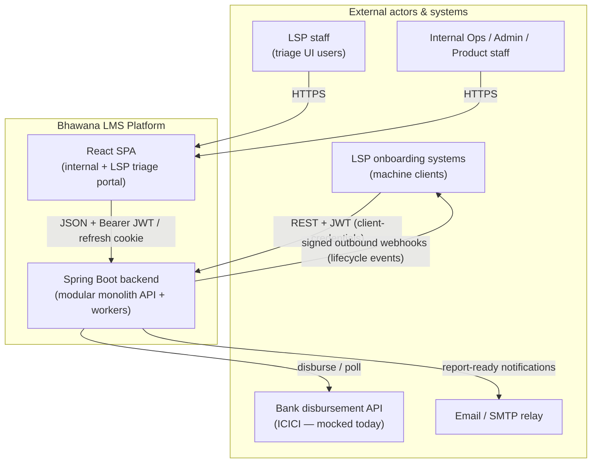

**Key context facts**
- LSP loan **creation** is API-only (`POST /api/v1/lsp/loan-applications`, gated to `LSP_API_CLIENT`). The LSP UI is read-mostly: triage, document upload, invalidation, bank verification (ADR 0003).
- The frontend is a **single SPA** (`frontend/`) talking to the live backend; the former dual-frontend (`frontend-2/`) consolidation is complete and the in-app mock layer is removed (ADR 0001).
- The backend is the **single source of truth**; the SPA's API types are generated from the backend OpenAPI contract.

## 1.2 Container diagram (C4 Level 2)

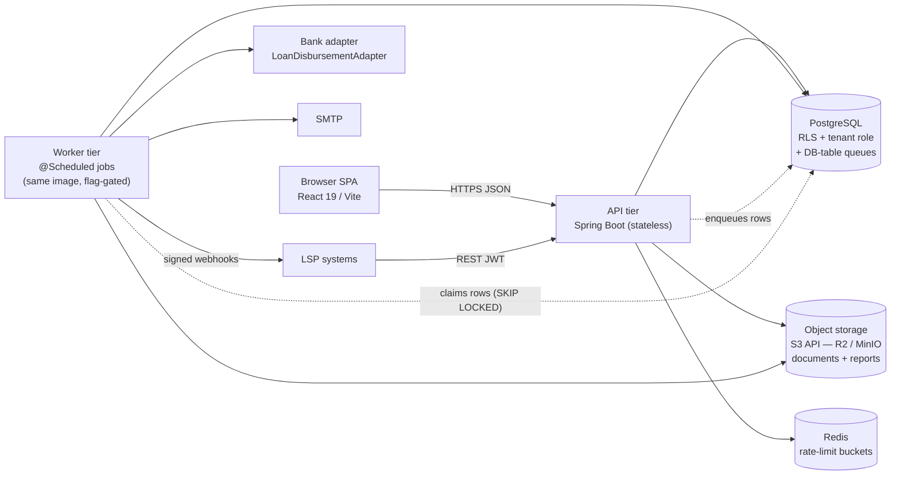

**Deployment note:** API and worker pods run the **same container image**, differentiated only by feature flags (`app.disbursement.worker.enabled`, `app.webhooks.delivery.enabled`, `app.reports.processing.enabled`, `app.alert-rules.scheduler-enabled`). Today all schedulers run in-process on every instance — splitting into a dedicated worker tier is a roadmap prerequisite (§6, deployment §2).

## 1.3 Backend module / component map

The backend is a **package-by-feature modular monolith** under `com.bhawana.lms`: `web` (controllers), `service`, `repo`, `domain`, `security`, `tenant`, `config`, `common`. Logical modules (per the blueprint) map onto these packages:

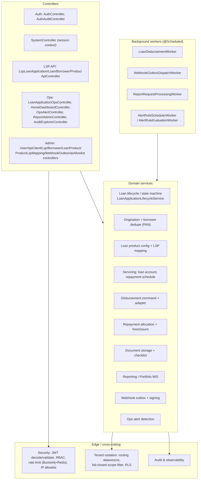

**God nodes / core abstractions** (from the graphify report): `LoanApplicationLifecycleService` (66 edges) is the lifecycle hub; `Jwt`, `requestJson()` (test harness), and webhook `dispatch()` are the next most-connected. The lifecycle service is the natural seam if the monolith is ever decomposed.

## 1.4 API surface inventory

24 controllers across four surfaces. Load-relevant subset (full risk analysis in the scalability audit §5):

### Partner-facing LSP API (`/api/v1/lsp/**`)
| Endpoint group | Methods | Auth | Rate limit | Idempotency |
|---|---|---|---|---|
| `/loan-applications` (create, list, get) | POST/GET | `LSP_API_CLIENT` (create), `LSP_UI_READ/WRITE` (read/triage) | 60/min write | Optional `Idempotency-Key` |
| `.../documents`, `.../documents/batch` | POST | `LSP_API_CLIENT`/`LSP_UI_WRITE` | 60/min write | None |
| `.../invalid`, `.../invalid-reasons` | POST/GET | `LSP_UI_WRITE` | 60/min write | Yes (audited) |
| `/loans/{id}` + `/repayment-schedule` + `/payments` | GET/POST | LSP roles | reads unbounded; payments 60/min | DB unique key (payments) |
| `.../borrower-pii` | GET | LSP roles | docs lane | Audited reveal |
| `/products` | GET | LSP roles | unbounded | — |

### Internal Ops / Admin API (`/api/v1/internal/**`)
| Area | Representative endpoints | Controller |
|---|---|---|
| Loan lifecycle | `/ops/loan-applications/{id}/status-transitions`, `/manual-status`, `/disbursement-requests`, `/payments` | `LoanApplicationOpsController` |
| Dashboard | `/home/overview` | `HomeDashboardController` |
| Reporting | `/reports/portfolio-mis/{summary,preview}`, `/reports/requests` | `ReportAdminController` |
| Audit | `/admin/audit-events` (8-stream UNION) | `AuditExplorerController` |
| Alerts | `/alerts`, `/alerts/{id}/acknowledge` | `OpsAlertController` |
| Admin CRUD | LSPs, users, API clients, products, product↔LSP mappings, IP allowlists, webhook outbox | `*AdminController` |
| Session | `/system/context` | `SystemController` |

### Auth API (`/api/v1/auth/**`, mostly public)
`login`, `token` (client-credentials for API clients), `refresh` (httpOnly cookie), `logout`, `password` (forced change). Auth endpoints are IP rate-limited (10/min login & token).

## 1.5 Database & data model

- **Engine:** PostgreSQL (17 locally; managed PG 15+ in prod). Migrations via **Flyway**, ~90 versioned scripts (`V1` → `V97`), expand→migrate→contract discipline.
- **Persistence:** Spring Data JPA / Hibernate, `open-in-view: false` (no lazy-load leakage). JSON columns migrated `TEXT → jsonb` (V72).
- **Core entities** (blueprint §7, realized in migrations): `lsp`, `lsp_webhook_subscription`, `app_user`, `app_role`, `api_client` (+ IP allowlists), `loan_product` (+ `loan_product_lsp_mapping`), `borrower` (+ identifiers/onboarding fields), `loan_application` (+ status history/state machine V51, intake audit, document checklist + metadata), `loan_account` (+ `processing_fee_amount` V97), `loan_repayment_schedule_installment`, `loan_disbursement_request_log`, `loan_payment_transaction` (+ allocation, idempotency fingerprint V92), foreclosure/closure (V26), `report_request` (+ storage key, notification), `webhook_event_outbox` + `webhook_event_delivery_attempt`, `ops_alert`, `refresh_token`.
- **Tenant tagging:** every tenant-owned row carries `lsp_id`. Global borrower model with per-LSP access (V43) supports the **one-open-loan-globally** rule and **PAN-first dedupe**.
- **Row-Level Security:** RLS policies (`V41`, hardening `V45`, `report_request` `V71`) keyed on `app.current_lsp_id`. Child tables (installments/payments) use an `EXISTS`-based `tenant_owns_loan_account()` policy.
- **Performance objects:** dedicated index migrations (V34, V36, V38 worker-claim, V48 admin-read, V57 dashboard, V59 audit-explorer), optimistic-locking columns (V37), check constraints (V65).

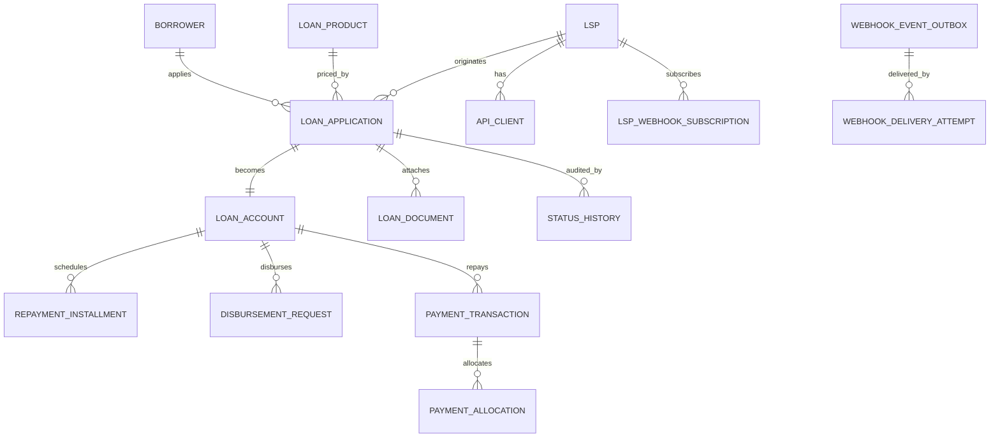

## 1.6 Background jobs / workers

All workers are Spring `@Scheduled` `fixedDelay` jobs in-process today. DB-table queues with `FOR UPDATE SKIP LOCKED` are the queueing mechanism (no broker on the money path).

| Worker | Interval (default) | Batch | Multi-instance safe | Notes |
|---|---|---|---|---|
| `LoanDisbursementWorker` | 30s | intent: 10 (configurable) | **Yes** (intent workflow) — `SKIP LOCKED` + lease on `disbursement_intent` | When `app.disbursement.intent-workflow.enabled=true` (default): provider call **outside** DB tx; legacy inline path when flag off |
| `WebhookOutboxDispatchWorker` | 60s | 20 | **Yes** — `SKIP LOCKED` + lease TTL | Thread pool 10; HMAC-signed; backoff retry; redrive cap |
| `ReportRequestProcessingWorker` | 15s | 10 | **Yes** — PG claim | Single tx per batch (gap); CSV in memory |
| `AlertRuleSchedulerWorker` / `EvaluationWorker` | 300s | full portfolio scan | Partial (dedupe on insert) | Stale-intake, stuck-disbursement, LSP reject-rate, auth brute-force rules |

> **Finding (P0/P1, from audit):** disbursement worker was the weakest link — provider call inside the DB transaction, no `SKIP LOCKED` claim, one mega-transaction for the whole backlog. **Remediated 2026-07-13 (Spec S3 / MNY-01):** `disbursement_intent` + out-of-transaction provider calls + leased claims when intent workflow is enabled. Legacy inline path remains behind `app.disbursement.intent-workflow.enabled=false`. Residual: intent metrics/alarms, full crash-matrix tests; beneficiary snapshot (**S5 deferred 2026-07-15** — see `docs/deferred-implementation.md`). See `docs/implementation-log.md`.

## 1.7 Integrations & external dependencies

| Dependency | Interface | Current implementation | Notes |
|---|---|---|---|
| Bank disbursement (ICICI) | `LoanDisbursementAdapter` | `MockLoanDisbursementAdapter` (deterministic success) | Adapter pattern; real ICICI deferred. Records audit/request logs like a real provider |
| Object storage | AWS SDK v2 S3 client | Cloudflare **R2** (prod default) / **MinIO** (local) | Documents + report files; provider configurable (`APP_STORAGE_DOCUMENTS_PROVIDER`) |
| Email | SMTP (`spring-boot-starter-mail`) | MailHog (local); SMTP relay/SES (prod) | Report-ready notifications |
| Cache / rate limit | Redis (Lettuce) | Redis 7.4 + Bucket4j 8.14 | Rate-limit buckets only — **not on the money path** |
| Message broker | AMQP (`spring-boot-starter-amqp`) | RabbitMQ present in compose but **unused** | Retired in favour of DB-table queues (deployment D10); removal tracked |
| API docs | springdoc-openapi 2.8.16 | OpenAPI at `/v3/api-docs` | Source of generated frontend types; UI disabled by default |

## 1.8 Key data flows (sequences)

### Loan origination (LSP → platform)
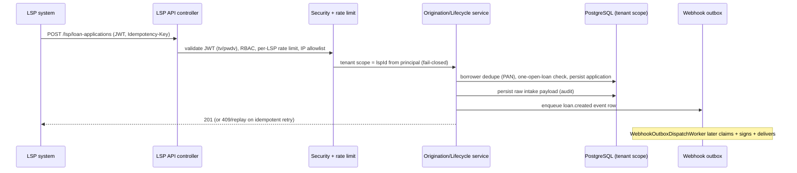

### Disbursement (ops-triggered, worker-driven)
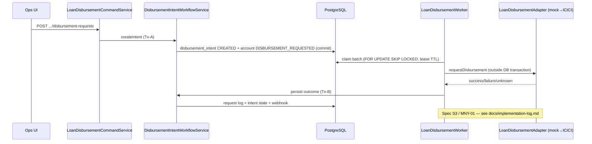

### Webhook delivery (outbox pattern)
```mermaid
sequenceDiagram
    participant SVC as Domain service
    participant DB as webhook_event_outbox
    participant WK as WebhookOutboxDispatchWorker
    participant LSP as LSP endpoint

    SVC->>DB: insert event (same tx as business change)
    WK->>DB: claim batch (FOR UPDATE SKIP LOCKED, lease TTL)
    WK->>LSP: POST signed payload (HMAC)
    LSP-->>WK: 2xx / 4xx / 5xx
    WK->>DB: record delivery attempt (status, latency, headers)
    alt failure
        WK->>DB: backoff retry; redrive cap; terminal → ops alert
    end
```

### Asynchronous reporting (Portfolio MIS)
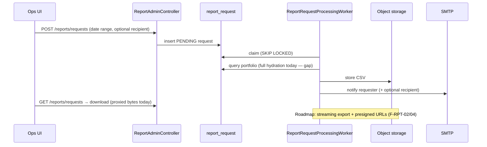

## 1.9 Tenant flow (request scoping — the isolation core)

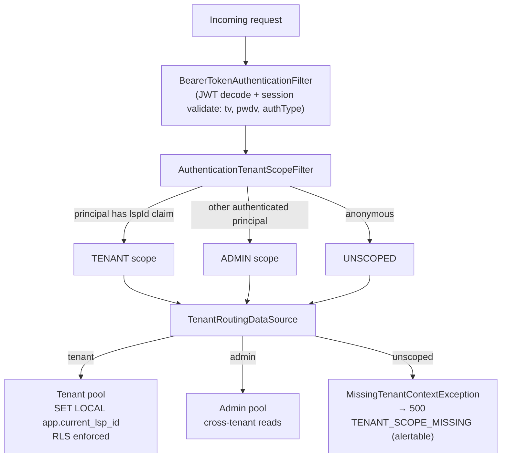

**Decision (ADR 0005):** scope is derived from the **authenticated principal**, set in the security filter chain (not by URL pattern), and **fails closed** — unscoped data access is a server invariant violation, never a silent admin fallback. Pre-auth/perimeter lookups (token validators, login `UserDetailsService`, IP-allowlist reads) wrap their repository calls in `TenantScopedExecution.callAsAdmin`. An LSP principal hitting any endpoint only ever holds tenant scope.

> **Verdict (audit F-TEN-01):** data-isolation is well-designed and tested (Postgres RLS integration tests). The weak point is **performance isolation** — shared DB pool, shared Redis, shared webhook thread pool — i.e. noisy-neighbour, not data leakage.

## 1.10 Reporting flow

Reports run **asynchronously** via the queue above. Day-one report is the **Portfolio MIS** (loan + borrower + LSP details, tabular, CSV). Dashboard (`/home/overview`) currently serves **live full-portfolio aggregates** (measured p95 ~32s under load) — the roadmap replaces this with nightly KPI snapshots and "data as of" semantics (audit F-RPT-01).

## 1.11 Audit logging

Audit is **synchronous, in the business transaction** (consistency over latency). Distinct audit streams persisted across migrations:

`loan_application_audit_event`, `loan_application_intake_audit` (raw payload), `loan_application_status_history`, `loan_application_pii_reveal_audit`, `loan_document_access_audit`, `disbursement_outcome_audit`, `loan_payment` (idempotency), `auth_event_audit`, `app_user_audit_event`, `api_client_audit_event`, `lsp_audit_event`, `report_access_audit`, `borrower_bank_details_audit`, `bank_mismatch_log`, `webhook_event_delivery_attempt`.

The **Audit Explorer** (`/admin/audit-events`) unions ~8 streams. Growth is projected at **50–150M rows/year**; there is **no partitioning or retention** yet, and the explorer lacks a mandatory date bound — both are roadmap items (audit F-AUD-01/02, F-DB-02).

## 1.12 Frontend architecture

- **Single SPA** (`frontend/`): React 19, Vite 5, TypeScript 5.9, Tailwind 4, shadcn/Radix component library, TanStack Query (server cache) + TanStack Table, react-hook-form + Zod, react-router-dom 6, Recharts.
- **Backend contract is authoritative:** API types generated from OpenAPI via `openapi-typescript`; contract drift surfaces as a TS compile error.
- **Auth:** Bearer access token held in SPA memory only (not `localStorage`); silent refresh via httpOnly `lms-refresh` cookie; one automatic retry on 401 after refresh. Session metadata may persist for shell continuity. HTTP client refuses credential-bearing cross-origin absolute URLs. Session bootstrap via `/system/context`.
- **Route guards** enforce role/permission; internal users get the "All LSPs" scope; LSP UI users are scoped to their LSP and are read-mostly.
- **Quality gates:** Vitest (unit/component), Playwright (e2e), axe (a11y), ESLint + Prettier + lint-staged/Husky.

### Section 1 — Findings, risks, recommendations
- **Finding:** architecture matches the blueprint intent closely; the realized system is more complete on security/audit than the blueprint anticipated.
- **Risk:** the disbursement worker and live-aggregate dashboard are the two structural liabilities at volume.
- **Recommendation:** treat §1.6 worker hardening and §1.10 snapshotting as the first architecture work before any production volume.
- **Assumption:** the graphify report's reference to `frontend-2/` is stale (graph dated 2026-06-12, before the ADR 0001 consolidation completed).

---

# 2. Cloud-Agnostic Deployment Strategy

This section embeds and extends `docs/architecture/deployment-strategy.md` (the authoritative sizing doc). The principle: **depend only on portable interfaces; confine all provider-specific surface to Terraform modules + at most two thin code adapters (object storage, secrets loader).**

## 2.1 Portability contract

| Concern | Portable interface the app depends on | Provider-specific? |
|---|---|---|
| Compute / orchestration | OCI containers on **Kubernetes** | No (Terraform/Helm only) |
| Database | **PostgreSQL wire protocol** (JDBC) — no proprietary features | No |
| Cache / rate limit | **Redis protocol** (Lettuce) | No |
| Object storage | **S3-compatible API** (behind storage interface) | One adapter (exists) |
| Messaging | **None** — DB-table queues + `SKIP LOCKED` | No broker to port |
| Email | **SMTP** | No |
| Metrics | **Prometheus exposition** (Micrometer) | No |
| Logs | **JSON to stdout** | No |
| Config / secrets | **12-factor env vars** | Secrets loader (thin) |
| Provisioning | **Terraform + Helm** | Isolated in modules |

## 2.2 Logical topology (identical on every provider)

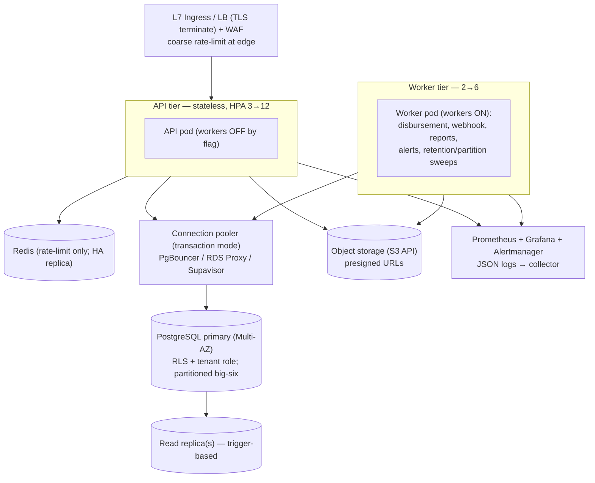

## 2.3 Provider mapping (pick a column; the app does not change)

| Capability | Portable interface | AWS | GCP | Azure | On-prem |
|---|---|---|---|---|---|
| Orchestration | Kubernetes | EKS | GKE | AKS | k3s / kubeadm |
| Image registry | OCI | ECR | Artifact Registry | ACR | Harbor |
| Managed Postgres | PG 15+ wire | RDS / Aurora PG | Cloud SQL PG | Azure DB for PG (Flexible) | Patroni / CloudNativePG |
| Connection pooler | PgBouncer (txn) | RDS Proxy / sidecar | PgBouncer sidecar | PgBouncer sidecar | PgBouncer / Supavisor |
| Managed Redis | Redis protocol | ElastiCache | Memorystore | Azure Cache for Redis | Redis / KeyDB |
| Object storage | S3 API | S3 | GCS (S3 interop) | Blob (S3 adapter) | MinIO / R2 |
| Ingress / LB | K8s Ingress (L7) | ALB + LB Controller | GCLB + GKE Ingress | App Gateway + AGIC | NGINX / Traefik |
| TLS certs | ACME / cert-manager | ACM | Google-managed | App Gateway certs | cert-manager + LE |
| Secrets | env injection | Secrets Manager / SSM | Secret Manager | Key Vault | Vault / sealed-secrets |
| Email (SMTP) | SMTP | SES | SendGrid/SMTP | Azure Comm. Services | any relay |
| Metrics | Prometheus | AMP / self-host | GMP / self-host | Azure Monitor / self-host | Prometheus + Grafana |
| Logs | JSON stdout | CloudWatch / OpenSearch | Cloud Logging | Azure Monitor | Loki / ELK |
| IaC | Terraform + Helm | AWS modules | GCP modules | Azure modules | Terraform + Helm |

## 2.4 Capacity sizing (~100K loans/day)

Demand: ~100K creates + ~100K disbursements + ~300–500K repayments/day; sustained ~50–100 rps, spike 300–500+ rps.

| Tier / resource | Baseline | Spike | Rationale |
|---|---|---|---|
| API pods | 3 | 12 | I/O- and connection-bound; HPA on CPU + p95 + in-flight |
| Worker pods | 2 | 4–6 | Disbursement parallelism + webhook throughput |
| API pod DB pool | tenant 20–25 + admin 5–10 | — | Per-role Hikari sizing |
| Worker pod DB pool | tenant 10 + admin 10 | — | Mostly admin scope |
| Connection pooler | transaction mode | — | Multiplex ~480 client conns → ~100–150 backend |
| Postgres primary | 8–16 vCPU, NVMe, Multi-AZ | vertical-first | OLTP |
| Read replica | 0 | 1–2 | Add on ops/reporting load or primary CPU >60% |
| Redis | 1 small | + replica (HA) | Rate-limit keys only |

> **Constraint that bites first:** without a **transaction-mode pooler**, app pools × pods exceed any single `max_connections` (this is what broke the prior Supabase 15-session cap). A pooler is **mandatory** at this scale on every provider.
>
> **Pooler-safety caveat:** the generic tenant path uses transaction-scoped `set_config('app.current_lsp_id', …, true)` (`SET LOCAL`) — pooler-safe. The Supabase-only path additionally issues a **session-level `SET ROLE`** which is **not** transaction-scoped and leaks under plain PgBouncer transaction mode. On non-Supabase providers keep the single tenant app role + RLS-on-GUC model (no per-request `SET ROLE`); if a per-request role is ever needed, use `SET LOCAL ROLE`.

## 2.5 Cross-cutting deployment concerns

- **Compute:** one image, two roles (API vs worker) by flag. Min 3 API pods for AZ spread.
- **Database:** managed PG, Multi-AZ synchronous standby; vertical-first, read replica on trigger; never autoscale the primary on connections (that is the pooler's job).
- **Storage:** managed S3-compatible bucket; documents + reports served via **presigned URLs** (keeps bytes out of pods — roadmap #228).
- **Networking:** API behind L7 LB/WAF; **Postgres/Redis/object storage on private networking only** (no public endpoints); pods in private subnets; controlled egress.
- **Secrets:** never baked into images; injected from provider secret store as env (12-factor). Startup validator already refuses default/placeholder secrets outside local/test — keep as a deploy gate.
- **Monitoring:** Prometheus (Micrometer) + Grafana + Alertmanager; JSON logs with correlation/tenant/loan MDC → collector. **Not yet deployed** (only `health,info` actuator exposed today — roadmap #217–#220).
- **CI/CD (provider-neutral):** build → test → scan → push OCI → `helm upgrade` (rolling; canary/blue-green for risky releases). Only registry/deploy creds change per provider.
- **Migrations:** Flyway as a **pre-deploy K8s Job** (not per-pod boot) so rolling deploys don't race; index builds use `CONCURRENTLY`; expand→migrate→contract.
- **Backup / DR:** automated PG backups + PITR (WAL); target **RPO ≤ 5 min, RTO ≤ 1 h**, confirmed by restore drill. Object storage versioning + cross-region replication; partition-aware retention (instant `DROP PARTITION`); full Terraform+Helm rebuild as the portability/DR drill.
- **Scaling policy:** API tier HPA on CPU + custom signal (p95/in-flight); worker tier scales on **queue depth / oldest-pending-age** (the right signal for DB-table queues) — requires claim-safe workers first.
- **HA / failure isolation:** stateless API/workers (JWT, no affinity); DB failover via managed promotion + pooler reconnect; **Redis outage must be non-fatal** (fail-open business traffic, fail-closed auth); worker death mid-batch self-heals via DB-queue lease re-issue; graceful drain on SIGTERM.

## 2.6 Gate ordering (deployment is safe only after these land)
`#243` multi-thread scheduler · `#203/#204` claim-safe disbursement · `#201` prod profile + pool sizing + timeouts · `#244` per-tenant bulkhead · `#245` webhook throughput · `#217/#234` metrics for autoscaling. Deploying the topology without these yields a *bigger* version of today's failure modes.

### Section 2 — Open decisions
1. Target cloud (or multi-cloud/on-prem) for first prod env — picks the Terraform module set.
2. Postgres `max_connections` + pooler sizing against chosen managed offering.
3. RPO/RTO confirmation with the business.
4. Whether any launch partner justifies a dedicated node-pool/Deployment escape hatch (default: no).
5. **India data-residency** requirements — may constrain provider/region; confirm with compliance.

---

# 3. Technology Stack

## 3.1 Current stack (as built)

| Layer | Technology | Version / notes |
|---|---|---|
| Language (BE) | Java | 21 |
| Backend framework | Spring Boot | 3.5.11 (Maven) |
| Security | Spring Security + OAuth2 Resource Server | JWT HS256 (Nimbus), `@EnableMethodSecurity` |
| Persistence | Spring Data JPA / Hibernate | `open-in-view: false` |
| Migrations | Flyway (+ flyway-database-postgresql) | V1→V97 |
| Database | PostgreSQL | 17 local; RLS, dual datasource, tenant role |
| Cache / rate limit | Spring Data Redis (Lettuce) + Bucket4j | Bucket4j 8.14 (Redis-backed buckets) |
| Object storage | AWS SDK v2 `s3` | 2.31.60 — against R2 (prod) / MinIO (local) |
| Email | Spring Mail (SMTP) | MailHog local |
| API docs | springdoc-openapi | 2.8.16; `/v3/api-docs` |
| Messaging | spring-boot-starter-amqp (RabbitMQ) | **present but unused** (DB-table queues used instead) |
| Observability | Spring Boot Actuator + Micrometer | only `health,info` exposed today |
| Testing (BE) | JUnit 5, Testcontainers (PG, MinIO), ArchUnit 1.4.1, spring-security-test, H2 | |
| Frontend | React 19 + Vite 5 + TypeScript 5.9 | single SPA |
| Styling / UI | Tailwind CSS 4, shadcn 4, Radix UI, Recharts, lucide/tabler icons | |
| FE state / data | TanStack Query 5, TanStack Table 8, react-hook-form 7, Zod 3 | |
| FE routing | react-router-dom 6 | |
| FE codegen | openapi-typescript 7 | types from backend OpenAPI |
| Testing (FE) | Vitest 2, Playwright 1.59, axe-core, Testing Library | |
| Local infra | docker-compose: Postgres 17, Redis 7.4, RabbitMQ 4.1, MinIO, MailHog | |

## 3.2 Recommended additions (for the target volume)

| Layer | Recommendation | Why |
|---|---|---|
| Compute | Kubernetes (EKS/GKE/AKS/k3s) + Helm | portable orchestration; HPA |
| DB pooling | PgBouncer / RDS Proxy (transaction mode) | mandatory connection multiplexing (§2.4) |
| Read scaling | PG read replica (trigger-based) | offload ops/reporting reads |
| Resilience | resilience4j (circuit breaker / bulkhead) | bank/storage/Redis adapters (audit F-ISO-02) |
| Observability | Prometheus + Grafana + Alertmanager; structured JSON logging; OpenTelemetry traces | autoscaling signals + incident scoping (#217–#220) |
| Messaging | **keep DB-table queues**; remove RabbitMQ | no broker to operate; simpler portability (D10/#226) |
| Secrets | provider secret store + thin loader | 12-factor injection |
| IaC | Terraform modules per provider | confine provider surface |
| Security tooling | image scanning + upload AV (#221) + SAST/dependency scan in CI | supply-chain + partner-file safety |
| Partitioning | native PG declarative partitioning on the "big six" tables | retention + vacuum health (#208/#209) |

---

# 4. Operational Model — Team & Ownership

## 4.1 Roles, responsibilities, access

| Role | Responsibility | Platform access | Production data access | Approves |
|---|---|---|---|---|
| **System Admin** (`SYSTEM_ADMIN`) | Cross-tenant ops, user/role/API-client/LSP/product config, lifecycle overrides, reports | Full "All LSPs" UI + admin APIs | All tenants (admin scope) | LSP onboarding/disable, role grants |
| **Ops User** (`OPS_USER`) | Loan triage, status transitions, document review, report requests, alert handling | Ops UI (all LSPs), no security admin | All tenants (read + lifecycle write) | Status transitions within state machine |
| **Product Admin** (`PRODUCT_ADMIN`) | Loan product catalog + LSP↔product mappings, pricing/fees | Product admin UI/APIs | Product config (cross-tenant) | Product create/activate/deactivate |
| **LSP UI user** (`LSP_UI_READ` / `LSP_UI_WRITE`) | Own-LSP triage, doc upload, invalidation, bank check (no create) | LSP-scoped UI only | Own LSP only (tenant scope) | — |
| **LSP API client** (`LSP_API_CLIENT`) | Machine origination + status/doc/payment calls | LSP API only | Own LSP only | — |
| **DevOps / SRE** | Cluster, pipelines, infra, pooler, scaling, on-call | Infra + cluster, no app PII by default | Break-glass only (audited) | Production deploys, infra changes |
| **Security** | Secrets, RBAC policy, allowlists, incident lead, reviews | Security config, audit explorer, alerts | PII access on incident (audited) | Security exceptions, key rotation |
| **Compliance / Audit** | Audit trail, retention, data-residency, regulatory reporting | Audit explorer + reports (read) | Read via audited paths | Retention/DPDP policy |
| **Support** | Partner queries, ticket triage | Read-mostly ops UI (scoped) | Minimal; no raw PII | — |
| **LSP / Partner** | Integrate API, receive webhooks, self-serve (future) | API + (future) self-serve reports | Own LSP only | — |

## 4.2 Ownership boundaries

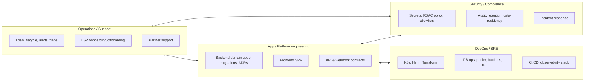

## 4.3 Approval / change-control flows

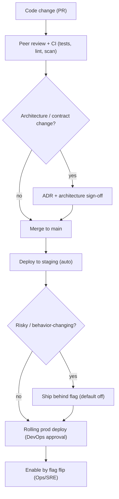

- **Database migrations:** reviewed by app + DevOps; run as pre-deploy Job; destructive/contract migrations require explicit sign-off (see `docs/runbooks/database-migrations.md`).
- **LSP onboarding/disable:** Ops/Admin action with required reason + audit note; disable triggers the **kill chain** (token-version bump, client deactivation, audit, alert) — ADR 0002.
- **Break-glass production data access:** Security-approved, time-boxed, audited.
- **Secrets/key rotation:** Security-owned; rotation invalidates affected JWTs via token versioning.

### Section 4 — Open decisions
- Formal RACI sign-off per role; on-call rotation ownership of the worker tier; who owns LSP commercial SLAs (Ops vs partner-success).

---

# 5. Security Model

## 5.1 Authentication
- **JWT, HS256** (Nimbus), stateless sessions (`SessionCreationPolicy.STATELESS`). Access token TTL 30m (`APP_SECURITY_JWT_TTL`), refresh TTL 7d.
- **Refresh** via httpOnly `lms-refresh` cookie (`secure-cookies: true`), DB-backed `refresh_token` table (V47/V73). SPA does one silent retry on 401.
- **Two principal classes:** managed users (UI) authenticate via `/auth/login` (BCrypt, `DaoAuthenticationProvider`); API clients via `/auth/token` (client-credentials, `authType=api_client` claim).
- **Bootstrap user** provisioned from config (`ops.admin`); startup validator refuses default/blank secrets outside local/test.
- **Account safety:** user lockout (V94), forced password change (`ROLE_PASSWORD_CHANGE_REQUIRED` → 428), auth brute-force alert rules (V95). **Gap:** API clients have no lockout yet (audit F-SEC-01).

## 5.2 Authorization & RBAC
- **Method-level** `@PreAuthorize` + URL rules in `SecurityConfig`. Roles: `SYSTEM_ADMIN`, `OPS_USER`, `PRODUCT_ADMIN`, `LSP_UI_READ`, `LSP_UI_WRITE`, `LSP_API_CLIENT`. Authorities derived from the `roles` JWT claim.
- **Origination is API-only** — `LSP_UI_WRITE` cannot create loans (ADR 0003).
- **Instant revocation:** token-version claims `tv` (user `token_version` V54; `lsp.token_version` + `api_client.token_version` V77) and `pwdv` (password version) validated on every request; mismatch → token rejected (`LSP_TOKEN_REVOKED`, `API_CLIENT_INACTIVE`, etc.).

## 5.3 Tenant isolation (defense in depth)
1. **Application scope** from principal, fail-closed (ADR 0005) — `AuthenticationTenantScopeFilter`.
2. **Dual datasource routing** — admin pool (cross-tenant) vs tenant pool; unscoped access throws.
3. **PostgreSQL RLS** keyed on `app.current_lsp_id` GUC (`SET LOCAL`, transaction-scoped) — V41/V45/V71.
4. **Dedicated tenant DB role** (`lms_tenant_app`) with minimal grants; admin-only tables (e.g. `lsp_api_ip_allowlist`) deliberately ungranted so unwrapped tenant reads fail loudly.
5. **Per-LSP rate limits** (writes) + **IP allowlists** (API + UI surfaces).

## 5.4 Secrets & encryption
- **Secrets:** 12-factor env injection from provider secret store; never in images; startup gate on placeholders.
- **In transit:** TLS at edge; HSTS (1 year, includeSubDomains); internal services on private networking.
- **At rest:** managed DB + object-storage encryption (provider-managed keys); object storage private with presigned access (roadmap).
- **PII handling:** Aadhaar masked at API/UI; reveal flows are **audited** (`loan_application_pii_reveal_audit`, LSP `/borrower-pii`). **Known open finding:** bank account number is returned unmasked across borrower-360/MIS/audit/UI (no `maskBankAccount` helper) — High severity, must fix before broad PII exposure (see Appendix B / memory `bug_bank_account_unmasked`).

## 5.5 API security
- Stateless JWT, **CSRF disabled** (no cookies for API auth besides refresh), **CORS** allow-listed (currently hardcoded localhost — must externalize for prod, audit F-SEC-02 / #237).
- Security headers: frame `DENY`, `X-Content-Type-Options`, XSS block, CSP `default-src 'none'; frame-ancestors 'none'`.
- **Rate limiting** (Bucket4j + Redis): auth login/token 10/min/IP, refresh 30/min, password 5/min, LSP write 60/min/LSP, doc lanes 120/min, reports 60/min, mock-outcome per subject+application. `Retry-After` on 429.
- **Payload limits:** Tomcat 10MB POST, multipart 12MB file / 40MB request; document policy 10MB → 422 / 413.
- **Idempotency:** `Idempotency-Key` header on mutations; DB-unique payment key + fingerprint → 409. **Gaps:** LSP idempotency executes before claim (F-MNY-06); create idempotency optional (F-MNY-07).
- **Upload AV scanning:** absent (audit F-SEC-03 / #221).

## 5.6 Audit logging & monitoring
- Comprehensive synchronous audit (see §1.11). Auth events, PII reveals, document access, disbursement outcomes, LSP/admin/API-client changes all recorded with actor + IP.
- **Detection without delivery:** ops alerts are detected and stored but **not yet fanned out** to email/webhook/on-call (audit F-OPS-02). No Prometheus scrape target deployed yet (F-OPS-01).

## 5.7 Incident response expectations
- **Fail-closed posture:** tenant-scope miss → alertable 500, never silent cross-tenant exposure.
- **Containment levers:** LSP disable kill-chain (ADR 0002), token-version revocation, IP allowlists, `statement_timeout` (as a query-of-death DoS control — roadmap #201).
- **Forensics:** audit explorer + per-stream audit tables; correlation id on every response (`X-Correlation-Id`).
- **To mature:** structured JSON logging + MDC (lspId/loan), runbooks, alert-path verification, MTTR targets (audit F-OPS-03/04, #218/#220).

### Section 5 — Risks
- **High:** bank-account PII unmasked (open). **High:** no API-client lockout; alerts not delivered; no prod metrics. **Medium:** CORS hardcoded; no upload AV; Redis rate-limit fail policy undefined.

---

# 6. Roadmap (improvements & scalability gaps)

Derived from `docs/scalability-audit-report-2026-06-14.md` and the deployment gate ordering. **No dates** — sequencing only; timeline decisions are left to internal planning. Issue numbers reference `sid12701/lms`.

## 6.1 Phase P0 — Production-blocking (before any production volume)
| Theme | Items | Outcome |
|---|---|---|
| Connection & timeouts | **#201** prod Hikari sizing, `statement_timeout`, separate report-worker DB role; transaction-mode pooler | Stops pool-exhaustion cascade (the dominant tail-latency cause) |
| Disbursement safety | **#203** claim + per-loan tx (`SKIP LOCKED`), **#204** intent row + provider call outside tx + sweeper | Removes double-pay risk at real-bank go-live |
| Payment correctness | **#205** same-tx claim+allocation, **#206** installment row lock | Eliminates orphan/duplicate payments |
| Idempotency | **#202** claim-before-execute | Prevents concurrent duplicate mutations |
| Dashboard | **#211/#212** nightly KPI snapshot + "data as of" | Dashboard usable at 500K+ accounts (vs 32s p95) |
| Tenancy at scale | **#229** per-LSP read+write rate limits & tiers | Partners can complete origination; noisy-neighbour contained |
| Failure isolation | **#223** Redis fail-open(business)/fail-closed(auth) | Redis outage ≠ platform outage |
| Worker tier | **#243** multi-thread scheduler, **#244** per-tenant bulkhead | Enables >1 worker pod + compute isolation |

## 6.2 Phase P1 — Before 1M loans/month sustained
| Theme | Items |
|---|---|
| Error contract | **#207** unique-violation → 409 globally |
| Reporting | **#213** report tx split + retry lease, **#227** streaming export, **#228** presigned URLs |
| Audit | **#214** explorer mandatory date window + keyset pagination |
| Data growth | **#208** partition big-six, **#209** retention sweeps |
| Uploads | **#225** store bytes outside tx |
| Webhooks | **#230** per-LSP delivery cap, **#245** webhook throughput |
| Observability | **#217** metrics endpoint + health contributors, **#234** domain queue-depth metrics, **#235** alert delivery, **#218** structured logging, **#220** runbooks |
| Origination | **#236** loan-create natural-key replay |
| Repayment | **#222** payment bounce/reversal (NACH) |
| Security | **#224** API-client lockout |

## 6.3 Phase P2 — Operational excellence
Test bed & multi-instance staging (**#197–#200**), bulk repayment inbox (**#231**), reporting automation (**#232–#233**), Grafana dashboards (**#219**), CORS externalization (**#237**), upload AV (**#221**), RabbitMQ removal (**#226**), read replica / CQRS (trigger-driven).

## 6.4 Bank go-live gate
Real **ICICI adapter** hardening (**#210** ADR) — circuit breaker, contract tests, reconciliation — depends on **#203/#204** landing first.

## 6.5 Validation gate
Re-run the full perf matrix (stress/spike/soak at peak tier) on **two-instance staging** with a **synthetic portfolio** before go-live sign-off. Target overall readiness ≥85% (currently ~32%).

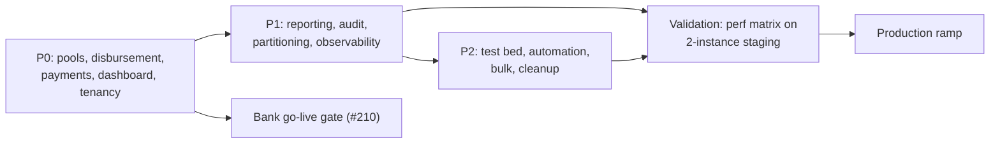

---

# 7. Future Challenges

| Challenge | Description | Early signals / mitigations |
|---|---|---|
| **Maintainability of the monolith** | One deployable holds origination → servicing → reporting → audit. As features grow, build/test time and blast radius rise. | Strong module boundaries + ArchUnit already in place; `LoanApplicationLifecycleService` is the extraction seam if a service split is ever needed. Keep ADR discipline. |
| **Scaling cost** | OLTP-heavy, audit-heavy (50–150M rows/yr). Storage + DB compute are the cost drivers; live aggregates waste compute. | Partitioning + retention (#208/#209), snapshot dashboards (#211), presigned URLs (#228), read replica only on trigger. |
| **Resource & capacity planning** | Connection arithmetic, not CPU, is the binding constraint. Mis-sized pools = outage. | Transaction-mode pooler + per-role sizing (#201); autoscale on queue-age/in-flight, not just CPU. |
| **Operational ownership** | Worker tier, DB ops, observability, on-call are nascent. Alerts detected but not delivered. | Stand up metrics + alert fan-out (#217/#235), runbooks (#220), define on-call + RACI (§4). |
| **Support burden** | API-only origination means partner integration errors (timeouts → retries → idempotency pressure) surface as tickets. | Natural-key replay (#236), clear 4xx/409 contract (#207), partner sandbox + docs (exist), rate-limit tiers (#229). |
| **Onboarding new LSPs** | One shared API contract is the asset; each new tenant adds webhook endpoints, IP allowlists, rate quotas, and load. | Self-serve onboarding + per-LSP quotas (#229), per-LSP webhook isolation (#230), optional dedicated node-pool escape hatch for whales. |
| **Compliance complexity** | Indian lending (RBI/DPDP): PII protection, data residency, audit retention, consent, reporting. | Audit foundation strong; close PII masking gap; data-residency constrains provider/region (§2.6 open decision); retention policy (#209). |
| **Reporting accuracy under load** | Live aggregates are slow and non-reproducible; MIS hydrates in memory. | Point-in-time KPI snapshots + "data as of" (#211/#212), streaming MIS (#227), consistent snapshot boundary in jobs (#213). |
| **Data growth** | Audit, idempotency, webhook-attempt, payment tables grow fastest. | Native partitioning + instant `DROP PARTITION` retention; cold archive tier. |
| **Long-term platform reliability** | Money-path correctness (disbursement/repayment) and noisy-neighbour isolation define trust. | P0 roadmap is exactly this; treat Phase 0–1 as a hard gate; restore + DR drills; circuit breakers on externals (#210, resilience4j). |
| **Real bank integration** | ICICI replaces the mock; latency + partial failures + reconciliation become real. | Adapter pattern already isolates it; harden behind #203/#204; contract tests + sweeper + maker-checker. |

---

# Appendix A — draw.io / diagrams.net import bundle

**Recommended (presentation-ready):** open the standalone, fully-styled file **`docs/architecture/diagrams/lms-architecture.drawio`** directly in diagrams.net (File ▸ Open) or the draw.io desktop app — it is a layered, color-coded, legended architecture diagram intended for stakeholder/executive sharing. Export it to PNG/PDF/SVG via **File ▸ Export as**.

The two raw import paths below remain for quick edits; both reproduce the **container diagram** as editable shapes.

## A.1 CSV import (Arrange ▸ Insert ▸ Advanced ▸ CSV…)
Paste the block below verbatim into diagrams.net's CSV import dialog.

```text
## Bhawana LMS — container diagram
## Generated for internal review (2026-06-14)
# label: %name%
# style: rounded=1;whiteSpace=wrap;html=1;fillColor=%fill%;strokeColor=#333333;
# namespace: lms-
# connect: {"from":"depends_on","to":"id","style":"endArrow=block;html=1;"}
# width: 160
# height: 60
# padding: 20
# nodespacing: 40
# levelspacing: 60
# layout: horizontaltree
## ---- columns ----
id,name,fill,depends_on
browser,Browser SPA (React/Vite),#DAE8FC,
lspsys,LSP systems,#DAE8FC,
api,API tier (Spring Boot stateless),#D5E8D4,"browser,lspsys"
worker,Worker tier (flag-gated jobs),#D5E8D4,
pooler,Connection pooler (txn mode),#FFF2CC,"api,worker"
pg,PostgreSQL (RLS + tenant role),#F8CECC,pooler
replica,Read replica (trigger-based),#F8CECC,pg
redis,Redis (rate-limit only),#FFE6CC,api
obj,Object storage (S3 API),#E1D5E7,"api,worker"
bank,Bank adapter (ICICI/mock),#FFF2CC,worker
mail,SMTP,#FFF2CC,worker
obs,Prometheus/Grafana/Logs,#F5F5F5,"api,worker"
```

## A.2 mxGraph XML (Extras ▸ Edit Diagram…)
Replace the diagram body with the XML below to import the same model as native draw.io shapes.

```xml
<mxGraphModel dx="800" dy="600" grid="1" gridSize="10" guides="1" tooltips="1" connect="1" arrows="1" fold="1" page="1" pageScale="1" pageWidth="1100" pageHeight="850" math="0" shadow="0">
  <root>
    <mxCell id="0"/>
    <mxCell id="1" parent="0"/>
    <mxCell id="browser" value="Browser SPA (React/Vite)" style="rounded=1;fillColor=#DAE8FC;strokeColor=#333;" vertex="1" parent="1"><mxGeometry x="40" y="40" width="180" height="60" as="geometry"/></mxCell>
    <mxCell id="lspsys" value="LSP systems" style="rounded=1;fillColor=#DAE8FC;strokeColor=#333;" vertex="1" parent="1"><mxGeometry x="40" y="140" width="180" height="60" as="geometry"/></mxCell>
    <mxCell id="api" value="API tier (Spring Boot, stateless)" style="rounded=1;fillColor=#D5E8D4;strokeColor=#333;" vertex="1" parent="1"><mxGeometry x="300" y="80" width="200" height="60" as="geometry"/></mxCell>
    <mxCell id="worker" value="Worker tier (flag-gated @Scheduled jobs)" style="rounded=1;fillColor=#D5E8D4;strokeColor=#333;" vertex="1" parent="1"><mxGeometry x="300" y="200" width="200" height="60" as="geometry"/></mxCell>
    <mxCell id="redis" value="Redis (rate-limit only)" style="rounded=1;fillColor=#FFE6CC;strokeColor=#333;" vertex="1" parent="1"><mxGeometry x="580" y="20" width="180" height="50" as="geometry"/></mxCell>
    <mxCell id="pooler" value="Connection pooler (txn mode)" style="rounded=1;fillColor=#FFF2CC;strokeColor=#333;" vertex="1" parent="1"><mxGeometry x="580" y="120" width="180" height="50" as="geometry"/></mxCell>
    <mxCell id="pg" value="PostgreSQL (RLS + tenant role; partitioned)" style="shape=cylinder3;fillColor=#F8CECC;strokeColor=#333;" vertex="1" parent="1"><mxGeometry x="820" y="110" width="200" height="80" as="geometry"/></mxCell>
    <mxCell id="replica" value="Read replica (trigger-based)" style="shape=cylinder3;fillColor=#F8CECC;strokeColor=#333;" vertex="1" parent="1"><mxGeometry x="820" y="220" width="200" height="70" as="geometry"/></mxCell>
    <mxCell id="obj" value="Object storage (S3 API: docs/reports)" style="rounded=1;fillColor=#E1D5E7;strokeColor=#333;" vertex="1" parent="1"><mxGeometry x="580" y="220" width="180" height="60" as="geometry"/></mxCell>
    <mxCell id="bank" value="Bank adapter (ICICI/mock)" style="rounded=1;fillColor=#FFF2CC;strokeColor=#333;" vertex="1" parent="1"><mxGeometry x="580" y="310" width="180" height="50" as="geometry"/></mxCell>
    <mxCell id="mail" value="SMTP" style="rounded=1;fillColor=#FFF2CC;strokeColor=#333;" vertex="1" parent="1"><mxGeometry x="580" y="380" width="180" height="40" as="geometry"/></mxCell>
    <mxCell id="e1" style="endArrow=block;html=1;" edge="1" parent="1" source="browser" target="api"><mxGeometry relative="1" as="geometry"/></mxCell>
    <mxCell id="e2" style="endArrow=block;html=1;" edge="1" parent="1" source="lspsys" target="api"><mxGeometry relative="1" as="geometry"/></mxCell>
    <mxCell id="e3" style="endArrow=block;html=1;" edge="1" parent="1" source="api" target="redis"><mxGeometry relative="1" as="geometry"/></mxCell>
    <mxCell id="e4" style="endArrow=block;html=1;" edge="1" parent="1" source="api" target="pooler"><mxGeometry relative="1" as="geometry"/></mxCell>
    <mxCell id="e5" style="endArrow=block;html=1;" edge="1" parent="1" source="worker" target="pooler"><mxGeometry relative="1" as="geometry"/></mxCell>
    <mxCell id="e6" style="endArrow=block;html=1;" edge="1" parent="1" source="pooler" target="pg"><mxGeometry relative="1" as="geometry"/></mxCell>
    <mxCell id="e7" style="endArrow=block;html=1;dashed=1;" edge="1" parent="1" source="pg" target="replica"><mxGeometry relative="1" as="geometry"/></mxCell>
    <mxCell id="e8" style="endArrow=block;html=1;" edge="1" parent="1" source="api" target="obj"><mxGeometry relative="1" as="geometry"/></mxCell>
    <mxCell id="e9" style="endArrow=block;html=1;" edge="1" parent="1" source="worker" target="obj"><mxGeometry relative="1" as="geometry"/></mxCell>
    <mxCell id="e10" style="endArrow=block;html=1;" edge="1" parent="1" source="worker" target="bank"><mxGeometry relative="1" as="geometry"/></mxCell>
    <mxCell id="e11" style="endArrow=block;html=1;" edge="1" parent="1" source="worker" target="mail"><mxGeometry relative="1" as="geometry"/></mxCell>
  </root>
</mxGraphModel>
```

> The Mermaid blocks throughout §1–§2 are the primary, version-controlled diagrams; this appendix is the editable export for stakeholders who prefer a canvas tool.

---

# Appendix B — Assumptions, Risks register, Open decisions

## B.1 Assumptions
1. Target load is **100K loans/day, 10+ LSPs** (per audit re-scope), not the original ~8K/day sizing.
2. The graphify report (2026-06-12) predates the `frontend-2 → frontend` consolidation (ADR 0001 completed 2026-06); the live tree has a **single** `frontend/`.
3. RabbitMQ remains deployed in local infra but carries **no production responsibility**; DB-table queues are the queueing mechanism.
4. The disbursement adapter is a **deterministic mock**; all money-path risk statements assume the real ICICI adapter will eventually replace it.
5. Prod runs on Kubernetes with a transaction-mode pooler; no provider chosen yet.

## B.2 Risk register (top items)
| ID | Risk | Sev | Source | Mitigation |
|---|---|---|---|---|
| R1 | Connection-pool exhaustion → platform-wide outage | Critical | F-API-01/F-DB-01 | #201 + pooler |
| R2 | Duplicate/orphan payments on same EMI | High | F-MNY-04/05 | #205/#206 |
| R3 | Dashboard/MIS unusable + OOM at volume | High | F-RPT-01/02 | #211/#212/#227 |
| R4 | Alerts detected but not delivered; no prod metrics | High | F-OPS-01/02 | #217/#235 |
| R5 | Noisy-neighbour: one LSP degrades all (shared pool/Redis/webhook pool) | High | F-TEN-01/03 | #229/#230/#244 |
| R6 | Audit/idempotency tables unbounded (50–150M rows/yr) | Medium | F-DB-02/08, F-AUD-01 | #208/#209 |
| R7 | API-client credential stuffing (no lockout) | Medium | F-SEC-01 | #224 |
| R8 | CORS hardcoded localhost; no upload AV; Redis fail policy undefined | Medium | F-SEC-02/03, F-ISO-01 | #237/#221/#223 |

## B.3 Open decisions (consolidated)
1. **Target cloud / region** (and India data-residency constraints) for first prod environment.
2. **Postgres `max_connections` + pooler sizing** against the chosen managed offering.
3. **RPO/RTO** confirmation with the business (proposals: RPO ≤ 5 min, RTO ≤ 1 h).
4. **Whale-tenant isolation:** dedicated node-pool/Deployment for any large launch partner? (default: no).
5. **LSP self-serve reports API** scope and timing (#215).
6. **RabbitMQ removal** vs retain-for-future (#226).
7. **Shared LSP API contract** open items from blueprint §19 still warranting confirmation: exact auth scheme nuances, document-storage ownership (LMS owns binaries — confirmed by R2/MinIO usage), LSP-UI launch scope (confirmed read-mostly by ADR 0003).
8. Formal **RACI** and on-call ownership of the worker tier.

---

*End of package. This document makes no code changes; it consolidates the live codebase state with `deployment-strategy.md`, the scalability audit, INTEGRATION-STATUS, and ADRs 0001–0005 into a single reviewable artifact.*
