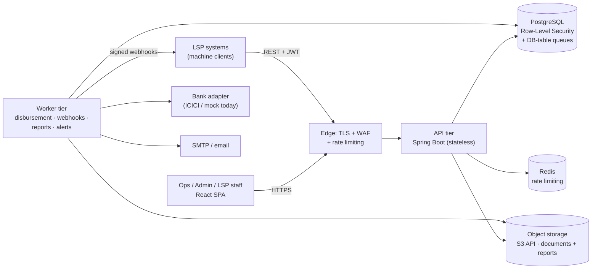
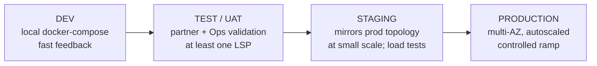
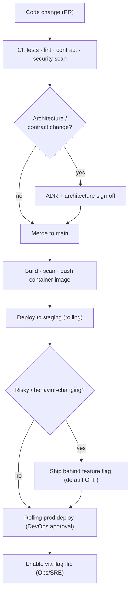
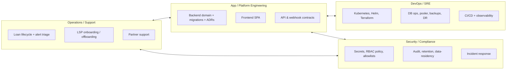
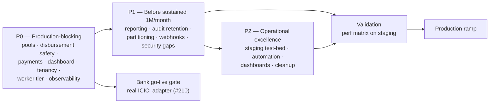

# Bhawana LMS — Executive Briefing Deck

> **Purpose:** Source Markdown for a PowerPoint-generation agent. Each `##` heading is a slide title; `---` separates slides. Bullets are slide body copy, `> Speaker notes:` blocks are presenter notes, and `🖼️ Visual:` lines describe the suggested diagram/table/graphic. Mermaid code blocks are diagram-ready.
>
> **Audience:** CEO and executive leadership. **Tone:** concise, business-impact-first, governance- and risk-aware.
> **As of:** 2026-06-16. Volume target and readiness figures sourced from the 100K loans/day scalability audit.

---

## Bhawana LMS — Platform Overview

**A multi-tenant Loan Management System for Indian small-ticket lending**

- Serves multiple **Loan Service Providers (LSPs)** on one shared platform
- LSPs originate loans **machine-to-machine via a single shared API**; our Ops team manages the full lifecycle across all tenants
- Covers the complete loan journey: **origination → approval → disbursement → repayment → closure**, with reporting, webhooks, and audit built in
- Cloud-agnostic by design — runs on **any cloud or on-prem with no rewrite**

> Speaker notes: One sentence to anchor the room — "This is the engine that lets partner lenders plug in once and operate loans at scale, while we keep central control of risk, compliance, and the money path." Everything that follows is about turning a strong foundation into a production-ready platform.

🖼️ Visual: Full-bleed title slide with the loan lifecycle as a horizontal pipeline (Originate → Approve → Disburse → Repay → Close).

---

## Executive Summary

- **What it is:** Multi-tenant LMS — partner lenders (LSPs) originate via API; we run approval, disbursement, repayment, and reporting centrally.
- **Where we are:** Core platform is **built and functionally complete** across all 9 delivery phases (auth, products, intake, lifecycle, servicing, webhooks, reporting, foreclosure, hardening).
- **Production readiness:** ~**32%** against the high-volume target (100K loans/day). Foundations (data model, security, audit) are strong; **money-path workers and reporting need hardening before scale**.
- **Bank integration:** Disbursement runs on a **deterministic mock** today; real **ICICI** integration is gated behind money-path safety work.
- **The ask:** Endorse the **P0 production-blocking roadmap** as a hard gate before onboarding live volume.

> Speaker notes: Be candid about the 32%. It is not "the product is 32% done" — the product works end-to-end. It is "32% ready for 100K loans/day." The gap is concentrated and well-understood: connection pooling, disbursement concurrency, dashboard/reporting at scale, and observability. This is a financing/sequencing decision, not a rebuild.

🖼️ Visual: Three KPI tiles — "Functionally complete," "~32% scale-ready," "Cloud-agnostic." Use a traffic-light accent (green / amber / green).

---

## Section 1 — Architecture Overview

> Speaker notes: This section is the "how it's built" story. Keep the executive framing: layered, standards-based, portable, auditable. Detail lives in the architecture package; here we show shape and control points.

---

## Architecture at a Glance

- **Shape:** Modular-monolith **Spring Boot** backend + single **React** web app (SPA)
- **Data:** **PostgreSQL** with row-level security; **Redis** for rate limiting; **S3-compatible** object storage for documents and reports
- **Work queues:** Database-table queues (no message broker on the money path) — simpler to operate and port
- **Integrations:** Bank disbursement adapter (ICICI / mock), outbound signed **webhooks** to LSPs, **SMTP** email
- **Cross-cutting:** Tenant isolation, RBAC, comprehensive audit, and rate limiting are built into the core, not bolted on

> Speaker notes: The deliberate choices that matter to a CEO: (1) one codebase keeps the team small and fast today; (2) standards-based dependencies (Postgres, Redis, S3, SMTP) mean no cloud lock-in; (3) audit and tenant isolation are foundational, which is exactly what a lending regulator expects.

🖼️ Visual: The container diagram below, rendered clean with our brand colors.

---

## System Architecture — Diagram

- **API tier** and **Worker tier** run the *same container image*, differentiated only by feature flags — scale each independently
- Every tenant-owned row carries an `lsp_id`; isolation enforced in software (RLS + dedicated DB role + fail-closed scoping)

> Speaker notes: Point out the worker tier separation — disbursement, webhooks, reporting and alerts run as background jobs. Today they run inside every instance; splitting them into a dedicated tier is a roadmap step that unlocks horizontal scale.

🖼️ Visual: Render the Mermaid above. Color the edge/security band distinctly to emphasize the controlled perimeter.

---

## Architecture — Layers & Data Flow

| Layer | Responsibility |
|---|---|
| **Client** | React SPA for internal Ops/Admin (all tenants) + LSP triage (own tenant, read-mostly) |
| **Edge / Security** | TLS termination, WAF, JWT auth, RBAC, per-tenant rate limits, IP allowlists |
| **API tier** | Loan origination, lifecycle, servicing, admin, reporting endpoints (stateless) |
| **Domain services** | Lifecycle state machine, borrower dedupe, products, disbursement, repayment, documents |
| **Worker tier** | Disbursement, webhook delivery, report generation, alert evaluation, retention |
| **Data** | PostgreSQL (system of record + queues), Redis (rate limit), S3 storage (files) |
| **Integrations** | Bank adapter, outbound webhooks, SMTP |

**Reporting:** Asynchronous — request queued, generated by a worker, stored in object storage, emailed to requester. Day-one report is the **Portfolio MIS** (CSV).

**Audit:** Synchronous and comprehensive — ~15 audit streams (auth, PII reveal, document access, disbursement outcomes, status history, LSP/admin/API-client changes), unified in an **Audit Explorer**.

> Speaker notes: The audit story is a selling point for partners and regulators: every sensitive action (who revealed PII, who changed a status, every webhook attempt) is recorded inside the business transaction, so the trail can't drift from reality.

🖼️ Visual: Layered horizontal band diagram (Client → Edge → API → Domain → Workers → Data/Integrations) with the audit + tenant-isolation rails running underneath all layers.

---

## Architecture — Cloud-Agnostic by Design

- The application depends only on **portable interfaces**, never a cloud vendor's SDK:

| Concern | Portable interface |
|---|---|
| Compute | OCI containers on **Kubernetes** |
| Database | **PostgreSQL** wire protocol (JDBC) |
| Cache / rate limit | **Redis** protocol |
| Object storage | **S3-compatible** API |
| Messaging | **None** — DB-table queues |
| Email | **SMTP** |
| Metrics / logs | **Prometheus** exposition / **JSON** to stdout |
| Secrets / config | **12-factor** environment variables |

- **Entire vendor-specific surface confined to two places:** Terraform/Helm modules, and two thin code adapters (object storage + secrets loader)
- **Move between AWS / GCP / Azure / on-prem = configuration change, not a rewrite**

> Speaker notes: This is a strategic and commercial point. No lock-in means leverage in cloud negotiations, freedom on data-residency (important for India), and the ability to run on-prem for a partner who demands it. The portability claim is testable — a Terraform+Helm rebuild in a new region is the proof and a DR drill at once.

🖼️ Visual: A "pick a column" table — one row per concern, columns AWS / GCP / Azure / On-prem — with a caption: "The app does not change."

---

## Section 2 — Technology Stack

> Speaker notes: Keep this slide factual and current. The message: mainstream, well-supported, hireable technologies — no exotic bets.

---

## Technology Stack — As Built

| Layer | Technology |
|---|---|
| **Backend** | Java 21, Spring Boot 3.5.11 (modular monolith) |
| **Frontend** | React 19, Vite 5, TypeScript 5.9, Tailwind 4, shadcn/Radix, Recharts |
| **Database** | PostgreSQL (17 local; managed PG 15+ in prod), Flyway migrations |
| **Persistence** | Spring Data JPA / Hibernate |
| **Storage** | S3-compatible — Cloudflare R2 (prod) / MinIO (local), AWS SDK v2 |
| **APIs / contracts** | REST + JWT; OpenAPI spec → generated TypeScript types (contract drift fails the build) |
| **Integrations** | Bank adapter (ICICI/mock), HMAC-signed webhooks, SMTP |
| **Cache / rate limit** | Redis + Bucket4j |
| **Reporting** | Async jobs → CSV in object storage → email |
| **Security tooling** | Spring Security + OAuth2 Resource Server, method-level RBAC, RLS, ArchUnit boundary tests |
| **CI/CD** | GitHub Actions (typecheck, lint, unit, e2e, build); deploy via Helm |
| **Testing** | JUnit 5, Testcontainers, ArchUnit; Vitest, Playwright, axe (a11y) |

> Speaker notes: Highlight the OpenAPI contract pipeline — the frontend can't silently drift from the backend; a mismatch is a compile error in CI. That is cheap insurance against an entire class of integration bugs.

🖼️ Visual: Two-column logo wall (Backend / Frontend) plus a thin "Cross-cutting" strip (Security, CI/CD, Testing).

---

## Technology Stack — Recommended for Scale

These are **additions for the high-volume target**, all cloud-agnostic:

| Need | Recommendation | Why it matters |
|---|---|---|
| Orchestration | Kubernetes + Helm | Portable autoscaling of API and worker tiers |
| **DB connection pooling** | PgBouncer / RDS Proxy (transaction mode) | **Mandatory** at scale — the constraint that binds first |
| Read scaling | PostgreSQL read replica (trigger-based) | Offload reporting/dashboard reads from the primary |
| Resilience | Circuit breakers / bulkheads (resilience4j) | Contain bank/storage/Redis failures |
| Observability | Prometheus + Grafana + Alertmanager, structured JSON logs | Autoscaling signals + fast incident response |
| Partitioning | Native PostgreSQL partitioning on high-growth tables | Bounded retention and database health |
| Security tooling | Image scanning, upload anti-virus, dependency/SAST scans in CI | Supply-chain + partner-file safety |

> Speaker notes: Don't get lost in the list. The headline is one word: **pooling**. At 100K loans/day, database connections — not CPU — are what break first. A transaction-mode pooler is non-negotiable; everything else is standard hardening.

🖼️ Visual: "Today vs. At Scale" two-column comparison; star/flag the connection pooler row.

---

## Section 3 — Deployment Procedure

> Speaker notes: This section answers "how do changes reach production safely?" Emphasize controls, gates, and reversibility.

---

## Environments & Promotion

| Environment | Purpose | Gate to next |
|---|---|---|
| **Dev** | Local full stack (Postgres, Redis, storage, mail) for fast iteration | All CI checks green |
| **Test / UAT** | Partner integration + Ops acceptance; at least one LSP exercised | UAT sign-off |
| **Staging** | Prod-shaped topology at small scale; performance + noisy-neighbour suite | Perf matrix pass |
| **Production** | Multi-AZ, autoscaled, controlled volume ramp | Roadmap P0 gate cleared |

> Speaker notes: Staging is where the load and "noisy-neighbour" scenarios run before any production ramp — it mirrors prod topology so we test the real failure modes, not a toy. Production go-live is itself gated on the P0 roadmap (next section's roadmap slide).

🖼️ Visual: The promotion pipeline above as a 4-stage gated funnel, with the gate condition on each arrow.

---

## CI/CD Flow & Release Controls

- **One image, two roles:** API and worker pods are the same build, selected by flags
- **Database migrations:** Flyway, run as a *pre-deploy job* (not on every pod), expand→migrate→contract so rolling deploys never race the schema
- **Provider-neutral pipeline:** only registry/deploy credentials change per cloud

> Speaker notes: The control that de-risks releases most is **feature flags**. A behavior-changing change ships disabled; we turn it on deliberately, and a bad outcome is a flag flip — not a redeploy or a rollback under pressure.

🖼️ Visual: Render the flow; highlight the two decision diamonds (architecture sign-off, risk gate) as the human control points.

---

## Rollback, Approvals & Monitoring

- **Rollback strategy (layered):**
  - Behavior-changing changes → **flag flip** (instant, no redeploy)
  - Bad build → **roll back to previous image** (stateless tiers, no session affinity)
  - Schema → expand/contract pattern keeps the previous version compatible during deploy
- **Approvals:**
  - Peer review + green CI required to merge
  - Architecture/contract changes require an **ADR** and sign-off
  - Production deploys require **DevOps approval**; data access is **break-glass, time-boxed, audited**
- **Monitoring (target state):** Prometheus + Grafana + Alertmanager; JSON logs with correlation/tenant/loan IDs; autoscale on queue-age and latency, not just CPU
- **Current state:** only `health`/`info` endpoints exposed — full metrics + alert delivery are a **roadmap P0/P1 item**

> Speaker notes: Be transparent: monitoring is designed but not yet stood up in production. Alerts are *detected and stored* today but not yet delivered to a human. Closing that is in the P0/P1 roadmap and is a go-live condition — you can't operate a money platform you can't observe.

🖼️ Visual: Three-panel layout — "Approvals," "Rollback," "Monitoring" — each with 2–3 bullets and a status chip (✅ in place / 🔶 roadmap).

---

## Section 4 — Operational Model: Team & Ownership

> Speaker notes: This answers "who is accountable for what." Use it to surface where ownership is mature vs. nascent.

---

## Ownership Map

> Speaker notes: The boxes are clear; the honest gap is that **DevOps/SRE and on-call ownership of the worker tier are still being stood up**. That's an organizational action item, not a code gap.

🖼️ Visual: Four ownership swimlanes (App, DevOps/SRE, Security/Compliance, Ops/Support) with the interaction arrows.

---

## Responsibility & Access Matrix

| Area | Owner | Production data access |
|---|---|---|
| **Development** (backend, frontend, contracts, migrations) | App / Platform Engineering | Non-prod; prod via audited deploy only |
| **Testing & QA** (unit, integration, e2e, UAT) | App Eng + Ops (UAT) | Test data only |
| **Infrastructure** (K8s, DB ops, pooler, scaling, DR) | DevOps / SRE | Break-glass only, audited |
| **Support** (partner queries, ticket triage) | Support / Ops | Minimal; no raw PII |
| **Governance** (change control, ADRs, release approval) | App Eng + DevOps | — |
| **Compliance** (audit, retention, data-residency, RBI/DPDP) | Compliance / Audit | Read via audited paths |
| **Security** (secrets, RBAC, allowlists, incident lead) | Security | PII on incident, audited |

- **Loan operations** (`SYSTEM_ADMIN`, `OPS_USER`, `PRODUCT_ADMIN`): cross-tenant lifecycle, products, reports
- **Partners** (`LSP_API_CLIENT`, `LSP_UI_READ/WRITE`): own-tenant only; origination is API-only

> Speaker notes: Two principles to state plainly: (1) least privilege — infrastructure and support staff don't see raw borrower PII by default; (2) every elevated access is **audited and time-boxed**. Open item: formal RACI sign-off and worker-tier on-call rotation.

🖼️ Visual: Clean RACI-style table; add a callout box: "Open: formal RACI + worker-tier on-call."

---

## Section 5 — Security Model

> Speaker notes: For a lending platform this is the trust section. Lead with strengths (isolation, audit, fail-closed), then be candid about the open findings — being upfront builds credibility.

---

## Security — Identity, Access & Isolation

- **Authentication:** Stateless **JWT** (30-min access, 7-day refresh via httpOnly cookie); separate flows for UI users (login) and partner machines (client-credentials); startup refuses default/blank secrets
- **Authorization (RBAC):** Method-level permission checks; six roles spanning internal Ops/Admin/Product and LSP UI/API; **origination is API-only** by policy
- **Instant revocation:** Token-version claims validated on every request — disabling an LSP or user invalidates live tokens immediately (the "kill chain")
- **Tenant / LSP data isolation — defense in depth:**
  1. Scope derived from the **authenticated principal**, set in the security layer, **fails closed**
  2. Dual datasource routing — admin pool vs. tenant pool
  3. **PostgreSQL Row-Level Security** keyed per tenant
  4. Dedicated minimal-privilege tenant DB role
  5. Per-LSP rate limits + IP allowlists

> Speaker notes: The "fails closed" decision (ADR 0005) is the one to emphasize: if the system can't prove which tenant a request belongs to, it refuses the request rather than guessing. We deliberately chose a momentary availability failure over any chance of cross-tenant data exposure. This is exactly the posture a regulator wants to see.

🖼️ Visual: Concentric-rings / "defense in depth" diagram: principal scope → routing → RLS → DB role → rate limits.

---

## Security — Environment, Pipeline & Secrets

- **Environment segregation:** Dev / Test-UAT / Staging / Prod fully separated; prod data networks (DB, Redis, storage) on **private networking only — no public endpoints**
- **Pipeline security:** Image scanning, dependency/SAST scans, and partner-upload anti-virus in CI; private registries; signed images (target state)
- **Secrets management:** 12-factor injection from the provider's secret store; **never baked into images**; startup gate blocks placeholder secrets outside local/test; key rotation invalidates affected tokens
- **API security:** TLS + HSTS, strict security headers/CSP, CSRF-safe stateless auth, per-endpoint rate limits with `Retry-After`, payload size caps, idempotency keys on mutations
- **Audit & compliance readiness:** ~15 synchronous audit streams + Audit Explorer; correlation ID on every response; foundation aligns with **RBI / DPDP** expectations

> Speaker notes: Secrets and environment isolation are mature in design. The two things to land are operational: deploy the image-scanning/AV in CI, and externalize CORS (still hardcoded to localhost). Both are on the roadmap.

🖼️ Visual: Three-pillar layout — Environment | Pipeline | Secrets — each with a 🔒 icon and 2–3 bullets.

---

## Security — Open Findings (Transparency)

| Finding | Severity | Status / Mitigation |
|---|---|---|
| **Bank account number returned unmasked** across borrower views / MIS / audit / UI | **High** | Fix before broad PII exposure; add masking helper (Aadhaar already masked) |
| **No lockout for API-client credentials** (UI users have lockout) | Medium-High | Add API-client lockout (roadmap #224) |
| **Ops alerts detected but not delivered** to email/on-call | High (operational) | Stand up alert fan-out + metrics (roadmap P0/P1) |
| **CORS allow-list hardcoded** to localhost | Medium | Externalize per environment (roadmap #237) |
| **No upload anti-virus** on partner files | Medium | Add AV scan in upload path (roadmap #221) |

- **Strong by contrast:** data isolation is well-designed and **tested with PostgreSQL RLS integration tests** — the weak points are performance isolation and the items above, **not** data leakage between tenants

> Speaker notes: Putting the open findings on a slide is deliberate — it signals the program is honest and managed. None is a design flaw; all are bounded, known, and ticketed. The bank-account masking item is the one to fix first and is cheap.

🖼️ Visual: Severity-coded table (red/amber). Add a reassurance footer: "Tenant data isolation: designed + tested ✅."

---

## Section 6 — Roadmap

> Speaker notes: Frame the roadmap as a gated path to scale, not a wish list. The sequencing is deliberate: nothing ships to volume until the money path and observability are safe.

---

## Roadmap — Status Overview

| Stage | Capability | Status |
|---|---|---|
| **Completed** | Auth & RBAC, multi-tenant isolation (RLS, fail-closed), products, intake + borrower dedupe (PAN), lifecycle state machine, servicing (schedule/EMI/DPD), disbursement (mock), repayment + foreclosure, webhooks, async MIS reporting, audit | ✅ |
| **In progress** | Error-contract typing, OpenAPI type generation, code-quality decomposition (god-class refactors), CI hardening | 🔄 |
| **Planned (P0 — production-blocking)** | Connection pooling + timeouts, disbursement concurrency safety, payment correctness, dashboard snapshots, per-LSP rate tiers, worker tier split, observability + alert delivery | 📋 |
| **Future** | Real ICICI integration, table partitioning + retention, read replica/CQRS, LSP self-serve reports, NACH bounce/reversal, RabbitMQ removal | 🔮 |

> Speaker notes: The completed column is the proof the product works. The planned column is the cost of running it at 100K/day. Read the planned items as "operational hardening," because that's what they are — the business logic is done.

🖼️ Visual: Four-column Kanban (Completed / In progress / Planned / Future) with status chips.

---

## Roadmap — Sequenced Gates to Production

- **Business-critical / money-path:** disbursement concurrency, payment correctness, idempotency (P0)
- **Compliance:** PII masking, audit retention + partitioning, data-residency (P0–P1)
- **Scalability:** connection pooling, worker tier, per-tenant isolation, read replica (P0–future)
- **Reporting:** snapshot dashboards, streaming MIS, presigned downloads (P0–P1)
- **Automation / ops:** alert delivery, structured logging, runbooks, staging test-bed (P1–P2)
- **Validation gate:** re-run full performance matrix on a 2-instance staging stack; **target readiness ≥85%** (from ~32%) before go-live

> Speaker notes: The single most important slide for a go/no-go decision. Production ramp sits behind a validation gate; the bank go-live sits behind the money-path safety work. We are not asking to skip steps — we're asking to fund and sequence them.

🖼️ Visual: Render the Mermaid gate flow; emphasize the two gates (Bank, Validation) as checkpoints before "Production ramp."

---

## Section 7 — Future Challenges & Mitigations

> Speaker notes: This is the risk-visibility section the CEO needs. Every risk has an owner and a mitigation already on the roadmap — that's the reassurance.

---

## Risk Register — Executive View

| Challenge | Risk | Mitigation (roadmap-backed) |
|---|---|---|
| **Scalability** | Database **connections**, not CPU, bind first; mis-sized pools = outage | Transaction-mode pooler + per-role sizing; autoscale on queue-age (P0) |
| **Money-path correctness** | Duplicate/orphan payments; double-disbursement at real-bank go-live | Claim-safe workers, intent rows, reconciliation sweeper (P0) |
| **Operational readiness** | Alerts detected but **not delivered**; no prod metrics; nascent on-call | Metrics + alert fan-out, runbooks, define on-call/RACI (P0–P1) |
| **Security / compliance** | Unmasked bank PII; no API-client lockout; RBI/DPDP, data residency | Masking fix, lockout, audit retention; region choice with compliance |
| **Cost** | Audit/idempotency tables grow 50–150M rows/yr; live aggregates waste compute | Partitioning + retention, snapshot dashboards, presigned URLs |
| **Maintainability** | One deployable spans origination→reporting; blast radius grows | Strong module boundaries + ArchUnit; clear extraction seam if split needed |
| **Business / partner** | API-only origination → partner integration errors become support load | Natural-key replay, clear error contracts, partner sandbox, rate tiers |
| **Bank dependency** | ICICI introduces real latency, partial failures, reconciliation | Adapter already isolates it; harden behind money-path safety + contract tests |

> Speaker notes: The pattern across the table is the message: every risk is **known, bounded, owned, and ticketed**. The two to watch personally are the money path (because it's irreversible once real funds move) and operational observability (because you can't run what you can't see). Both are P0.

🖼️ Visual: Risk-register table with a severity heatmap column; or a 2×2 (Impact × Likelihood) bubble chart with the top risks plotted.

---

## Recommendation & The Ask

- **Endorse the P0 roadmap as a hard gate** before any live production volume
- **Fund the scale-readiness work** — connection pooling, money-path safety, observability — sequenced, not rushed
- **Authorize the bank integration track** (real ICICI) to start *behind* the money-path safety gate
- **Confirm two business inputs:** target cloud/region (with India data-residency) and RPO/RTO targets
- **Outcome:** a portable, auditable, multi-tenant lending platform ready to onboard partners at 100K loans/day with controlled risk

> Speaker notes: Close on confidence, not caveats. The foundation is strong and standards-based; the path to scale is mapped and gated; the risks are visible and mitigated. The decision in front of leadership is to fund and sequence the hardening — and to confirm the two business inputs (cloud/region and recovery targets) that only leadership can set.

🖼️ Visual: Single-slide summary with the loan pipeline at top and three asks as large bullets; end card with "Strong foundation → Gated path to scale → Visible, mitigated risk."

---

## Appendix — Key Facts & Sources

- **Volume target:** ~100K loans/day, ~1M+/month, 10+ concurrent LSP tenants
- **Current scale-readiness:** ~32% (per 100K/day scalability audit); validation target ≥85%
- **Loan lifecycle:** 10-state machine (Initialized → Awaiting Approval → Approved → Disbursed → Under Repayment → Closed/Foreclosed; plus Rejected/Invalid/Retry)
- **Disbursement:** deterministic mock today; real ICICI gated behind money-path safety work
- **Sources:** `docs/architecture/platform-architecture-and-deployment-package.md`, `docs/architecture/deployment-strategy.md`, ADRs 0001–0005, scalability audit, code-quality review tracker
- **Editable diagrams:** draw.io / diagrams.net bundle in the architecture package (Appendix A)

> Speaker notes: Hold this slide for Q&A. It gives the source documents for anyone who wants to go deeper after the meeting.

🖼️ Visual: Plain reference slide — facts left, source list right.
