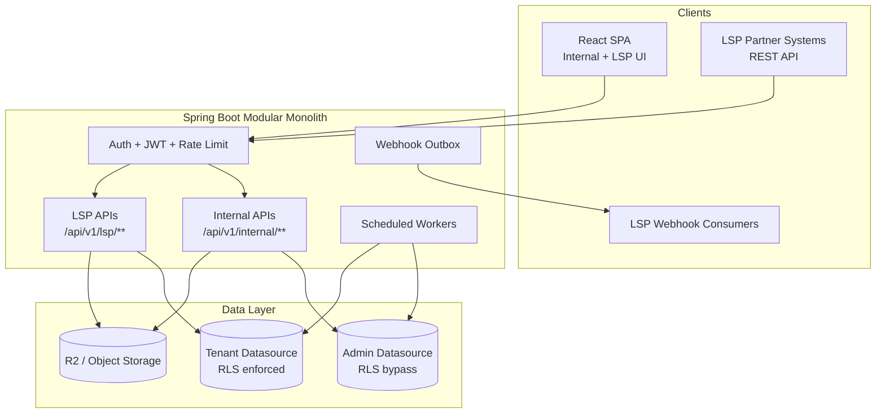
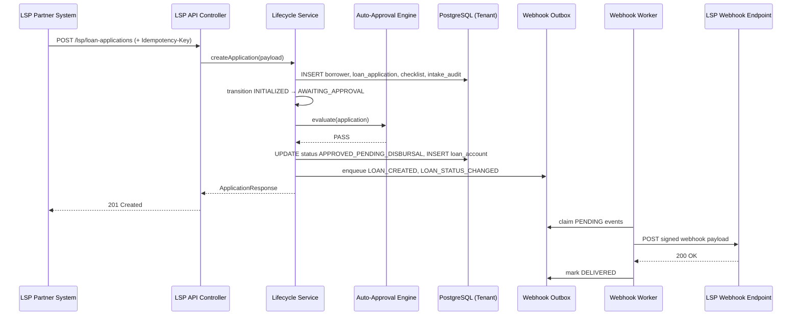
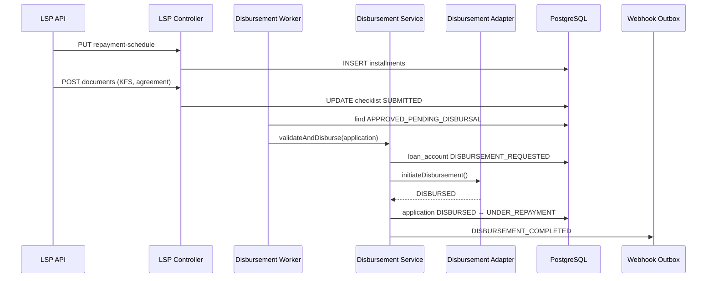
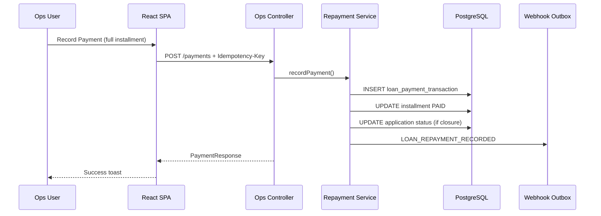
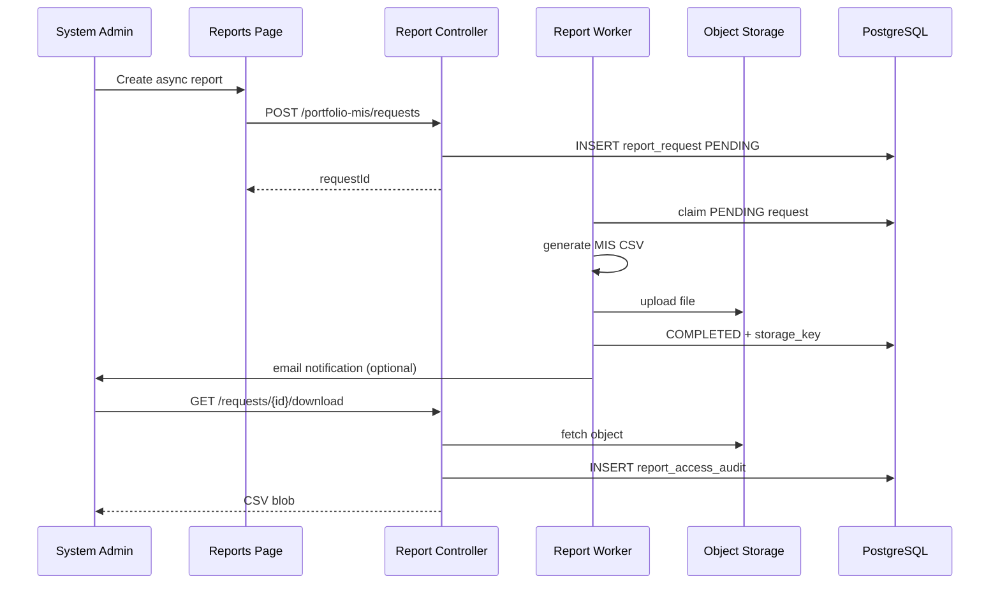
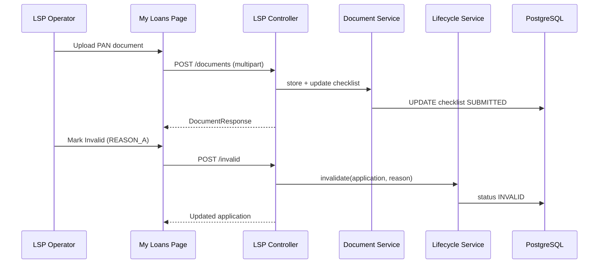
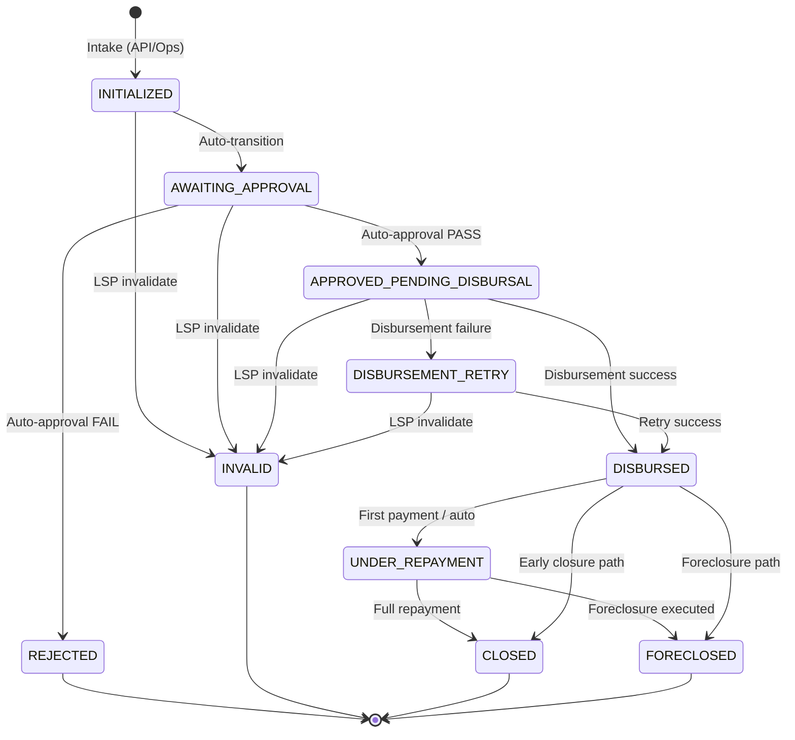
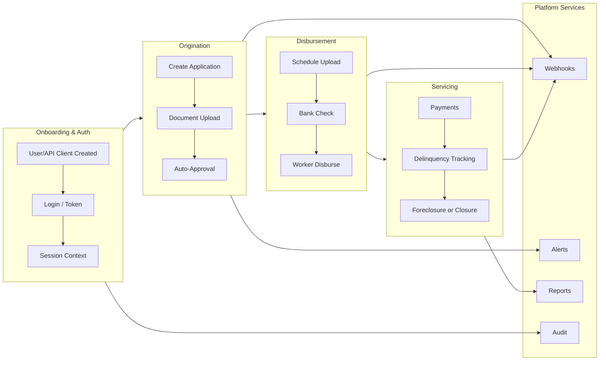

# LMS — Use Case & Happy Path Workflow Documentation

**Document version:** 1.0  
**Prepared:** 2026-06-06  
**Validation method:** Code analysis of `backend/`, `frontend/`, Flyway migrations (`V1`–`V88`), and integration configuration  
**Audience:** Product Managers, Business Teams, QA, Developers, New Team Members, Auditors, Stakeholders

---

## Table of Contents

1. [Deliverable 1 — Application Overview](#deliverable-1--application-overview)
2. [Deliverable 2 — Use Case Document](#deliverable-2--use-case-document)
3. [Deliverable 3 — Happy Path Workflow Document](#deliverable-3--happy-path-workflow-document)
4. [Deliverable 4 — End-to-End Business Process Map](#deliverable-4--end-to-end-business-process-map)
5. [Deliverable 5 — Module-Level Workflow Breakdown](#deliverable-5--module-level-workflow-breakdown)
6. [Deliverable 6 — Gap Analysis](#deliverable-6--gap-analysis)
7. [Deliverable 7 — Test Scenarios](#deliverable-7--test-scenarios-derived-from-use-cases)
8. [Assumptions](#assumptions)

---

# Deliverable 1 — Application Overview

## System Overview

### Purpose of Application

The **Bhawana Loan Management System (LMS)** is a multi-tenant institutional lending platform that digitizes the full loan lifecycle: origination, underwriting, disbursement, servicing, foreclosure, reporting, and partner integration. Each **Lending Service Provider (LSP)** operates as an isolated tenant while Bhawana internal staff manage the portfolio across all tenants.

### Business Problem Solved

| Problem | LMS Solution |
|---------|--------------|
| Fragmented loan operations across partners | Single control plane with tenant isolation |
| Manual credit policy enforcement | Auto-approval rule engine + governed state machine |
| Partner integration complexity | Versioned LSP API with OAuth2, idempotency, webhooks |
| Regulatory/audit exposure | Append-only audit tables, document access logging, PII masking |
| Operational blind spots | Scheduled alert rules, ops dashboard, MIS reporting |

### Key Modules

| Module | Description |
|--------|-------------|
| **Authentication & Session** | JWT access tokens, refresh cookies, password lifecycle, API client credentials |
| **Tenant / LSP Administration** | LSP registry, status kill chain, webhook config, IP allowlists |
| **User & API Client Admin** | Internal users, LSP UI users, machine credentials |
| **Product Catalog** | Loan products, tenure/rate bounds, LSP mappings |
| **Loan Origination** | Application intake (API + ops), document checklist, auto-approval |
| **Loan Servicing** | Repayment schedule, payments, delinquency, foreclosure |
| **Disbursement** | Worker-driven disbursement via pluggable adapter (mock in dev) |
| **Borrower Management** | Global borrower identity (PAN-deduped), bank details, cross-LSP visibility |
| **Operations Console** | Loan queue, lifecycle actions, escalation, document access |
| **LSP Self-Service UI** | Tenant-scoped loan list, invalidation, document upload |
| **Reporting** | Portfolio MIS preview, sync download, async CSV generation (R2) |
| **Alerting** | Scheduled + event-driven ops alerts |
| **Webhooks** | Transactional outbox with retry, redrive, delivery audit |
| **Audit Explorer** | Unified cross-domain audit search |

### Primary User Types

| Actor | Type | Interface |
|-------|------|-----------|
| System Administrator | Internal human | React SPA (`/home`, admin routes) |
| Operations User | Internal human | React SPA (`/loan-applications`, `/alerts`) |
| Product Administrator | Internal human | React SPA (`/products`) |
| LSP UI User (Read) | Partner human | React SPA (`/my-loans`) |
| LSP UI User (Write) | Partner human | React SPA (`/my-loans` + write actions) |
| LSP API Client | Machine | REST API (`/api/v1/lsp/**`) |
| Background Workers | System | Scheduled jobs (disbursement, webhooks, reports, alerts) |
| External LSP Webhook Consumer | External system | HTTPS POST from LMS |

### External Integrations

| Integration | Technology | Purpose |
|-------------|------------|---------|
| PostgreSQL | Primary datastore + RLS | Tenant isolation, transactional integrity |
| Cloudflare R2 / S3-compatible | Object storage | KYC documents, MIS report files |
| Local filesystem (dev) | File storage | Alternative document provider |
| LSP Webhook Endpoints | HTTPS POST + HMAC | Real-time event notification to partners |
| Email (SMTP) | Report notifications | Async report completion alerts |
| Mock Disbursement Adapter | In-process | Simulated bank disbursement (production swappable) |
| Redis / RabbitMQ / MinIO / MailHog | Infra (`infra/`) | Local development scaffolding |

### High-Level Architecture



**Tenant routing:** `/api/v1/internal/**` and `/api/v1/auth/**` use the admin datasource; `/api/v1/lsp/**` uses the tenant datasource with JWT `lspId` and PostgreSQL RLS via `app.current_lsp_id`.

---

## User Roles

### Role Summary Table

| Role | Responsibilities | Key Permissions | Accessible Modules | Restricted Modules |
|------|------------------|-----------------|--------------------|--------------------|
| **SYSTEM_ADMIN** | Full platform control, approvals, disbursement, reporting, audit | All internal + admin APIs; lifecycle write; manual override | Home, Loans, Borrowers, Alerts, Reports, Audit, LSPs, Products, Users, API Clients | LSP tenant API (uses internal routes instead) |
| **OPS_USER** | Loan triage, borrower research, alert handling, repayment posting | Read/write loans (no admin-only mutations); escalate | Loans, Borrowers, Alerts | Home, Reports, Audit, LSP/User/API admin, disbursement trigger, status override, foreclosure trigger |
| **PRODUCT_ADMIN** | Product catalog and LSP mapping | Product CRUD, product audit | Products, Loan list (read), Borrowers (read) | Lifecycle mutations, admin config, reports |
| **LSP_UI_READ** | View tenant loans | LSP API read endpoints | My Loans (read) | All internal routes, write actions |
| **LSP_UI_WRITE** | Manage tenant loans (invalidate, upload docs) | LSP read + invalidate + document upload | My Loans (read/write) | Internal ops, API-only endpoints (payments, schedule) |
| **LSP_API_CLIENT** | Machine integration | Full LSP API (create loans, payments, schedule, bank check) | None (API only) | All UI routes |

### Role Details

#### SYSTEM_ADMIN
- **Responsibilities:** Tenant onboarding, user/API client management, credit decisions (approve/reject), disbursement initiation, foreclosure, MIS reporting, webhook redrive, audit investigation
- **Permissions (backend):** `@PreAuthorize("hasRole('SYSTEM_ADMIN')")` on admin controllers; exclusive access to reports, audit explorer, webhook admin, manual status override
- **Landing route:** `/home`

#### OPS_USER
- **Responsibilities:** Monitor loan queue, research borrowers, acknowledge alerts, escalate stuck loans, post repayments
- **Permissions:** `hasAnyRole('SYSTEM_ADMIN','OPS_USER')` on ops controllers; **no** lifecycle ActionBar in UI (escalate only)
- **Landing route:** `/loan-applications`

#### PRODUCT_ADMIN
- **Responsibilities:** Configure loan products and LSP availability
- **Permissions:** Product admin APIs; read-only loan/borrower visibility
- **Landing route:** `/products`

#### LSP_UI_READ / LSP_UI_WRITE
- **Responsibilities:** View (and optionally manage) own-tenant loan applications
- **Permissions:** `/api/v1/lsp/loan-applications` read; write role adds invalidate + document upload
- **Landing route:** `/my-loans`

#### LSP_API_CLIENT
- **Responsibilities:** Automated loan origination, document submission, schedule upload, payments, bank verification
- **Authentication:** `POST /api/v1/auth/token` (client credentials); IP allowlist when enforced
- **No UI access**

---

# Deliverable 2 — Use Case Document

## Use Case Index

| ID | Name | Primary Actor |
|----|------|---------------|
| UC-001 | User Login | All human users |
| UC-002 | Mandatory Password Change | Authenticated user |
| UC-003 | Session Refresh & Logout | All human users |
| UC-004 | API Client Token Issuance | LSP_API_CLIENT |
| UC-005 | View Session Context | Authenticated user |
| UC-006 | Create LSP Tenant | SYSTEM_ADMIN |
| UC-007 | Activate/Deactivate LSP | SYSTEM_ADMIN |
| UC-008 | Configure LSP Webhook Subscription | SYSTEM_ADMIN |
| UC-009 | Manage LSP IP Allowlists | SYSTEM_ADMIN |
| UC-010 | Create Internal/LSP User | SYSTEM_ADMIN |
| UC-011 | Update User / Reset Password | SYSTEM_ADMIN |
| UC-012 | Create API Client | SYSTEM_ADMIN |
| UC-013 | Rotate API Client Secret | SYSTEM_ADMIN |
| UC-014 | Create/Update Loan Product | SYSTEM_ADMIN, PRODUCT_ADMIN |
| UC-015 | Configure Product-LSP Mappings | SYSTEM_ADMIN, PRODUCT_ADMIN |
| UC-016 | LSP API — Create Loan Application | LSP_API_CLIENT |
| UC-017 | Ops — Create Loan Application | SYSTEM_ADMIN, OPS_USER |
| UC-018 | Auto-Approval Rule Evaluation | System |
| UC-019 | Upload KYC Documents (LSP) | LSP_API_CLIENT, LSP_UI_WRITE |
| UC-020 | Download KYC Documents (Ops) | SYSTEM_ADMIN, OPS_USER |
| UC-021 | Manual Status Transition | SYSTEM_ADMIN |
| UC-022 | Manual Status Override | SYSTEM_ADMIN |
| UC-023 | Invalidate Loan (Pre-Disbursal) | LSP_API_CLIENT, LSP_UI_WRITE |
| UC-024 | Submit Repayment Schedule | LSP_API_CLIENT |
| UC-025 | Disbursement Bank Check | LSP_API_CLIENT |
| UC-026 | Initiate Disbursement | SYSTEM_ADMIN |
| UC-027 | Automated Disbursement Processing | System (Worker) |
| UC-028 | Simulate Disbursement Outcome | SYSTEM_ADMIN |
| UC-029 | Record Payment (Internal Ops) | SYSTEM_ADMIN, OPS_USER |
| UC-030 | Record Payment (LSP API) | LSP_API_CLIENT |
| UC-031 | Request Foreclosure Quote | SYSTEM_ADMIN, LSP_API_CLIENT |
| UC-032 | Execute Foreclosure | SYSTEM_ADMIN |
| UC-033 | Update Borrower Bank Details | LSP_API_CLIENT, SYSTEM_ADMIN |
| UC-034 | Search & View Borrowers | SYSTEM_ADMIN, OPS_USER |
| UC-035 | View Portfolio Dashboard | SYSTEM_ADMIN |
| UC-036 | Search Loan Applications | Internal roles |
| UC-037 | Portfolio MIS — Preview & Sync Download | SYSTEM_ADMIN |
| UC-038 | Async MIS Report Generation | SYSTEM_ADMIN |
| UC-039 | Acknowledge Ops Alert | SYSTEM_ADMIN, OPS_USER |
| UC-040 | Escalate Loan to Admin | OPS_USER |
| UC-041 | Scheduled Alert Rule Evaluation | System (Worker) |
| UC-042 | Webhook Outbox Dispatch | System (Worker) |
| UC-043 | Manual Webhook Redrive | SYSTEM_ADMIN |
| UC-044 | Audit Explorer Search | SYSTEM_ADMIN |
| UC-045 | Auth Audit Search | SYSTEM_ADMIN |
| UC-046 | LSP View Own Loans | LSP_UI_READ, LSP_UI_WRITE |
| UC-047 | View LSP Product Catalog | LSP_API_CLIENT, LSP_UI_* |

---

## UC-001 — User Login

### Use Case ID
UC-001

### Use Case Name
User Login (Password Authentication)

### Description
A human user authenticates with username and password to obtain a JWT access token and httpOnly refresh cookie.

### Business Objective
Secure access to role-appropriate LMS surfaces.

### Actors
- **Primary Actor:** App User (any role)
- **Secondary Actors:** Auth service, Audit service

### Preconditions
- User exists in `app_user` with status `ACTIVE`
- User is not blocked by LSP UI IP allowlist (if enforced for LSP users)

### Trigger
User submits credentials on `/login`.

### Main Flow
1. User enters username and password on Login page.
2. Frontend sends `POST /api/v1/auth/login`.
3. Backend validates credentials and user status.
4. Backend issues JWT (roles, `lspId` if applicable, `pwdv`, `tv` claims).
5. Backend sets refresh token cookie and records `auth_event_audit`.
6. Frontend stores access token; redirects to role default landing or `/change-password` if required.

### Alternate Flows
- **AF-1:** Password change required → HTTP 200 with flag → redirect to UC-002.
- **AF-2:** Invalid credentials → 401 with generic error.

### Exception Flows
- **EF-1:** Rate limit exceeded on login endpoint → 429.
- **EF-2:** LSP UI IP not in allowlist → 403.

### Post Conditions
- Valid session established; correlation ID propagated.

### Data Created
- `auth_event_audit` (LOGIN_SUCCESS or LOGIN_FAILURE)

### Data Updated
- `refresh_token` row

### APIs Involved
- `POST /api/v1/auth/login`

### Database Tables Involved
- `app_user`, `app_user_role`, `app_role`, `refresh_token`, `auth_event_audit`

### Notifications Triggered
- None

### Audit Logs Generated
- `auth_event_audit`

### Security Considerations
- Rate limiting per IP; bcrypt password hash; refresh token rotation

### Business Rules
- Inactive users cannot login
- `ROLE_PASSWORD_CHANGE_REQUIRED` blocks `/api/v1/**` until password changed

### Dependencies
- JWT signing key configuration

---

## UC-016 — LSP API Create Loan Application

### Use Case ID
UC-016

### Use Case Name
LSP API — Create Loan Application (Partner Intake)

### Description
An LSP partner system submits a new loan application with full borrower payload via machine credentials.

### Business Objective
Enable partner-led loan origination at scale without manual ops entry.

### Actors
- **Primary Actor:** LSP_API_CLIENT
- **Secondary Actors:** Loan lifecycle service, Auto-approval engine, Webhook dispatcher, Borrower service

### Preconditions
- API client is `ACTIVE`; LSP is `ACTIVE`
- Product is `ACTIVE` and mapped to LSP
- API IP allowlist satisfied (if `enforceApi` enabled)
- Valid OAuth2 bearer token

### Trigger
`POST /api/v1/lsp/loan-applications` with borrower + loan payload and optional `Idempotency-Key`.

### Main Flow
1. LSP system authenticates (UC-004) and POSTs application.
2. API validates payload, product mapping, and idempotency.
3. System resolves/creates global `borrower` (PAN dedup) and `borrower_lsp_access`.
4. System creates `loan_application` in `INITIALIZED`.
5. System records `loan_application_intake_audit` (full payload snapshot).
6. System initializes document checklist rows.
7. System transitions to `AWAITING_APPROVAL` and runs UC-018 (auto-approval).
8. Outcome: `APPROVED_PENDING_DISBURSAL` or `REJECTED`; creates `loan_account` on approval.
9. System enqueues `LOAN_CREATED` and `LOAN_STATUS_CHANGED` webhooks.
10. API returns application detail with status and rejection codes if applicable.

### Alternate Flows
- **AF-1:** Idempotent replay → return cached response from `lsp_api_idempotency_record`.
- **AF-2:** Auto-approval rejects → terminal `REJECTED` with rule failure codes.
- **AF-3:** Existing borrower linked via PAN match.

### Exception Flows
- **EF-1:** Inactive product/LSP → 400/422.
- **EF-2:** Duplicate `(lsp_id, external_loan_id)` → 409.
- **EF-3:** Borrower has open loan (BR-1) → rejection during auto-approval.

### Post Conditions
- Application exists in terminal or in-flight pre-disbursal state.

### Data Created
- `borrower` (if new), `borrower_lsp_access`, `loan_application`, `loan_application_intake_audit`, `loan_application_document_checklist`, `loan_application_status_transition`, `loan_application_audit_event`, `loan_account` (if approved), `webhook_event_outbox`, `lsp_api_idempotency_record`

### Data Updated
- Borrower profile fields if existing borrower updated

### APIs Involved
- `POST /api/v1/lsp/loan-applications`

### Database Tables Involved
- See Data Created

### Notifications Triggered
- Webhook: `LOAN_CREATED`, `LOAN_STATUS_CHANGED`
- Ops alert possible: `BORROWER_IDENTITY_CONFLICT`, `BORROWER_ACTIVE_LOAN_DUPLICATE`, `LSP_AUTO_REJECT_SPIKE`

### Audit Logs Generated
- Intake audit, status transition, application audit event

### Security Considerations
- Tenant RLS; JWT `lspId` scoping; rate limits on LSP writes

### Business Rules
- BR-1: One open loan per borrower (cross-LSP)
- BR-2: Approval-required documents must be submitted for auto-approval pass
- Product amount/tenure/rate bounds enforced
- Borrower required fields validated

### Dependencies
- UC-004 (token), UC-014/UC-015 (active product mapping)

---

## UC-018 — Auto-Approval Rule Evaluation

### Use Case ID
UC-018

### Use Case Name
Automated Credit Decision (Rule Engine)

### Description
System evaluates structured rules when application enters `AWAITING_APPROVAL`.

### Business Objective
Consistent, automated credit policy enforcement without manual underwriter for straight-through processing.

### Actors
- **Primary Actor:** System (`LoanAutoApprovalRuleEngine`)
- **Secondary Actors:** Ops alert service

### Preconditions
- Application in `AWAITING_APPROVAL`

### Trigger
Automatic on intake transition from `INITIALIZED`.

### Main Flow
1. Engine evaluates product/LSP/mapping active status.
2. Engine validates amount, tenure, rate within product bounds.
3. Engine validates borrower required fields.
4. Engine checks approval-required documents are `SUBMITTED`.
5. Engine checks no other open loan for borrower (all LSPs).
6. If all pass → transition to `APPROVED_PENDING_DISBURSAL`, create `loan_account`.
7. If any fail → transition to `REJECTED` with `rejection_reason_json`.

### Alternate Flows
- **AF-1:** Partial doc submission → `DOCS_INCOMPLETE` rule failure.

### Exception Flows
- **EF-1:** Missing borrower → `BORROWER_REQUIRED_FIELDS_MISSING`.

### Post Conditions
- Application in `APPROVED_PENDING_DISBURSAL` or `REJECTED`.

### Data Created/Updated
- `loan_application.status`, `loan_account`, `loan_application_status_transition`, `loan_application_audit_event`

### APIs Involved
- Internal service call (not direct API)

### Business Rules
- Rule codes: `PRODUCT_INACTIVE`, `LSP_INACTIVE`, `MAPPING_DISABLED`, `AMOUNT_OUT_OF_BOUNDS`, `TENURE_OUT_OF_BOUNDS`, `RATE_OUT_OF_BOUNDS`, `BORROWER_REQUIRED_FIELDS_MISSING`, `DOCS_INCOMPLETE`, `BORROWER_HAS_OPEN_LOAN`

---

## UC-027 — Automated Disbursement Processing

### Use Case ID
UC-027

### Use Case Name
Disbursement Worker — Automated Processing

### Description
Background worker picks up approved applications and orchestrates disbursement through the adapter.

### Business Objective
Reliable, retryable disbursement without manual polling.

### Actors
- **Primary Actor:** `LoanDisbursementWorker` (system)
- **Secondary Actors:** Disbursement adapter, Webhook dispatcher, Alert service

### Preconditions
- `app.disbursement.worker.enabled=true`
- Application in `APPROVED_PENDING_DISBURSAL` or `DISBURSEMENT_RETRY`
- Disbursement prerequisites met (docs, schedule, bank details)

### Trigger
`@Scheduled` every 30s (configurable).

### Main Flow
1. Worker claims applications in admin tenant context.
2. Worker validates disbursement prerequisites.
3. Worker calls `initiateDisbursement` → `loan_account` → `DISBURSEMENT_REQUESTED`.
4. Worker invokes `LoanDisbursementAdapter`.
5. On success → `DISBURSED` → `UNDER_REPAYMENT`; webhooks `DISBURSEMENT_COMPLETED`.
6. On retryable failure → `DISBURSEMENT_RETRY` (max attempts configurable).
7. On validation failure / exhaustion → `REJECTED` or alert `DISBURSEMENT_RETRY_EXHAUSTED`.

### Alternate Flows
- **AF-1:** Mock auto-resolve enabled → immediate `DISBURSED` outcome.
- **AF-2:** Bank mismatch logged in `loan_disbursement_bank_mismatch_log`.

### APIs Involved
- Internal worker only

### Database Tables Involved
- `loan_application`, `loan_account`, `loan_disbursement_request_log`, `disbursement_outcome_audit`, `webhook_event_outbox`, `ops_alert`

### Notifications Triggered
- Webhooks: `DISBURSEMENT_REQUESTED`, `DISBURSEMENT_COMPLETED`, `DISBURSEMENT_FAILED`
- Alerts: `STUCK_DISBURSEMENT`, `DISBURSEMENT_RETRY_EXHAUSTED`

---

## UC-029 — Record Payment (Internal Ops)

### Use Case ID
UC-029

### Use Case Name
Post Loan Repayment (Operations Console)

### Description
Admin or ops user records a repayment against a disbursed loan with idempotency.

### Business Objective
Accurate installment allocation and loan closure tracking.

### Actors
- **Primary Actor:** SYSTEM_ADMIN or OPS_USER
- **Secondary Actors:** Repayment command service, Webhook dispatcher

### Preconditions
- Loan in `DISBURSED`, `UNDER_REPAYMENT`, or servicing-eligible status
- Schedule exists with pending installments

### Trigger
User submits payment via Schedule tab → `POST /api/v1/internal/ops/loan-applications/{id}/payments`.

### Main Flow
1. User opens loan detail → Schedule tab → Record Payment dialog.
2. User enters amount, date, reference; frontend sends idempotency key.
3. Service validates full installment amount (BR-13).
4. Service creates `loan_payment_transaction`, allocates to installment.
5. Service updates installment status (`PAID`/`PARTIALLY_PAID`).
6. If first payment on `DISBURSED` loan → auto-advance to `UNDER_REPAYMENT` (BR-14).
7. If all installments paid → `CLOSED` with `FULLY_REPAID`.
8. Webhook `LOAN_REPAYMENT_RECORDED`; if fully repaid → `LOAN_FULLY_REPAID`.

### Alternate Flows
- **AF-1:** Idempotent replay → return existing transaction.

### Exception Flows
- **EF-1:** Partial installment amount → rejected (BR-13).
- **EF-2:** Invalid loan status → 422.

### Post Conditions
- Payment recorded; schedule and delinquency updated.

### Data Created
- `loan_payment_transaction`, `loan_application_audit_event`

### Data Updated
- `loan_repayment_schedule_installment`, `loan_application.status`, `loan_account`

### APIs Involved
- `POST /api/v1/internal/ops/loan-applications/{id}/payments`

### Security Considerations
- Role-gated; audited; idempotency prevents duplicate posting

### Business Rules
- BR-13: Full installment payment required
- BR-14: First payment advances `DISBURSED` → `UNDER_REPAYMENT`
- BR-15: Full repayment triggers closure

---

## UC-023 — Invalidate Loan (Pre-Disbursal)

### Use Case ID
UC-023

### Use Case Name
LSP-Initiated Loan Invalidation

### Description
Partner cancels an in-flight application before disbursement.

### Business Objective
Allow partners to withdraw applications per business reason codes.

### Actors
- **Primary Actor:** LSP_API_CLIENT or LSP_UI_WRITE
- **Secondary Actors:** Lifecycle service, Webhook dispatcher

### Preconditions
- Application in pre-disbursal status (`INITIALIZED`, `AWAITING_APPROVAL`, `APPROVED_PENDING_DISBURSAL`, `DISBURSEMENT_RETRY`)

### Trigger
`POST /api/v1/lsp/loan-applications/{id}/invalid` or UI Mark Invalid dialog.

### Main Flow
1. Actor selects invalidation reason (`REASON_A`, `REASON_B`, `REASON_C`, `OTHERS` + text).
2. System validates pre-disbursal status.
3. System transitions to `INVALID` (terminal).
4. Mirrors `loan_account` to `INVALID` if exists.
5. Records audit events; enqueues `LOAN_STATUS_CHANGED` webhook.

### Exception Flows
- **EF-1:** Post-disbursal invalidation → 422.
- **EF-2:** `OTHERS` without detail text → 400.

### APIs Involved
- `POST /api/v1/lsp/loan-applications/{id}/invalid`
- `GET /api/v1/lsp/loan-applications/invalid-reasons`

---

## Remaining Use Cases — Summary Reference

The following use cases follow the same structural pattern. Full field-level detail is available in code references cited in [Assumptions](#assumptions).

| ID | Trigger API / Entry | Key Tables | Key Audit |
|----|---------------------|------------|-----------|
| UC-002 | `POST /api/v1/auth/password` | `app_user`, `auth_event_audit` | Auth audit |
| UC-003 | `POST /auth/refresh`, `POST /auth/logout` | `refresh_token` | Auth audit |
| UC-004 | `POST /api/v1/auth/token` | `api_client`, `refresh_token` | Auth audit |
| UC-005 | `GET /api/v1/internal/system/context` | — | — |
| UC-006–009 | `/api/v1/internal/admin/lsps/**` | `lsp`, `lsp_audit_event`, allowlist tables | LSP audit |
| UC-010–011 | `/api/v1/internal/admin/users/**` | `app_user`, `app_user_audit_event` | User audit |
| UC-012–013 | `/api/v1/internal/admin/api-clients/**` | `api_client`, `api_client_audit_event` | API client audit |
| UC-014–015 | `/api/v1/internal/admin/products/**` | `loan_product`, `loan_product_lsp_mapping` | Product audit |
| UC-017 | `POST /internal/ops/loan-applications` | Same as UC-016 | Intake audit |
| UC-019 | `POST /lsp/loan-applications/{id}/documents` | `loan_application_document_checklist` | — |
| UC-020 | `GET .../kyc-documents/**` | — | `loan_application_document_access_audit` |
| UC-021 | `POST .../status-transitions` | `loan_application_status_transition` | Application audit |
| UC-022 | `POST .../manual-status` | Same | Application audit + reason code |
| UC-024 | `PUT /lsp/loan-applications/{id}/repayment-schedule` | `loan_repayment_schedule_installment` | — |
| UC-025 | `POST .../disbursement-bank-check` | `loan_disbursement_bank_mismatch_log` | — |
| UC-026 | `POST .../disbursement-requests` | `loan_disbursement_request_log` | Disbursement audit |
| UC-028 | `POST .../mock-outcome` | `disbursement_outcome_audit` | Disbursement audit |
| UC-030 | `POST /lsp/loans/{id}/payments` | `loan_payment_transaction` | Application audit |
| UC-031–032 | Foreclosure endpoints | `loan_foreclosure_quote` | Application audit |
| UC-033 | `PATCH /lsp/borrowers/{id}/bank-details` | `borrower`, `borrower_bank_details_update_audit` | Bank audit + webhook |
| UC-034 | `/internal/admin/borrowers/**` | `borrower`, `borrower_lsp_access` | — |
| UC-035 | `GET /internal/home/overview` | Aggregations | — |
| UC-036 | `GET /internal/ops/loan-applications` | `loan_application` | — |
| UC-037–038 | `/internal/reports/**` | `report_request`, R2 | `report_access_audit` |
| UC-039–040 | `/internal/alerts/**` | `ops_alert` | — |
| UC-041 | AlertRuleSchedulerWorker | `ops_alert`, `alert_rule` | — |
| UC-042–043 | Webhook worker + admin | `webhook_event_outbox` | Redrive audit |
| UC-044 | `GET /internal/admin/audit-events` | 8 audit streams | — |
| UC-045 | `GET /internal/ops/auth-audit` | `auth_event_audit` | — |
| UC-046–047 | `/api/v1/lsp/**` read | Tenant-scoped | — |

---

# Deliverable 3 — Happy Path Workflow Document

## WF-01 — Partner API Loan Origination (Straight-Through)

### Objective
Partner submits loan via API and receives auto-decision without manual ops intervention.

### Trigger
LSP system calls `POST /api/v1/lsp/loan-applications` after UC-004 authentication.

### Actors
LSP_API_CLIENT, Auto-Approval Engine, Webhook Dispatcher

### Happy Path Journey

| Step | Actor | Action |
|------|-------|--------|
| 1 | LSP System | Obtain bearer token via client credentials |
| 2 | LSP System | POST loan application with borrower, product, amount, tenure, documents metadata |
| 3 | API Gateway | Validate JWT, IP allowlist, rate limit |
| 4 | LoanApplicationLifecycleService | Create borrower + application + checklist |
| 5 | Service | Record intake audit snapshot |
| 6 | Service | Transition INITIALIZED → AWAITING_APPROVAL |
| 7 | LoanAutoApprovalRuleEngine | Evaluate all rules → PASS |
| 8 | Service | Transition → APPROVED_PENDING_DISBURSAL; create loan_account |
| 9 | WebhookOutboxService | Enqueue LOAN_CREATED, LOAN_STATUS_CHANGED |
| 10 | API | Return 201 with application ID and status |
| 11 | WebhookOutboxDispatchWorker | Deliver events to LSP endpoint |

### Success Outcome
Application in `APPROVED_PENDING_DISBURSAL`; partner notified via webhooks; ready for disbursement worker.

### Data Flow
```
LSP System → API (/lsp/loan-applications) → LoanApplicationLifecycleService
  → BorrowerRepository + LoanApplicationRepository → PostgreSQL (tenant RLS)
  → WebhookOutboxService → webhook_event_outbox
  → Response → LSP System
  → Worker → HttpWebhookDeliveryClient → LSP Webhook URL
```

### Sequence Diagram



---

## WF-02 — Disbursement to Active Loan

### Objective
Funds disbursed and loan enters repayment phase.

### Trigger
Application reaches `APPROVED_PENDING_DISBURSAL` with schedule and disbursement docs complete.

### Actors
LoanDisbursementWorker, SYSTEM_ADMIN (optional manual trigger), Mock Adapter

### Happy Path Journey

| Step | Action |
|------|--------|
| 1 | LSP submits repayment schedule (`PUT .../repayment-schedule`) |
| 2 | LSP uploads disbursement-required docs (KFS, loan agreement) |
| 3 | LSP runs disbursement bank check (optional pre-validation) |
| 4 | Worker claims application every 30s |
| 5 | Worker validates docs + schedule + bank details |
| 6 | Worker initiates disbursement → loan_account DISBURSEMENT_REQUESTED |
| 7 | Adapter processes disbursement → DISBURSED outcome |
| 8 | Application → DISBURSED → UNDER_REPAYMENT |
| 9 | Webhooks DISBURSEMENT_COMPLETED fired |

### Success Outcome
Loan actively serviced; installments trackable; partner notified.

### Sequence Diagram



---

## WF-03 — Internal Ops Repayment & Closure

### Objective
Record installment payment and close fully repaid loan.

### Trigger
SYSTEM_ADMIN or OPS_USER posts payment on Schedule tab.

### Actors
Ops User, Repayment Command Service

### Happy Path Journey

| Step | Action |
|------|--------|
| 1 | User opens `/loan-applications/{id}` → Schedule tab |
| 2 | User clicks Record Payment; enters full installment amount |
| 3 | Frontend POST with Idempotency-Key |
| 4 | Service allocates payment to next pending installment |
| 5 | If first payment: DISBURSED → UNDER_REPAYMENT |
| 6 | If last installment paid: → CLOSED |
| 7 | Webhook LOAN_REPAYMENT_RECORDED (+ LOAN_FULLY_REPAID if closed) |

### Sequence Diagram



---

## WF-04 — Async MIS Report Generation

### Objective
System admin generates portfolio MIS CSV for date range.

### Trigger
User submits Create Report dialog on `/reports`.

### Actors
SYSTEM_ADMIN, ReportRequestProcessingWorker, R2 Storage, Email Notification

### Happy Path Journey

| Step | Action |
|------|--------|
| 1 | Admin sets LSP filter + disbursal date range |
| 2 | POST `/portfolio-mis/requests` |
| 3 | `report_request` created PENDING |
| 4 | Worker claims → PROCESSING |
| 5 | Worker generates CSV, uploads to R2 |
| 6 | Status → COMPLETED; optional email sent |
| 7 | Admin downloads via GET `/requests/{id}/download` |
| 8 | `report_access_audit` recorded |

### Sequence Diagram



---

## WF-05 — LSP UI Document Upload & Invalidation

### Objective
LSP operator manages own-tenant loan from My Loans workspace.

### Trigger
LSP_UI_WRITE user opens `/my-loans/{id}`.

### Actors
LSP_UI_WRITE user

### Happy Path Journey

| Step | Action |
|------|--------|
| 1 | User views loan status and document checklist |
| 2 | User uploads missing KYC via multipart POST |
| 3 | Checklist status → SUBMITTED |
| 4 | If cancelling: user opens Mark Invalid dialog |
| 5 | Selects reason, confirms |
| 6 | Application → INVALID; webhook fired |

### Sequence Diagram



---

# Deliverable 4 — End-to-End Business Process Map

## Master Lifecycle Diagram



## Process Swimlane Overview



## Status Transition Reference

### Loan Application Status

| From | To | Actor/Mechanism |
|------|-----|-----------------|
| INITIALIZED | AWAITING_APPROVAL | System (on intake) |
| AWAITING_APPROVAL | APPROVED_PENDING_DISBURSAL | Auto-approval engine |
| AWAITING_APPROVAL | REJECTED | Auto-approval engine |
| APPROVED_PENDING_DISBURSAL | DISBURSED | Disbursement worker/adapter |
| APPROVED_PENDING_DISBURSAL | DISBURSEMENT_RETRY | Failed disbursement |
| DISBURSEMENT_RETRY | DISBURSED | Retry success |
| DISBURSED | UNDER_REPAYMENT | First payment / system |
| UNDER_REPAYMENT | CLOSED | Full repayment |
| UNDER_REPAYMENT | FORECLOSED | Foreclosure execution |
| Pre-disbursal states | INVALID | LSP invalidate |
| Any (admin) | Any | SYSTEM_ADMIN manual override |

### Loan Account Status

`PENDING_DISBURSEMENT` → `DISBURSEMENT_REQUESTED` → `DISBURSED` → `CLOSED` / `FORECLOSED`

### Webhook Outbox Status

`PENDING` → `IN_FLIGHT` → `DELIVERED` | `RETRYABLE_FAILURE` → retry | `PERMANENT_FAILURE` → admin redrive

---

# Deliverable 5 — Module-Level Workflow Breakdown

## Module: Authentication

| Aspect | Detail |
|--------|--------|
| **Purpose** | Identity verification for humans and API clients |
| **Entry points** | `/login`, `/api/v1/auth/token`, refresh cookie |
| **User actions** | Login, change password, logout |
| **Backend actions** | Credential validation, JWT issuance, session invalidation via `pwdv`/`tv` |
| **Database** | `app_user`, `api_client`, `refresh_token`, `auth_event_audit` |
| **Integrations** | None external |
| **Outputs** | JWT access token, refresh cookie |
| **Risks** | Brute force (mitigated: rate limits); token theft (mitigated: short TTL, httpOnly refresh) |
| **Edge cases** | Password change required (428); secret rotation grace window for API clients |

## Module: LSP Administration

| Aspect | Detail |
|--------|--------|
| **Purpose** | Tenant lifecycle and integration configuration |
| **Entry points** | `/lsps` (SYSTEM_ADMIN) |
| **User actions** | Create LSP, activate/deactivate, configure webhooks, IP allowlists |
| **Backend** | `LspStatusService` kill chain cascades API client deactivation |
| **Database** | `lsp`, `lsp_audit_event`, `lsp_api_ip_allowlist`, `lsp_ui_ip_allowlist` |
| **Integrations** | Webhook endpoint validation (SSRF-safe) |
| **Outputs** | Tenant ready for users, API clients, products |
| **Risks** | Deactivating LSP blocks all partner operations |
| **Edge cases** | Cannot enable allowlist enforcement without entries |

## Module: Loan Origination

| Aspect | Detail |
|--------|--------|
| **Purpose** | Create and decide loan applications |
| **Entry points** | LSP API POST, Ops POST, `/my-loans` uploads |
| **User actions** | Submit application, upload docs, invalidate |
| **Backend** | Intake audit, checklist init, auto-approval, idempotency |
| **Database** | `loan_application`, `borrower`, `borrower_lsp_access`, checklist, intake audit |
| **Integrations** | R2 document storage; webhooks |
| **Outputs** | Approved or rejected application |
| **Risks** | Cross-LSP borrower identity conflicts |
| **Edge cases** | PAN dedup links existing borrower; duplicate external_loan_id rejected |

## Module: Disbursement

| Aspect | Detail |
|--------|--------|
| **Purpose** | Move funds and activate loan account |
| **Entry points** | Worker (auto), admin disbursement POST, mock outcome POST |
| **Backend** | Validation gates (BR-3, BR-10), adapter invocation |
| **Database** | `loan_account`, `loan_disbursement_request_log`, `disbursement_outcome_audit` |
| **Integrations** | Disbursement adapter (mock); bank mismatch logging |
| **Outputs** | DISBURSED loan |
| **Risks** | Stuck disbursement triggers alerts after 2h |
| **Edge cases** | DISBURSEMENT_RETRY loop; worker rejection on validation failure |

## Module: Servicing & Repayment

| Aspect | Detail |
|--------|--------|
| **Purpose** | Track installments, payments, delinquency, foreclosure |
| **Entry points** | Ops Schedule tab, LSP payment API, foreclosure endpoints |
| **Database** | `loan_repayment_schedule_installment`, `loan_payment_transaction`, `loan_foreclosure_quote` |
| **Integrations** | Webhooks on payment and foreclosure |
| **Outputs** | Updated schedule, CLOSED or FORECLOSED loan |
| **Risks** | Partial payment rejected (by design) |
| **Edge cases** | Idempotent payment replay; quote expiry (BR-9) |

## Module: Reporting

| Aspect | Detail |
|--------|--------|
| **Purpose** | Portfolio MIS for management |
| **Entry points** | `/reports` |
| **Backend** | Sync preview/download + async worker |
| **Database** | `report_request`, `report_access_audit` |
| **Integrations** | R2 storage, email notification |
| **Outputs** | CSV file |
| **Risks** | Large date ranges may be slow (async mitigates) |

## Module: Alerting

| Aspect | Detail |
|--------|--------|
| **Purpose** | Proactive operational monitoring |
| **Entry points** | `/alerts`, scheduled worker, event hooks |
| **Alert types** | STALE_INTAKE, STUCK_DISBURSEMENT, DPD_BUCKET_TRANSITION, WEBHOOK_DEAD_LETTER, LSP_AUTO_REJECT_SPIKE, OPS_USER_ESCALATION, etc. |
| **Database** | `ops_alert`, `alert_rule` |
| **Outputs** | Actionable alerts for ops/admin |

## Module: Webhooks

| Aspect | Detail |
|--------|--------|
| **Purpose** | Reliable partner event delivery |
| **Entry points** | Domain events, admin dispatch/redrive |
| **Database** | `webhook_event_outbox`, `webhook_event_delivery_attempt`, `webhook_outbox_redrive_audit` |
| **Integrations** | LSP HTTPS endpoints, HMAC signing |
| **Outputs** | DELIVERED or failure with retry/redrive |
| **Risks** | Dead letter after max attempts |

## Module: Audit Explorer

| Aspect | Detail |
|--------|--------|
| **Purpose** | Forensic investigation across domains |
| **Entry points** | `/audit` |
| **Streams** | APPLICATION, INTAKE, DOCUMENT_ACCESS, PRODUCT, APP_USER, API_CLIENT, DISBURSEMENT, REPORT_ACCESS |
| **Database** | UNION across 8 audit tables |
| **Outputs** | Filterable audit timeline with correlation ID linking |

---

# Deliverable 6 — Gap Analysis

## Critical Gaps (Code-Validated)

| # | Category | Finding | Evidence |
|---|----------|---------|----------|
| G-01 | Frontend/Backend drift | Frontend `lifecycle.ts` defines statuses (INITIATED, KYC_PENDING, DOCS_PENDING, UNDER_REVIEW, etc.) **not present** in backend `LoanApplicationStatus` enum | `frontend/src/lib/lifecycle.ts` vs `LoanApplicationStatus.java` |
| G-02 | Orphaned API | `GET /api/v1/internal/ops/auth-audit` has **no frontend UI** | Backend `AuthAuditController`; no frontend references |
| G-03 | Orphaned API | Ops `POST /internal/ops/loan-applications` (manual intake) has **no UI create flow** | Controller exists; frontend has no create dialog |
| G-04 | Partial UI coverage | LSP API endpoints for repayment schedule, payments, foreclosure, bank check have **no LSP UI** — API-only | `LspLoanApiController`, `LspLoanApplicationApiController` |
| G-05 | Permission model | `app_permission` / `app_role_permission` tables exist but authorization uses **role-based `@PreAuthorize`**, not permission table | DB schema vs SecurityConfig |
| G-06 | OPS lifecycle | OPS_USER has `LOAN_STATUS_UPDATE` in frontend permissions but UI **hides ActionBar** — only escalate | `ActionBar` role gating in loan detail |
| G-07 | Incomplete UI | Command palette (⌘K) is **placeholder** — no global search | `AppShell` component |
| G-08 | Documentation drift | `frontend/docs/Frontend/UI pages.md` partially outdated vs actual nav | Agent exploration confirmed |
| G-09 | Foreclosure UI | `ForeclosureRequestDialog` exists but foreclosure primarily via **lifecycle ActionBar/API** — dialog may be unwired | Frontend components |
| G-10 | Status simplification | Backend uses **auto-approval straight-through** (INITIALIZED → AWAITING_APPROVAL → decision) without manual underwriting steps in UI state machine | `LoanApplicationLifecycleService` |

## Missing Validations / Clarifications Needed

| Area | Question for Business |
|------|----------------------|
| Document verification | No VERIFY step — upload = submitted (Gap #18 in lifecycle.ts). Is manual doc review required? |
| OPS write scope | Should OPS_USER perform status transitions, or escalate-only (current UI)? |
| Manual underwriting | Is auto-approval-only acceptable, or should AWAITING_APPROVAL queue for human review? |
| Delinquency transitions | `DELINQUENT` status in frontend lifecycle not in backend enum — DPD is computed, not a status |
| Production disbursement | Which real adapter replaces `MockLoanDisbursementAdapter`? |

## Missing Audit Trails (Minor)

| Item | Notes |
|------|-------|
| Webhook config changes | May be in `lsp_audit_event` — verify completeness for all webhook field changes |
| IP allowlist changes | Logged via LSP audit — confirmed in tests |
| Rate limit breaches | Alert emitted; no dedicated audit table |

## Security Observations

| Item | Status |
|------|--------|
| Tenant RLS | Implemented (V41+) |
| IP allowlists | Implemented (API + UI surfaces) |
| Rate limiting | Configured per path in `application.yml` |
| PII reveal audit | Table exists; verify all PII fields covered in UI |
| Idempotency | LSP writes + payments |

---

# Deliverable 7 — Test Scenarios Derived from Use Cases

## UC-016 — LSP API Create Loan Application

| Category | Scenario |
|----------|----------|
| **Positive** | Valid payload with all required docs → APPROVED_PENDING_DISBURSAL |
| **Positive** | Idempotency key replay returns same response |
| **Negative** | Inactive product → rejection/error |
| **Negative** | Amount above product max → auto-reject |
| **Negative** | Missing approval documents → auto-reject DOCS_INCOMPLETE |
| **Boundary** | Amount at exact min/max bounds |
| **Boundary** | Tenure at exact min/max bounds |
| **Permission** | Call without LSP_API_CLIENT role → 403 |
| **Permission** | IP not in allowlist when enforced → 403 |
| **Integration** | Webhook LOAN_CREATED delivered with valid HMAC signature |
| **Recovery** | Webhook failure → RETRYABLE_FAILURE → eventual DELIVERED |

## UC-027 — Disbursement Worker

| Category | Scenario |
|----------|----------|
| **Positive** | Complete prerequisites → DISBURSED → UNDER_REPAYMENT |
| **Negative** | Missing schedule → validation failure, no disbursement |
| **Negative** | Missing disbursement docs → blocked |
| **Negative** | Bank mismatch → logged, may block |
| **Boundary** | Max retry attempts → DISBURSEMENT_RETRY_EXHAUSTED alert |
| **Integration** | Mock adapter auto-resolve enabled |
| **Recovery** | DISBURSEMENT_RETRY → success on subsequent worker run |

## UC-029 — Record Payment

| Category | Scenario |
|----------|----------|
| **Positive** | Full installment → installment PAID |
| **Positive** | Last installment → CLOSED + LOAN_FULLY_REPAID webhook |
| **Positive** | Idempotent replay → same transaction returned |
| **Negative** | Partial amount → BR-13 rejection |
| **Negative** | Payment on REJECTED loan → 422 |
| **Permission** | OPS_USER can post; LSP_UI_READ cannot |
| **Integration** | LOAN_REPAYMENT_RECORDED webhook payload correct |

## UC-001 — Login

| Category | Scenario |
|----------|----------|
| **Positive** | Valid credentials → JWT + redirect to role landing |
| **Positive** | Password change required → redirect /change-password |
| **Negative** | Wrong password → 401 |
| **Negative** | Inactive user → 401/403 |
| **Boundary** | Rate limit threshold → 429 |
| **Permission** | LSP user from non-allowlisted IP → 403 |
| **Recovery** | Token refresh after access expiry |

## UC-007 — LSP Deactivation Kill Chain

| Category | Scenario |
|----------|----------|
| **Positive** | Deactivate LSP → API clients inactive, alert LSP_DISABLED |
| **Negative** | New loan on inactive LSP → blocked |
| **Integration** | Existing in-flight loans behavior — verify business rule |
| **Audit** | lsp_audit_event records status change with reason |

## UC-043 — Webhook Redrive

| Category | Scenario |
|----------|----------|
| **Positive** | Admin redrives PERMANENT_FAILURE event → PENDING → DELIVERED |
| **Negative** | Fourth redrive attempt → rejected (max 3) |
| **Audit** | webhook_outbox_redrive_audit row created |
| **Permission** | OPS_USER cannot redrive → 403 |

## UC-038 — Async Report

| Category | Scenario |
|----------|----------|
| **Positive** | Request → worker completes → download succeeds |
| **Negative** | Worker failure → FAILED status |
| **Audit** | report_access_audit on download |
| **Permission** | OPS_USER cannot access /reports → 403 |

## Cross-Cutting Tenant Isolation Tests

| Scenario | Expected |
|----------|----------|
| LSP A token queries LSP B application | 404 or empty (RLS) |
| Tenant connection without `app.current_lsp_id` | MissingTenantContextException |
| Admin datasource cross-tenant ops search | Returns all tenants |

---

# Assumptions

1. **Authoritative state machine** is the backend `LoanApplicationStatus` enum (10 values), not the expanded frontend `lifecycle.ts` status catalog.
2. **Production disbursement** will replace `MockLoanDisbursementAdapter` via the `LoanDisbursementAdapter` interface without changing the documented workflow.
3. **Email notifications** for reports depend on SMTP configuration in deployment environment.
4. **R2 storage** is the default production document/report store; filesystem storage is development-only.
5. **Auto-approval** is the primary credit decision path; manual approve/reject via ops UI maps to SYSTEM_ADMIN `status-transitions` and `manual-status` override, not a separate underwriting queue status.
6. **Borrower self-service** is out of scope per BRD — no borrower-facing portal exists.
7. **Redis/RabbitMQ** in `infra/` are local dev dependencies; core loan flows operate on PostgreSQL + scheduled workers without mandatory message broker.
8. **PRODUCT_ADMIN** loan application list access is read-only for visibility; product configuration is the primary duty.
9. **Correlation IDs** flow through all audited operations for cross-stream investigation in Audit Explorer.
10. **Sample seed data** (`SampleCatalogSeedService`) is optional and enabled only when `app.seed.sample-data.enabled=true`.

---

## Document Maintenance

| When to update | Trigger |
|----------------|---------|
| New API controller | Add use case + workflow |
| Status enum change | Update Deliverable 4 state diagram |
| New role | Update Deliverable 1 role table |
| Frontend route added | Update module breakdown + gap analysis |

**Code references for validation:**
- Backend controllers: `backend/src/main/java/com/bhawana/lms/web/`
- Domain statuses: `backend/src/main/java/com/bhawana/lms/domain/`
- Frontend routes: `frontend/src/routes/router.tsx`
- Migrations: `backend/src/main/resources/db/migration/`

---

*End of document*
