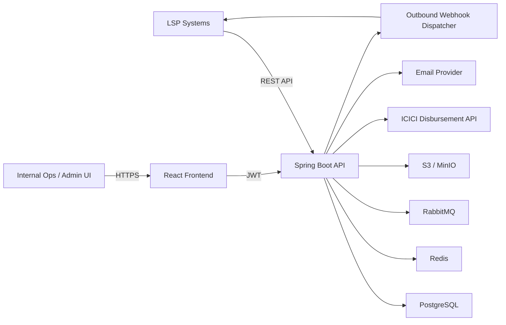

# LMS Blueprint

## 1. Goal

Build a multi-tenant Loan Management System (LMS) for multiple Loan Service Providers (LSPs) where:

- LSPs create and track loan applications through APIs and selected UI access.
- Internal ops/admin users manage the full loan lifecycle across all LSPs.
- The system sends outbound webhooks for status changes and integrates with ICICI for disbursement.
- Borrower, loan, repayment, document, and audit data stay segregated by LSP while still allowing internal "All LSPs" views.

This blueprint assumes a greenfield build with Spring Boot for the backend and React for the frontend.

## 1.1 Confirmed Business Decisions

The following decisions were confirmed on March 29, 2026:

- The "one open loan" rule is **global across all LSPs**.
- Borrower dedupe and uniqueness checks should use **PAN** as the primary identifier.
- All LSPs will integrate through **one standard LMS API**.
- ICICI integration is deferred initially; early phases should use a **mock disbursement API that returns success**.
- Day-one reporting includes one **MIS report** containing loan details, borrower details, and LSP details in tabular form.

## 2. Recommended Architecture

### Decision

Start with a **modular monolith backend** and a **separate React SPA frontend**.

### Why this is the right first shape

- Loan origination, servicing, repayment, foreclosure, reporting, and audit are tightly coupled.
- Multi-tenancy, permissioning, and cross-module transaction consistency matter more than independent deployment on day one.
- A modular monolith keeps delivery faster while still allowing future extraction of integrations, reporting, or notification services.

### Proposed stack

- Backend: Java 21, Spring Boot, Spring Security, Spring Data JPA, Flyway
- Frontend: React, React Router, shadcn-style components, and Tailwind CSS
- Database: PostgreSQL
- Cache and rate limiting: Redis
- Async processing: RabbitMQ
- Document storage: S3-compatible storage such as MinIO or AWS S3
- Email: SMTP or provider such as SES
- Observability: OpenTelemetry, Prometheus, Grafana, centralized logs

## 3. High-Level System Layout



## 4. Backend Module Boundaries

Use a package-by-feature or Gradle multi-module structure with clear domain boundaries:

1. `identity-access`
   Handles users, roles, permissions, API clients, auth tokens, password policy, and session control.
2. `tenant-lsp`
   Handles LSP master data, tenant settings, webhook endpoints, API credentials, and allowed products.
3. `loan-product`
   Handles product definitions, eligibility rules, pricing slabs, tenure, fees, and LSP mappings.
4. `borrower`
   Handles borrower master records, dedupe, KYC references, addresses, contacts, and borrower-LSP tagging.
5. `loan-origination`
   Handles inbound loan creation, validation, idempotency, application intake, and document linking.
6. `loan-lifecycle`
   Handles status transitions, assignment, decisioning checkpoints, audit trail, and lifecycle rules.
7. `loan-servicing`
   Handles approved loans, loan accounts, schedules, EMI tracking, delinquency, and closure.
8. `disbursement`
   Handles ICICI integration, payout requests, reconciliation, reversals, and error recovery.
9. `repayment`
   Handles payment events, repayment allocation, penalties, receipts, and schedule adjustments.
10. `foreclosure`
   Handles foreclosure quotes, approval, payoff calculation, and final closure.
11. `documents`
   Handles document metadata, storage references, checksum, access control, and retrieval logs.
12. `reporting`
   Handles asynchronous report generation, export files, email dispatch, and report history.
13. `webhooks`
   Handles outbound webhook subscriptions, signing, retry policy, dead-letter handling, and delivery logs.
14. `audit-observability`
   Handles audit events, actor/source tracking, alerts, and operational metrics.

## 5. Multi-Tenancy Model

### Decision

Use a **shared database, shared schema, tenant-tagged rows** model.

### Why

- Internal admins need a unified "All LSPs" view.
- Reporting across tenants is easier than schema-per-tenant.
- Product and borrower dedupe logic are easier when all data is in one logical store.

### Rules

- Every tenant-owned entity must carry `lsp_id`.
- All application-level queries must be tenant-scoped unless the user has internal cross-tenant permission.
- Every API request and UI action must resolve an `actor_context`:
  - `actor_type`: INTERNAL_USER, LSP_UI_USER, API_CLIENT, SYSTEM
  - `actor_id`
  - `lsp_scope`
  - `channel`: UI, API, WEBHOOK, SCHEDULER

### Optional hardening

- Add PostgreSQL Row-Level Security after the first stable release.
- Keep tenant filtering in both application logic and repository/query layer from day one.

## 6. Roles and Access Model

Define permissions, not only coarse roles.

### Suggested role bundles

- `SYSTEM_ADMIN`
  Full access to all tenants, products, users, reports, lifecycle, disbursement, and configuration.
- `OPS_USER`
  View all loans, update statuses, review documents, trigger reports, but no security administration.
- `PRODUCT_ADMIN`
  Manage loan products and LSP-product mappings.
- `LSP_UI_READ`
  Read-only access to that LSP's loans and reports.
- `LSP_UI_WRITE`
  Read-write UI access for that LSP's loans where allowed.
- `LSP_API_CLIENT`
  Write-only or write-dominant API scope used for loan intake, status fetch, and callback authentication.

### Minimum permission set

- `LOAN_READ`
- `LOAN_WRITE`
- `LOAN_STATUS_UPDATE`
- `PRODUCT_READ`
- `PRODUCT_WRITE`
- `USER_READ`
- `USER_WRITE`
- `REPORT_REQUEST`
- `REPORT_READ`
- `WEBHOOK_CONFIG_WRITE`
- `DISBURSEMENT_TRIGGER`
- `FORECLOSURE_TRIGGER`
- `ALL_LSP_VIEW`

## 7. Core Domain Model

### Main entities

- `lsp`
- `lsp_webhook_endpoint`
- `user`
- `role`
- `permission`
- `api_client`
- `loan_product`
- `loan_product_lsp_mapping`
- `borrower`
- `borrower_identifier`
- `borrower_lsp_tag`
- `loan_application`
- `loan_status_history`
- `loan_assignment`
- `loan_document`
- `loan_account`
- `disbursement_request`
- `repayment_schedule`
- `repayment_installment`
- `payment_transaction`
- `payment_allocation`
- `foreclosure_quote`
- `foreclosure_execution`
- `report_request`
- `report_file`
- `webhook_event`
- `webhook_delivery_attempt`
- `audit_event`

### Domain separation

- `loan_application` exists from intake until approval or rejection.
- `loan_account` is created only after approval or disbursement readiness, depending on final business rules.
- The loan detail page becomes a composed "Loan 360" view joining application, account, borrower, documents, schedules, payments, and audit history.

## 8. Borrower and Open-Loan Rule

### Borrower model

- Maintain a single borrower master where possible, deduped using mobile number, PAN, Aadhaar reference token, or another approved identifier strategy.
- Maintain borrower-to-LSP relationship through `borrower_lsp_tag`.

### Business rule

One borrower can have multiple historical LSP tags, but only one open loan at a time.

### Enforcement

- Define a loan as "open" if its status is in a configurable set such as:
  `INITIATED`, `UNDER_REVIEW`, `APPROVED`, `DISBURSEMENT_PENDING`, `DISBURSED`, `ACTIVE`, `DELINQUENT`, `FORECLOSURE_IN_PROGRESS`
- Reject new applications when an open loan already exists for the borrower.
- Persist this as both:
  - service-layer validation
  - a database-level protection, ideally through a partial unique index or locking strategy

This is confirmed as **one open loan globally across all LSPs**.

## 9. Loan Lifecycle Model

Use a controlled status machine, not free-text states.

### Recommended stages

- `ORIGINATION`
- `UNDERWRITING`
- `APPROVAL`
- `DISBURSEMENT`
- `SERVICING`
- `CLOSURE`

### Recommended statuses

- `INITIATED`
- `KYC_PENDING`
- `DOCS_PENDING`
- `UNDER_REVIEW`
- `APPROVED`
- `REJECTED`
- `DISBURSEMENT_PENDING`
- `DISBURSEMENT_IN_PROGRESS`
- `DISBURSED`
- `ACTIVE`
- `PARTIALLY_PAID`
- `DELINQUENT`
- `FORECLOSURE_REQUESTED`
- `FORECLOSURE_APPROVED`
- `FORECLOSED`
- `CLOSED`
- `CANCELLED`

### Transition control

Every status change must capture:

- previous status
- new status
- reason code
- free-text remarks
- actor and channel
- timestamp
- external correlation id if triggered by API

## 10. External API Strategy

### Inbound APIs from LSPs

Expose versioned REST endpoints:

- `POST /api/v1/lsp/loan-applications`
- `GET /api/v1/lsp/loan-applications/{externalLoanId}`
- `GET /api/v1/lsp/loans/{loanId}`
- `POST /api/v1/lsp/loan-applications/{loanId}/documents`
- `GET /api/v1/lsp/loans/{loanId}/repayment-schedule`
- `GET /api/v1/lsp/loans/{loanId}/payments`
- `POST /api/v1/lsp/loans/{loanId}/foreclosure-quote`

### Internal admin APIs

- `POST /api/v1/internal/loan-products`
- `PUT /api/v1/internal/loan-products/{id}`
- `POST /api/v1/internal/users`
- `PUT /api/v1/internal/users/{id}`
- `POST /api/v1/internal/loans/{loanId}/status`
- `POST /api/v1/internal/loans/{loanId}/disburse`
- `POST /api/v1/internal/reports`

### API design rules

- Use idempotency keys on create, disburse, and foreclosure endpoints.
- Keep both internal LMS loan id and LSP external loan id.
- All incoming payloads should be persisted with request audit metadata for traceability.
- Use one shared API contract for all LSPs.
- Define the shared contract explicitly through:
  - request and response JSON schemas
  - authentication method
  - required headers such as idempotency and correlation ids
  - error response format
  - webhook payload structure

In this context, "API contract" means the exact request, response, authentication, and error behavior that every LSP must integrate against.

## 11. Webhook Strategy

### Direction

The LMS sends outbound webhooks to LSP systems whenever major lifecycle events occur.

### Event types

- `loan.created`
- `loan.status.changed`
- `loan.disbursement.completed`
- `loan.disbursement.failed`
- `loan.repayment.posted`
- `loan.foreclosure.quote.generated`
- `loan.foreclosed`

### Delivery rules

- Use a webhook outbox table to avoid losing events.
- Sign payloads with HMAC.
- Retry with exponential backoff.
- Mark terminal failure after retry exhaustion and surface in ops alerts.
- Persist every delivery attempt with request, response, status code, and latency.

## 12. ICICI Disbursement Integration

Implement ICICI through an adapter pattern:

- `DisbursementProvider` interface
- `IciciDisbursementProvider` implementation

### Required behaviors

- request creation with idempotency key
- payout status polling or callback handling
- reconciliation job
- failure retry policy
- maker-checker approval if required by operations
- audit trail of full request-response lifecycle

Do not embed ICICI-specific payload rules directly inside loan services.

### Initial delivery note

Before the real ICICI integration is available, implement a `MockDisbursementProvider` that:

- accepts a disbursement request
- returns deterministic success
- records audit and request logs exactly like a real provider would

This keeps the servicing and lifecycle flows buildable without blocking on bank integration.

## 13. Repayment and EMI Tracking

### Model

- Generate a repayment schedule at approval or disbursement time.
- Persist installment-level due date, principal, interest, fees, penalty, paid amount, and outstanding amount.

### Payment flow

- Accept payment entries from integrations or internal uploads.
- Allocate payment according to a defined waterfall:
  penalty -> fees -> interest -> principal
- Recompute installment state after each payment.
- Track DPD and delinquency buckets.

## 14. Foreclosure

### Flow

1. Request foreclosure quote for a loan and an effective date.
2. Compute outstanding principal, accrued interest, charges, penalties, and prepayment fee.
3. Approve and execute foreclosure.
4. Post final settlement transaction.
5. Close the loan and emit webhook notifications.

### Important rule

The foreclosure quote must be versioned and time-bound because the payoff amount can change by date.

## 15. Reporting

### Reports expected in phase 1

- one MIS report
- the MIS report should include all loan details, borrower details, and LSP details in tabular format

### Execution model

- Reports should run asynchronously.
- Generate CSV first; add XLSX/PDF later if needed.
- Email the requesting user when the report is ready.
- If an additional recipient is provided, send to that recipient too.
- For large files, email a secure download link instead of attaching the file.

## 16. Frontend Architecture

Use React as a secure internal portal and selective LSP portal.

### Main screens

- login
- dashboard summary
- loan list
- loan detail
- product configuration
- user management
- reports
- webhook and integration monitoring

### UI behaviors

- Internal users can use `All LSPs` filter.
- LSP users only see allowed LSP-scoped data.
- Loan detail page should show:
  - application details
  - borrower details
  - LSP
  - product
  - documents
  - repayment schedule
  - payment history
  - status history
  - actor who last changed status

### Frontend implementation notes

- Use route guards for permissions.
- Use a central auth and actor-context store.
- Keep filter state and pagination in URL query params.
- Build a shared data table component with server-side filtering.

## 17. Suggested Repository Shape

```text
LMS/
  backend/
    build files
    modules/
      identity-access/
      tenant-lsp/
      loan-product/
      borrower/
      loan-origination/
      loan-lifecycle/
      loan-servicing/
      disbursement/
      repayment/
      foreclosure/
      documents/
      reporting/
      webhooks/
      shared-kernel/
  frontend/
react app
  infra/
    docker-compose
    db
    monitoring
  docs/
    architecture/
    planning/
    design/
```

## 18. Non-Functional Requirements

- Full audit logging for every data change and status change
- PII masking in logs and selected UI views
- Encryption at rest for documents and sensitive fields where required
- API rate limiting per LSP client
- Retry-safe outbound integrations
- Backup and restore plan
- UAT and production environment parity where possible
- Contract testing for LSP and ICICI integrations

## 19. Key Open Decisions

These decisions should be closed before implementation starts:

1. What are the exact request and response fields for the shared LSP API contract?
2. What authentication mechanism should LSP API clients use: API key, JWT, HMAC signature, or a combination?
3. Are documents stored inside LMS only as metadata plus file links, or does LMS fully own binary storage?
4. Do LSP users need a UI at launch, or should day one support only API clients plus internal UI?
