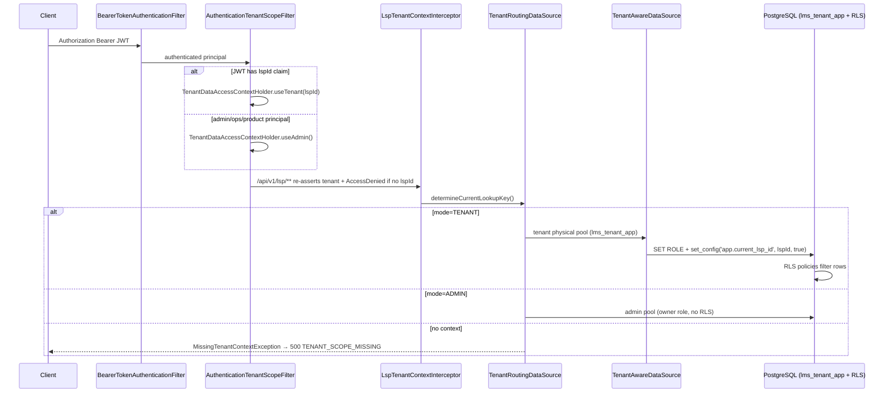

# Wave 1 Agent A2 — Tenant Isolation Architecture Audit

## 1. Exact scope reviewed

- All 13 classes under `/Users/siddhant/Desktop/lms/backend/src/main/java/com/bhawana/lms/tenant/`
- RLS Flyway migrations: `V41`, `V42`, `V43`, `V45`, `V71`, `V75`, `V113`
- All production call sites of `AdminScopedTransactionExecutor`, `TenantScopedExecution`, `TenantDataAccessContextHolder`, `TenantAccessContext`
- HTTP tenant provisioning: `AuthenticationTenantScopeFilter`, `LspTenantContextInterceptor`, `InternalAdminTenantContextInterceptor`, `TenantIsolationWebConfig`
- Cross-tenant dedupe paths: `BorrowerOnboardingService`, `BorrowerActiveLoanChecker`, `LoanApplicationOnboardingService`, `LspApiIdempotencyService` / `IdempotencyExecutionCoordinator`
- Scheduled workers (`@Scheduled`)
- D8 cross-check from `/Users/siddhant/Desktop/work/ferratum-products-specs-res/areas/bhawana/README.md` and `platform-setup/database-schema/spec.md`

**Out of scope (noted only):** frontend role guards; full review of every controller/service beyond tenant-context call sites.

---

## 2. Files and specifications inspected

| Category | Paths |
|----------|-------|
| Tenant package (13/13) | `TenantDataAccessContextHolder.java`, `TenantScopedExecution.java`, `AdminScopedTransactionExecutor.java`, `TenantRoutingDataSource.java`, `TenantAwareDataSource.java`, `TenantIsolationDataSourceConfig.java`, `TenantDataAccessBootstrap.java`, `TenantDataAccessJpaBootstrapConfiguration.java`, `TenantDataAccessMode.java`, `TenantAccessContext.java`, `MissingTenantContextException.java`, `TenantAwareDataSourceProperties.java`, `TenantDatasourceSecurityValidator.java` |
| RLS migrations | `V41__tenant_isolation_rls.sql`, `V42`, `V43`, `V45`, `V71`, `V75`, `V113` |
| Scope provisioning | `AuthenticationTenantScopeFilter.java`, `LspTenantContextInterceptor.java`, `InternalAdminTenantContextInterceptor.java`, `TenantIsolationWebConfig.java`, `SecurityFilterChainConfig.java`, `LspAuthenticationSupport.java` |
| Dedupe / admin escape | `BorrowerOnboardingService.java`, `BorrowerActiveLoanChecker.java`, `LoanApplicationOnboardingService.java`, `BorrowerBankDetailsService.java`, `IdempotencyExecutionCoordinator.java`, `LspApiIdempotencyService.java`, `SystemContextService.java` |
| Workers | `LoanDisbursementWorker.java`, `LoanDisbursementWorkerService.java`, `WebhookOutboxDispatchWorker.java`, `ReportRequestProcessingWorker.java`, `AlertRuleSchedulerWorker.java`, `IdempotencyRecordRetentionWorker.java`, `PortfolioKpiSnapshotWorker.java` |
| ADR / docs | `docs/adr/0005-tenant-scope-from-principal-fail-closed.md` |
| D8 spec | `ferratum-products-specs-res/areas/bhawana/README.md` (D8), `platform-setup/database-schema/spec.md` |
| Tests | `TenantIsolationPostgresIntegrationTest.java`, `TenantContextRegressionTest.java`, `TenantContextTestExecutionListener.java`, `AuthControllerTest.java` (referenced) |

---

## 3. Feature/workflow examined

- **D8 tenant isolation:** each partner sees only their data; Bhawana (admin roles) sees everything
- **LSP API request path:** JWT `lspId` → tenant scope → tenant datasource → `set_config('app.current_lsp_id')` → RLS
- **Admin/internal path:** non-LSP principals → admin scope → admin datasource (owner role, RLS bypass)
- **Cross-partner dedupe (D3):** PAN-global borrower directory + admin-scoped reads for `findByPan` and open-loan checks
- **Background workers:** explicit `TenantScopedExecution.callAsAdmin` at every `@Scheduled` entry point reviewed

---

## 4. End-to-end execution path

**LSP loan create (with idempotency):**

1. `LspLoanApplicationApiController.createApplication` validates `request.lspId()` == JWT `lspId` (lines 227–229)
2. Passes `authenticatedLspId` as `enforcedLspId` to lifecycle (lines 249–262)
3. `LspApiIdempotencyService.execute` flips to admin scope inside idempotency action (lines 37–44)
4. `LoanApplicationOnboardingService.createApplication` runs in `AdminScopedTransactionExecutor` REQUIRES_NEW tx (lines 94–95)
5. `BorrowerOnboardingService.resolveBorrowerForOnboarding` does global `findByPan` under admin tx (lines 51–55 comment, 69)
6. Response assembly uses tenant-scoped reads via filter-held tenant scope after admin tx completes

---

## 5. Relevant database objects

| Object | Role |
|--------|------|
| Role `lms_tenant_app` | Tenant connection identity; RLS policies target this role (`V41:181–221`) |
| `app_current_lsp_id()` | Reads `current_setting('app.current_lsp_id')::UUID` (`V41:148–153`) |
| `tenant_owns_application(uuid)`, `tenant_owns_loan_account(uuid)` | Child-table RLS helpers (`V41:155–177`) |
| RLS tables (23) | Per `spec.md:411` — core lending + `borrower_lsp_access` + `borrower_lsp_relationship` + `report_request` |
| `uk_borrower_pan` | Global PAN uniqueness (`V43:51`) — intentional cross-tenant identity |
| `uk_loan_application_lsp_external` | Per-LSP external loan id (`V6:23`) |
| `borrower_lsp_access` | Visibility bridge for shared global borrower (`V43:1–83`) |
| Admin-only tables (no RLS, no tenant GRANT) | `ops_alert` (`V45:6–9`), `disbursement_intent` (`V111`), `loan_delinquency_state` (`V101`), multiple audit tables |

---

## 6. Findings (with paths and line numbers)

### W1-A2-F01 — Hybrid enforcement: DB RLS + application routing (not discipline-only on Postgres prod)

**Evidence:** `V41` enables RLS on 17 core tables and creates per-`lsp_id` policies (`V41:223–367`). `TenantAwareDataSource` binds session GUC on every tenant connection (`TenantAwareDataSource.java:60–72`). `TenantRoutingDataSource` selects admin vs tenant pool (`TenantRoutingDataSource.java:11–24`).

**Answer Q1:** On PostgreSQL production, tenant isolation is **database-enforced (RLS) AND application-enforced (dual datasource + ThreadLocal scope)**. It is **not** application-discipline-only for the tenant role.

**Severity:** Informational (positive) | **Confidence:** High

---

### W1-A2-F02 — Admin-scoped escape hatch bypasses RLS by design

**Mechanism A — datasource routing:** Admin mode uses `adminDataSource` (owner credentials), which is not subject to `lms_tenant_app` RLS policies (`TenantIsolationDataSourceConfig.java:81–86`).

**Mechanism B — `AdminScopedTransactionExecutor`:** Sets admin scope **before** `REQUIRES_NEW` transaction acquires a connection (`AdminScopedTransactionExecutor.java:9–39`).

**Mechanism C — `TenantScopedExecution.callAsAdmin`:** Thread-local scope flip without necessarily opening a new transaction (`TenantScopedExecution.java:37–44`).

**Who invokes it (production):**

| Caller | Purpose |
|--------|---------|
| `LoanApplicationOnboardingService` | LSP intake under admin tx (`:94–95`) |
| `IdempotencyExecutionCoordinator` | LSP idempotency claim/execute (`:347, 400, 584`) |
| `BorrowerActiveLoanChecker` | Cross-LSP open-loan check (`:20–21, 61–66`) |
| `BorrowerOnboardingService` | Global PAN dedup (called inside admin tx; comment `:51–55`) |
| `BorrowerBankDetailsService` | Admin read + `hasVisibilityFor` gate (`:236–242, 253–258`) |
| `SystemContextService` | `app_user` lookup for LSP principals (`:24–33`) |
| `OpsAlertService`, `BorrowerPiiRevealAuditService`, `LspValidationAuditService`, `LocalBootstrapAdminSyncService` | Admin-only tables / cross-tenant ops |
| All `@Scheduled` workers reviewed | Cross-tenant batch processing |

**Leak if misused:** Yes. Any code calling `callAsAdmin` / `AdminScopedTransactionExecutor` without `enforcedLspId` or `hasVisibilityFor` can read/write **all tenants**. Documented compensating controls exist on intake (`LoanApplicationOnboardingService.java:110–113`, `BorrowerBankDetailsService.java:239–240`).

**Answer Q2:** Escape hatch = admin datasource + scope flip helpers. Invoked by **application code** (services/workers), not directly by HTTP callers. Misuse is a **privilege-escalation surface** mitigated by explicit app-level checks on known LSP write paths.

**Severity:** Medium (by design, guarded on known paths) | **Confidence:** High

---

### W1-A2-F03 — Cross-tenant dedupe intentionally bypasses RLS

**PAN dedup:** `BorrowerOnboardingService` documents that tenant RLS would hide other LSPs' borrowers and force duplicate PAN inserts (`BorrowerOnboardingService.java:51–55`). Runs `borrowerRepository.findByPan` under admin-scoped onboarding tx (`:69`).

**One-open-loan (D3):** `BorrowerActiveLoanChecker` states lookups "always run on the admin datasource" (`BorrowerActiveLoanChecker.java:20–21`). Uses `adminScopedTransactionExecutor.call` when caller is not already admin (`:61–66`).

**Global uniqueness:** `uk_borrower_pan` enforces one borrower row per PAN globally (`V43:51`).

**Integration proof:** `TenantIsolationPostgresIntegrationTest.samePanAcrossTwoLspsCreatesSeparateBorrowerSnapshotsAndTenantListsStayIsolated` — same PAN yields one `borrower` row, two applications, tenant lists isolated (`TenantIsolationPostgresIntegrationTest.java:213–258`).

**Severity:** Informational (required by D3/D8) | **Confidence:** High

---

### W1-A2-F04 — Tenant-adjacent tables without RLS (rely on admin-only access)

Per `platform-setup/database-schema/spec.md:413` and migration grants:

| Table | `lsp_id` column | Tenant GRANT | RLS |
|-------|-----------------|--------------|-----|
| `disbursement_intent` | via `loan_account_id` FK only | None (`V111`) | No |
| `loan_delinquency_state` | via `loan_application_id` | None (`V101`) | No |
| `borrower_pii_reveal_audit` | yes (`V102:4`) | None | No |
| `borrower_bank_details_update_audit` | yes (`V78:4`) | None | No |
| `loan_disbursement_bank_mismatch_log` | yes (`V78:26`) | None | No |
| `disbursement_outcome_audit` | — | None | No |
| `portfolio_kpi_snapshot` | — | None | No |
| `ops_alert` | — | **Intentionally** not granted (`V45:6–9`) | No |

**Answer Q3:** Yes — multiple tables holding tenant-correlated data lack RLS. Mitigation today: **no `GRANT` to `lms_tenant_app`**, so tenant connections cannot reach them. Admin/worker paths use admin datasource.

**Severity:** Low (current grants contain exposure) | **Confidence:** High

---

### W1-A2-F05 — Uniqueness constraints: mix of global (intentional) and per-tenant

| Constraint | Scope | Tenant-aware? | Evidence |
|------------|-------|---------------|----------|
| `uk_borrower_pan` | Global | **No** (by design — cross-partner identity) | `V43:51` |
| `uk_loan_application_lsp_external` | Per LSP | **Yes** | `V6:23` |
| `uk_borrower_lsp_relationship` | Per borrower+LSP | **Yes** | `V113:14` |
| `uk_loan_payment_transaction_idempotency_key` | Global on `idempotency_key` | **No** | `V92:6–7` |
| `loan_account.account_number` UNIQUE | Global | **No** | `V17:7` |
| `uk_disbursement_intent_tran_ref_no` | Global | N/A (admin-only table) | `V111:24` |

**Answer Q4:** Core business keys are tenant-aware where required (`external_loan_id` per LSP). Global PAN is intentional. **Potential gap:** payment `idempotency_key` is globally unique — two LSPs using the same key would conflict at DB level (may be acceptable if keys are UUIDs).

**Severity:** Low | **Confidence:** Medium (payment key collision is theoretical if UUID enforced at API)

---

### W1-A2-F06 — Workers without tenant context: fail-closed, not silent cross-tenant writes

Every reviewed `@Scheduled` entry wraps admin scope:

- `LoanDisbursementWorker.java:30` → `TenantScopedExecution.callAsAdmin`
- `LoanDisbursementWorkerService.processPendingStatusChecks` also wraps internally (`:127`)
- `WebhookOutboxDispatchWorker.java:35`, `ReportRequestProcessingWorker.java:35`, `AlertRuleSchedulerWorker.java:36`, `IdempotencyRecordRetentionWorker.java:39`, `PortfolioKpiSnapshotWorker` (grep)

Without scope: `TenantRoutingDataSource` throws `MissingTenantContextException` (`TenantRoutingDataSource.java:17–21`), mapped to HTTP 500 `TENANT_SCOPE_MISSING` (`GlobalExceptionHandler.java:502–520`). Regression test confirms (`TenantContextRegressionTest.java:47–59`).

**Answer Q5:** A worker **cannot** silently use wrong tenant data — it either runs under explicit admin scope (seeing all tenants, by design) or **fails closed**.

**Severity:** Informational (positive) | **Confidence:** High

---

### W1-A2-F07 — Fail-open / fail-soft paths

| Path | Behavior | Evidence |
|------|----------|----------|
| **Non-PostgreSQL JDBC** | Tenant pool collapses to admin pool — **no RLS, no tenant role** | `TenantIsolationDataSourceConfig.java:35–37` |
| **JPA/Flyway bootstrap** | Routes to ADMIN when `TenantDataAccessBootstrap.isActive()` | `TenantRoutingDataSource.java:14–15`, `TenantDataAccessJpaBootstrapConfiguration.java:10–24` |
| **Borrower INSERT RLS policy** | `WITH CHECK (app_current_lsp_id() IS NOT NULL)` only — insert allowed before `borrower_lsp_access` row exists | `V45:34–37` (documented rationale `:3–4`) |
| **Test profile** | `TestTenantContextRestoreFilter` forces admin after every request | `TestTenantContextRestoreFilter.java:16–35` (`@Profile("test")`) |
| **Anonymous requests** | Left unscoped; data access throws (fail-closed, not fail-open to admin) | `AuthenticationTenantScopeFilter.java:22–23, 47–50` |

**Answer Q6:** Production Postgres path is **fail-closed** for missing scope. **Fail-open equivalents:** H2/non-Postgres dev profile (single admin pool), bootstrap window (infra only), permissive borrower INSERT policy (mitigated by subsequent visibility grant in same tx).

**Severity:** Medium (non-Postgres profile) / Low (others) | **Confidence:** High

---

### W1-A2-F08 — Principal-derived scope aligns with D8; LSP cannot hold admin scope

`AuthenticationTenantScopeFilter`: JWT with `lspId` → tenant; else → admin (`AuthenticationTenantScopeFilter.java:52–57`). ADR 0005 decision 1 and 4 (`docs/adr/0005-tenant-scope-from-principal-fail-closed.md:15–18`).

D8 from ferratum README: "**Tenant isolation** — each partner sees only their data; Bhawana sees everything" (`README.md:50`) — **matches** implementation.

LSP API additionally enforces `enforcedLspId` on create (`LoanApplicationOnboardingService.java:110–113`, `LspLoanApplicationApiController.java:227–229`).

**Severity:** Informational | **Confidence:** High

---

### W1-A2-F09 — LSP write paths run admin datasource despite tenant-scoped HTTP request

`LspApiIdempotencyService.runUnderAdminScope` flips to admin before onboarding action (`LspApiIdempotencyService.java:37–44`). Idempotency coordinator wraps LSP execute in `adminScopedTransactionExecutor.call` (`IdempotencyExecutionCoordinator.java:347`).

**Inferred rationale:** Cross-partner PAN dedup + idempotency race safety require admin visibility within the same logical LSP request.

**Risk:** Defense relies on `enforcedLspId` + `hasVisibilityFor`, not RLS, during these writes.

**Severity:** Medium (compensated) | **Confidence:** High

---

### W1-A2-F10 — `app.current_lsp_id` empty string fails loudly (not silent empty result)

`TenantAwareDataSource` sets `""` when `lspId == null` (`TenantAwareDataSource.java:60–61`). `app_current_lsp_id()` hard-casts to UUID (`V41:152`). Integration test expects UUID parse error (`TenantIsolationPostgresIntegrationTest.java:423–431`). `V45:11–14` documents intentional loud failure.

**Severity:** Informational (positive) | **Confidence:** High

---

## 7. Tests inspected

| Test | What it proves |
|------|----------------|
| `TenantIsolationPostgresIntegrationTest` | Cross-LSP RLS isolation; same-PAN shared borrower; fail-closed on null `lspId`; report_request RLS |
| `TenantContextRegressionTest` | Missing context throws; `callAsAdmin` works and restores |
| `TenantContextTestExecutionListener` | Test harness defaults to admin unless `@RequiresEmptyTenantContext` |
| `AuthControllerTest` (referenced in docs) | `SystemContextService` admin-scope-before-tx regression |
| `BorrowerLspRelationshipServiceTest` | Relationship dual-write under admin scope |

**Gap:** No automated test found that asserts a **misconfigured** `AdminScopedTransactionExecutor` call leaks cross-tenant data.

---

## 8. Commands/checks performed

- Glob: all files in `backend/src/main/java/com/bhawana/lms/tenant/` (13 files)
- Grep: `ROW LEVEL SECURITY|CREATE POLICY|set_config|app.current_lsp` in `backend/`
- Grep: all call sites of `AdminScopedTransactionExecutor`, `TenantScopedExecution`, `TenantDataAccessContextHolder`, `TenantAccessContext`
- Grep: `ENABLE ROW LEVEL SECURITY`, `GRANT.*tenant_app_role`, `UNIQUE`, `@Scheduled`
- Read: tenant package, security filters, interceptors, ADR 0005, D8 README, database schema spec tenancy section, key services and migrations

**Not run:** `mvn test`, live Postgres connection, Flyway apply.

---

## 9. Documented rationale found

| Source | Rationale |
|--------|-----------|
| `BorrowerOnboardingService.java:51–55` | Admin scope needed so `findByPan` sees cross-LSP borrowers |
| `BorrowerActiveLoanChecker.java:20–21` | Cross-LSP open-loan check requires admin datasource |
| `V45:1–14` | Borrower INSERT policy permissive; ops_alert intentionally off tenant role; empty GUC should error |
| `V71:1–10` | report_request RLS defense-in-depth; global rows admin-only |
| `V43:1–83` | Global borrower + `borrower_lsp_access` visibility bridge |
| `docs/adr/0005` | Principal-derived scope; fail-closed; pre-auth lookups use explicit admin |
| `platform-setup/database-schema/spec.md:105–107, 403–413` | Admin vs tenant datasource; 23 RLS tables; non-RLS tables rely on grants |
| D8 `README.md:50` | Partners isolated; Bhawana sees all |

---

## 10. Inferred rationale (labeled)

- **LSP intake uses admin tx despite tenant HTTP scope** — enables D3 cross-partner checks without splitting transactions; compensated by `enforcedLspId`.
- **Non-Postgres single pool** — local/H2 dev convenience; production intended to be PostgreSQL-only.
- **Bootstrap ADMIN routing** — Hibernate/Flyway need connections before HTTP interceptors; limited to init threads.
- **Global payment idempotency key** — partners likely use UUID idempotency keys, making global uniqueness acceptable.

---

## 11. Missing/contradictory evidence

| Item | Status |
|------|--------|
| Production deployment always uses `jdbc:postgresql:` | **Not verified** in this audit (config files not exhaustively read) |
| Every future table migration adds RLS or withholds tenant GRANT | **Not verified** — only migrations through V113 reviewed |
| `loan_payment_transaction.idempotency_key` API always UUID | **Not verified** at controller layer |
| D8 dedicated feature spec (vs README one-liner) | **No standalone D8 spec** — only inherited decision in README; detailed mechanics in `database-schema/spec.md` |
| Contradiction: `TenantIsolationPostgresIntegrationTest` line 236 expects `borrowerRepository.count() == 1` under test admin default — consistent with shared global borrower model, not a contradiction |

---

## 12. Severity + confidence summary

| ID | Severity | Confidence |
|----|----------|------------|
| W1-A2-F01 | Info | High |
| W1-A2-F02 | Medium | High |
| W1-A2-F03 | Info | High |
| W1-A2-F04 | Low | High |
| W1-A2-F05 | Low | Medium |
| W1-A2-F06 | Info | High |
| W1-A2-F07 | Medium (non-PG) / Low | High |
| W1-A2-F08 | Info | High |
| W1-A2-F09 | Medium | High |
| W1-A2-F10 | Info | High |

**Overall posture:** Strong on PostgreSQL production path. Primary residual risk is **admin escape hatch misuse** on new code paths, not tenant RLS bypass by the tenant role itself.

---

## 13. Recommended changes

1. **W1-A2-F02/F09:** Add a static/architecture test or checklist gate: any new `AdminScopedTransactionExecutor` / `callAsAdmin` usage in LSP-facing code must pair with `enforcedLspId` or `hasVisibilityFor` (mirror `LoanApplicationOnboardingService` / `BorrowerBankDetailsService` patterns).

2. **W1-A2-F04:** For new tenant-correlated audit tables (`borrower_pii_reveal_audit`, bank mismatch logs), either add RLS + selective tenant GRANT or document as admin-only in a single registry (spec already partially does this).

3. **W1-A2-F07:** Fail startup (not silent collapse) when `spring.datasource.url` is not PostgreSQL outside `local`/`test` profiles — `TenantIsolationDataSourceConfig.java:35–37` currently aliases tenant to admin without alarm.

4. **W1-A2-F05:** Confirm payment API requires UUID idempotency keys; if not, consider composite unique `(lsp_id, idempotency_key)` on `loan_payment_transaction`.

5. **D8 spec gap:** Add a short platform spec for tenant isolation covering escape hatches, dedupe paths, and worker contract (referenced in `outputs/bhawana-spec-implementation-review-2026-07-30/DELIVERABLE-1-INVENTORY.md`).

---

## 14. Wider context questions

1. Is production **guaranteed** PostgreSQL-only (no Supabase pooler / H2 fallback in any environment)?
2. Should LSP staff UI ever get **tenant datasource reads** for ops dashboards, or remain admin-scoped with query filters?
3. When will `borrower_lsp_access` cut over fully to `borrower_lsp_relationship` for visibility (dual-write status in `BorrowerLspRelationshipService.java:77–79`)?
4. Are payment/foreclosure idempotency keys contractually UUID across all partners?

---

## 15. Areas not reviewed

- Frontend role guards (explicitly out of scope)
- Every controller/service not on tenant-context call-site list
- Hibernate entity-level filters
- Network / infra isolation (VPC, secrets rotation beyond `TenantDatasourceSecurityValidator`)
- Supabase pooler `SET ROLE` path behavior under load (`TenantIsolationDataSourceConfig.java:44–48, 73–78`)
- Full 52-table grant matrix beyond grep samples
- Async `@Async` thread propagation (ADR notes ThreadLocal does not propagate — individual async entry points not exhaustively traced)

---

## Direct answers to audit questions

| # | Question | Answer |
|---|----------|--------|
| 1 | DB-enforced or app-only? | **Both** on Postgres prod: RLS for `lms_tenant_app` + app routing/scope |
| 2 | Admin escape hatch? | Admin datasource + `AdminScopedTransactionExecutor` / `callAsAdmin`; invoked by services/workers; **can leak** if used without LSP guards |
| 3 | Tenant tables without RLS? | **Yes** — several audit/workflow tables; mitigated by no tenant GRANT |
| 4 | Tenant-aware uniqueness? | **Mostly yes**; global PAN and some idempotency keys are intentional/global |
| 5 | Worker without tenant context? | **Fails closed** (`MissingTenantContextException`); workers use explicit admin scope |
| 6 | Fail-open paths? | **Non-Postgres profile** (admin-only pool); bootstrap admin routing; permissive borrower INSERT policy |

[REDACTED]