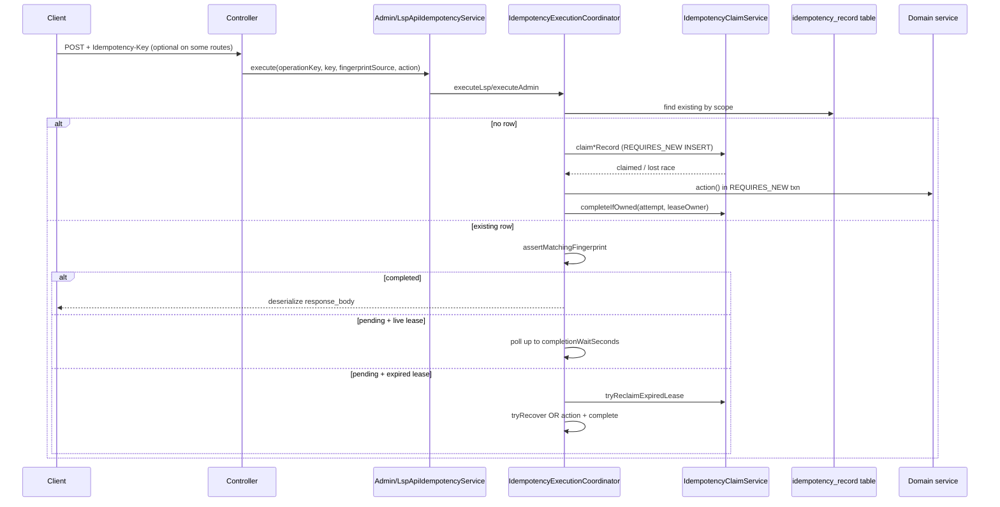

# Wave 1 Agent A3 — Idempotency Framework Audit (READ-ONLY)

## 1. Exact scope reviewed

- **Framework services** under `/Users/siddhant/Desktop/lms/backend/src/main/java/com/bhawana/lms/service/`:
  - `IdempotencyClaimService`, `IdempotencyExecutionCoordinator`, `IdempotencyRecoveryService`, `IdempotencyResultReconstructor` (interface), `IdempotencyFingerprinter`, `IdempotencyKeyValidator`, `IdempotencyRecordState`, `IdempotencyProperties`, `IdempotencyRecordRetentionWorker`, `IdempotencyMetrics`
  - Facades: `AdminApiIdempotencyService`, `LspApiIdempotencyService`
- **Domain**: `AdminApiIdempotencyRecord`, `LspApiIdempotencyRecord`
- **Repositories**: `AdminApiIdempotencyRecordRepository`, `LspApiIdempotencyRecordRepository` (lease SQL)
- **Migrations**: V40, V41 (RLS on LSP table), V56, V92, V103, V112; related payment/disbursement: V111
- **Controllers** wiring idempotency + payment alternate path
- **Crash recovery**: `LoanApplicationCreateIdempotencyReconstructor`
- **Disbursement intent** interaction (`tran_ref_no`, `disbursement_intent`)
- **Tests** for race, lease reclaim, crash recovery, retention, payments
- **Docs**: `docs/database-audit-report-2026-07-03.md`, `docs/deferred-implementation.md`, `docs/BRD-executive-brief.md`, `docs/implementation-log.md`, `CONTEXT.md` (disbursement attempt note only)

---

## 2. Files/specs inspected

| Category | Paths |
|---|---|
| Core coordinator | `/Users/siddhant/Desktop/lms/backend/src/main/java/com/bhawana/lms/service/IdempotencyExecutionCoordinator.java` |
| Claim/lease | `IdempotencyClaimService.java`, `AdminApiIdempotencyRecordRepository.java`, `LspApiIdempotencyRecordRepository.java` |
| Facades | `AdminApiIdempotencyService.java`, `LspApiIdempotencyService.java` |
| Recovery | `IdempotencyRecoveryService.java`, `LoanApplicationCreateIdempotencyReconstructor.java` |
| Retention/metrics | `IdempotencyRecordRetentionWorker.java`, `IdempotencyProperties.java`, `IdempotencyMetrics.java` |
| Payment path | `LoanRepaymentCommandService.java`, `LoanServicingSupportService.java` |
| Disbursement | `DisbursementIntentWorkflowService.java`, `V111__disbursement_intent.sql` |
| Migrations | `V40__lsp_api_idempotency.sql`, `V103__admin_api_idempotency.sql`, `V112__idempotency_lease.sql`, `V92__loan_payment_idempotency_fingerprint_and_unique.sql` |
| Config | `backend/src/main/resources/application.yml` (lines 228–234) |
| Controllers | 11 controllers using `*IdempotencyService` (see §4) |
| Tests | 10 idempotency-focused test classes (see §7) |
| Docs | `docs/database-audit-report-2026-07-03.md` (F-Q6, F-Q8), `docs/BRD-executive-brief.md` (BR-5), `docs/deferred-implementation.md`, `docs/implementation-log.md` |

**No ADR** matching `idempotency` in `/Users/siddhant/Desktop/lms/docs/adr/`.

---

## 3. Feature/workflow

Three parallel idempotency mechanisms:

1. **LSP API idempotency table** (`lsp_api_idempotency_record`) — scoped by `(lsp_id, operation_key, idempotency_key)`.
2. **Admin API idempotency table** (`admin_api_idempotency_record`) — scoped by `(operation_key, idempotency_key)`.
3. **Payment row idempotency** (`loan_payment_transaction.idempotency_key` UNIQUE + `request_fingerprint`) — separate from API tables.

**Claim-first lease workflow** (V112):

- Insert pending row (`response_body = {"__idempotencyPending":true}`, `lease_owner`, `lease_expires_at`, `attempt=1`) via `REQUIRES_NEW` claim.
- Execute business action + complete row in a second `REQUIRES_NEW` admin-scoped transaction (atomic pair).
- Replay: fingerprint check → if completed, deserialize stored JSON → if pending + live lease, poll → if expired lease, reclaim (`attempt++`) → recovery or re-execute.
- Failure before complete: `releasePending*` deletes owned pending row.

**Disbursement bank idempotency** is a fourth layer: `disbursement_intent.tran_ref_no` (deterministic from intent UUID) is the bank-facing key, independent of HTTP `Idempotency-Key`.

---

## 4. End-to-end path



**Operation keys in production controllers** (evidence: controller constants):

| Scope | Operation keys |
|---|---|
| LSP | `LOAN_APPLICATION_CREATE`, `LOAN_APPLICATION_INVALIDATION`, `LOAN_DOCUMENT_*`, `FORECLOSURE_EXECUTE`, `API_CLIENT_CREATE`, `API_CLIENT_ROTATE` |
| Admin | `OPS_DISBURSEMENT_*`, `OPS_FORECLOSURE_EXECUTE`, `OPS_STATUS_*`, `PRODUCT_*`, `USER_*`, `LSP_*`, allowlist creates, `ALERT_*`, `REPORT_REQUEST_CREATE` |

**Idempotency-Key header behavior**:

| Pattern | Endpoints |
|---|---|
| **Required** (validator throws if missing) | LSP invalidate, LSP foreclosure execute, payments (ops + LSP), API client create/rotate when key provided path used |
| **Optional** (`required=false`; no key → bypass framework) | LSP create, LSP documents, admin disbursement/foreclosure/status, most admin mutators |
| **Always required at service layer** | `LoanRepaymentCommandService` via `requireIdempotencyKey` |

---

## 5. DB objects

| Object | Purpose |
|---|---|
| `lsp_api_idempotency_record` (V40) | LSP mutation replay cache |
| `uk_lsp_api_idempotency_scope` | `UNIQUE (lsp_id, operation_key, idempotency_key)` |
| `admin_api_idempotency_record` (V103) | Admin mutation replay cache |
| `uk_admin_api_idempotency_scope` | `UNIQUE (operation_key, idempotency_key)` |
| Lease cols (V112) | `lease_owner`, `lease_expires_at`, `attempt` on both tables |
| Partial indexes (V112) | `idx_*_pending_lease` WHERE pending body |
| `loan_payment_transaction.idempotency_key` | Global UNIQUE (V92) |
| `loan_payment_transaction.request_fingerprint` | Payload mismatch detection (V92) |
| `disbursement_intent.tran_ref_no` | `UNIQUE` bank reference (V111) |
| `uk_disbursement_intent_live_account` | One live intent per loan account |

**Pending sentinel** (no extra status column):

```9:16:/Users/siddhant/Desktop/lms/backend/src/main/java/com/bhawana/lms/service/IdempotencyRecordState.java
    static final String PENDING_RESPONSE_BODY = "{\"__idempotencyPending\":true}";
    static final int PENDING_RESPONSE_STATUS = 0;
    ...
    static boolean isPending(String responseBody) {
        return PENDING_RESPONSE_BODY.equals(responseBody);
    }
```

---

## 6. Findings (evidence-backed)

### W1-A3-F01 — Optional idempotency on money-moving endpoints (HIGH)
**Evidence**: Admin disbursement initiates only when key present; without key calls `doInitiateDisbursement` directly.

```448:459:/Users/siddhant/Desktop/lms/backend/src/main/java/com/bhawana/lms/web/LoanApplicationOpsController.java
        if (idempotencyKey == null || idempotencyKey.isBlank()) {
            return doInitiateDisbursement(authentication, applicationId);
        }
        return adminApiIdempotencyService.execute(
                OPS_DISBURSEMENT_INITIATE,
```

Same optional pattern: `OPS_FORECLOSURE_EXECUTE`, `OPS_STATUS_TRANSITION`, LSP `createApplication` (lines 231–232). **Contradicts** BR-5 (“Every LSP-API mutation must carry an idempotency key”) in `docs/BRD-executive-brief.md` line 225.

### W1-A3-F02 — Crash recovery limited to loan create (HIGH)
Only one `IdempotencyResultReconstructor`: `LoanApplicationCreateIdempotencyReconstructor` (`OPERATION_KEY = LOAN_APPLICATION_CREATE`). On lease reclaim for unsupported ops:

```333:344:/Users/siddhant/Desktop/lms/backend/src/main/java/com/bhawana/lms/service/IdempotencyExecutionCoordinator.java
        if (attemptRecovery && !idempotencyRecoveryService.supports(operationKey, responseType)) {
            ...
            throw new ApiConflictException(
                    "IDEMPOTENCY_RECOVERY_REQUIRED",
                    "The prior request outcome cannot be reconstructed automatically. Escalate for reconciliation."
            );
```

Disbursement, foreclosure, invalidate, payments have **no** reconstructor. Post-crash reclaim for those ops escalates to manual reconciliation or (if recovery unsupported path not hit) risks re-execution.

### W1-A3-F03 — Retention purges pending rows (MEDIUM)
`IdempotencyRecordRetentionWorker` deletes by `created_at < cutoff` with **no** pending filter:

```42:45:/Users/siddhant/Desktop/lms/backend/src/main/java/com/bhawana/lms/service/IdempotencyRecordRetentionWorker.java
        Instant cutoff = Instant.now().minus(retentionDays, ChronoUnit.DAYS);
        long lspRecords = lspApiIdempotencyRecordRepository.deleteByCreatedAtBefore(cutoff);
        long adminRecords = adminApiIdempotencyRecordRepository.deleteByCreatedAtBefore(cutoff);
```

Default retention 90 days (`IdempotencyProperties`, `application.yml`). Stuck pending claims older than 90d are deleted; replay protection for that key is lost.

### W1-A3-F04 — Payment path JVM-local lock (MEDIUM)
```167:186:/Users/siddhant/Desktop/lms/backend/src/main/java/com/bhawana/lms/service/LoanRepaymentCommandService.java
        synchronized (idempotencyKey.intern()) {
            Optional<LoanPaymentTransaction> existingPayment = readOnlyRequiresNewTemplate.execute(
                    status -> loanPaymentTransactionRepository.findFirstByIdempotencyKeyOrderByCreatedAtAsc(idempotencyKey)
            );
            ...
            return transactionTemplate.execute(status -> createInstallmentPayment(...));
        }
```

Multi-replica safety relies on DB `uk_loan_payment_transaction_idempotency_key`, not the `synchronized` block. Race tests exist but are not multi-JVM.

### W1-A3-F05 — Layered but decoupled disbursement keys (LOW–MEDIUM, informational)
API idempotency (`OPS_DISBURSEMENT_INITIATE`) and bank idempotency (`tran_ref_no` from intent UUID) are independent:

```90:94:/Users/siddhant/Desktop/lms/backend/src/main/java/com/bhawana/lms/service/DisbursementIntentWorkflowService.java
        UUID intentId = UUID.randomUUID();
        DisbursementIntent intent = new DisbursementIntent(
                intentId,
                loanAccount,
                DisbursementIntentReference.deriveTranRefNo(intentId),
```

Without API idempotency key, duplicate `initiateDisbursement` calls can hit `DISBURSEMENT_ALREADY_REQUESTED` if first intent is live, but not if first attempt failed before intent commit.

### W1-A3-F06 — Fingerprint mismatch handling is correct (POSITIVE)
```595:601:/Users/siddhant/Desktop/lms/backend/src/main/java/com/bhawana/lms/service/IdempotencyExecutionCoordinator.java
    private static void assertMatchingFingerprint(String storedFingerprint, String requestFingerprint) {
        if (!storedFingerprint.equals(requestFingerprint)) {
            throw new ApiConflictException(
                    "IDEMPOTENCY_CONFLICT",
                    "Idempotency-Key has already been used for a different request."
            );
```

Payment path mirrors this at `LoanRepaymentCommandService.resolveExistingPayment` lines 287–292. SHA-256 over canonical JSON (`IdempotencyFingerprinter`); collision risk is cryptographically negligible.

### W1-A3-F07 — Lease fencing is sound (POSITIVE)
`completeIfOwned` requires matching `id`, `attempt`, `leaseOwner`, pending body (`AdminApiIdempotencyRecordRepository` lines 48–70). `IdempotencyLeaseReclaimTest` proves stale worker cannot complete after reclaim (lines 80–92).

### W1-A3-F08 — Action+complete atomicity (POSITIVE)
`executeClaimedLsp/Admin` wraps `action.get()` and `complete*OrThrow` in one `AdminScopedTransactionExecutor.call` (`REQUIRES_NEW`) — lines 347–370, 400–423. Crash mid-txn rolls back both.

### W1-A3-F09 — Stored HTTP status always 200 (LOW)
`completeLspOrThrow` always passes `200` (lines 430–431). Error responses are not cached idempotently; failed validations re-run on replay (by design for API table path).

### W1-A3-F10 — Money endpoints without any idempotency (HIGH)
| Endpoint | Path | Risk |
|---|---|---|
| LSP repayment schedule upsert | `PUT /api/v1/lsp/loan-applications/{id}/repayment-schedule` | Schedule rewrite |
| Ops application create | `POST /api/v1/internal/ops/loan-applications` | Duplicate onboarding |
| Foreclosure quote (not execute) | ops + LSP | Quote duplication (lower $ risk) |
| Borrower bank-details patch | admin + LSP | Pre-disbursement mutation |
| Webhook dispatch/redrive | admin | Operational, not ledger |

### W1-A3-F11 — No tests for `IDEMPOTENCY_IN_PROGRESS` / `IDEMPOTENCY_RECOVERY_REQUIRED` (MEDIUM)
Grep across `backend/src/test`: **zero** matches for these error codes.

### W1-A3-F12 — PII in idempotency `response_body` (MEDIUM, lifecycle)
Documented in `docs/database-audit-report-2026-07-03.md` F-N4 / F-Q8: serialized responses may contain PII; 90d purge bounds exposure but is not a financial audit trail.

---

## 7. Tests

| Test class | What it proves |
|---|---|
| `LspApiIdempotencyServiceRaceTest` | 5-way concurrent same key → single record; fingerprint mismatch → `IDEMPOTENCY_CONFLICT`; serialization failure rolls back business writes |
| `IdempotencyLeaseReclaimTest` | Expired lease reclaim; attempt increment; stale worker `completeIfOwned` fails |
| `IdempotencyCrashRecoveryIntegrationTest` | Expired pending `LOAN_APPLICATION_CREATE` recovers committed application without duplicate |
| `IdempotencyRecordRetentionWorkerTest` | 120d-old rows purged; fresh rows kept |
| `AdminApiIdempotencyIntegrationTest` | Admin ops replay (disbursement, status, alerts, reports, users) |
| `Issue86RepaymentIdempotencyIntegrationTest` | Payment same-key replay; mismatch conflict; concurrent same-key |
| `LoanRepaymentConcurrencyIntegrationTest` | Concurrent payments (different keys) |
| `LspLoanApplicationApiControllerTest` | Invalidate requires key; fingerprint conflict message |
| `LspLoanDocumentUploadIdempotencyIntegrationTest` | Document upload replay |
| `Issue74LspForeclosureExecuteIntegrationTest` | Foreclosure execute idempotency |
| `IdempotencyMetricsTest` | Pending gauges |

**Gaps**: multi-replica lease reclaim integration, disbursement/foreclosure crash recovery, `IDEMPOTENCY_IN_PROGRESS` polling timeout, admin reclaim parity (only LSP lease unit test).

---

## 8. Commands

Read-only inspection commands useful for replay:

```bash
# Run idempotency-focused tests
cd /Users/siddhant/Desktop/lms/backend && mvn -q test \
  -Dtest=IdempotencyLeaseReclaimTest,LspApiIdempotencyServiceRaceTest,\
IdempotencyCrashRecoveryIntegrationTest,IdempotencyRecordRetentionWorkerTest,\
AdminApiIdempotencyIntegrationTest,Issue86RepaymentIdempotencyIntegrationTest

# Inspect pending claims (Postgres)
psql "$DATABASE_URL" -c "
  SELECT operation_key, idempotency_key, lease_owner, lease_expires_at, attempt, created_at
  FROM lsp_api_idempotency_record
  WHERE response_body = '{\"__idempotencyPending\":true}'
  ORDER BY created_at;
"

# Config defaults
grep -A6 'idempotency:' /Users/siddhant/Desktop/lms/backend/src/main/resources/application.yml
```

---

## 9. Documented rationale

| Source | Rationale |
|---|---|
| `docs/database-audit-report-2026-07-03.md` F-Q6 | Claim-before-execute fix for LSP/admin API idempotency; residual risk if action succeeds outside claim txn (partially mitigated by atomic action+complete) |
| `docs/database-audit-report-2026-07-03.md` F-Q8 | 90d idempotency purge intentional; broader audit retention still deferred |
| `docs/deferred-implementation.md` | Retention beyond idempotency explicitly deferred (S13/S14 area) |
| `docs/BRD-executive-brief.md` BR-5 | States all LSP mutations require idempotency key |
| `IdempotencyRecordState` javadoc | Pending sentinel avoids status-column migration |
| `backend/README.md` | Disbursement intent workflow separate from inline path |
| `docs/implementation-log.md` | References shared `REQUIRES_NEW` transaction for idempotency completion |

**No ADR** in `docs/adr/` for idempotency design.

---

## 10. Inferred rationale (labeled)

- **Optional idempotency headers**: Likely backward compatibility / gradual rollout — controllers branch on `key == null` rather than enforcing at framework boundary. *[Inferred — no ADR]*
- **Separate payment idempotency**: Payments predate unified framework; payment row is system-of-record, API table would be redundant. *[Inferred from V56/V92 vs V40 timeline]*
- **`lease_owner = HOSTNAME`**: Per-pod fencing in K8s. *[Inferred from `IdempotencyProperties.defaultLeaseOwner()`]*
- **Single reconstructor (loan create)**: Highest-volume partner onboarding + `external_loan_id` natural key makes recovery tractable. *[Inferred — no doc]*
- **`tran_ref_no` from intent UUID**: Bank-grade deterministic idempotency independent of client header discipline. *[Inferred — aligns with V111 + README]*

---

## 11. Missing/contradictory evidence

| Item | Status |
|---|---|
| ADR for idempotency framework | **Missing** |
| BR-5 “all LSP mutations require key” vs optional create/documents | **Contradictory** |
| Test for `IDEMPOTENCY_RECOVERY_REQUIRED` on disbursement reclaim | **Missing** |
| Test for `IDEMPOTENCY_IN_PROGRESS` + `Retry-After` header | **Missing** (handler supports it at `GlobalExceptionHandler` 181–183) |
| Policy doc: minimum retention for financial dispute replay | **Missing** (only 90d default) |
| `graphify-out/GRAPH_REPORT.md` | **Missing/stale** (not found) |
| OpenAPI contract: which endpoints require key | **Not verified in this pass** |

---

## 12. Severity + confidence

| ID | Severity | Confidence | Summary |
|---|---|---|---|
| W1-A3-F01 | **High** | High | Optional keys on disbursement/foreclosure/LSP create |
| W1-A3-F02 | **High** | High | Recovery only for loan create |
| W1-A3-F03 | **Medium** | High | Retention deletes pending |
| W1-A3-F04 | **Medium** | High | Payment `synchronized` not cross-replica |
| W1-A3-F05 | **Low–Medium** | High | Decoupled disbursement keys |
| W1-A3-F06 | — (positive) | High | Fingerprint mismatch → 409 |
| W1-A3-F07 | — (positive) | High | Lease attempt fencing |
| W1-A3-F08 | — (positive) | High | Action+complete same txn |
| W1-A3-F09 | **Low** | High | Always store HTTP 200 |
| W1-A3-F10 | **High** | High | Schedule upsert, ops create unprotected |
| W1-A3-F11 | **Medium** | High | Missing in-progress/recovery tests |
| W1-A3-F12 | **Medium** | Medium | PII in response bodies + 90d purge |

**Overall lease safety (Q1)**: **Yes, with caveats** — DB-backed claim, attempt-fenced completion, and expired-lease reclaim are multi-replica safe for the API table path. Caveats: recovery gap (F02), optional keys (F01), payment JVM lock (F04).

---

## 13. Recommended changes

1. **Enforce required `Idempotency-Key`** on all money-moving routes (disbursement initiate, foreclosure execute, LSP create) — align code with BR-5 or update BR-5.
2. **Add reconstructors** (or idempotent domain guards) for `OPS_DISBURSEMENT_INITIATE`, `FORECLOSURE_EXECUTE`, `LOAN_APPLICATION_INVALIDATION` — at minimum return existing intent/quote/payment by business key.
3. **Retention**: exclude `response_body = pending` from purge OR alert + manual review before deleting pending rows; document retention vs dispute window.
4. **Payment path**: remove `synchronized(idempotencyKey.intern())`; rely on claim-first insert pattern (mirror API framework) or `INSERT … ON CONFLICT`.
5. **LSP repayment schedule**: add idempotency (schedule changes affect collections).
6. **Tests**: `IDEMPOTENCY_IN_PROGRESS` (live lease), `IDEMPOTENCY_RECOVERY_REQUIRED` (disbursement), multi-instance lease reclaim integration.
7. **ADR**: document three-layer model (API table / payment row / disbursement intent).

---

## 14. Wider questions

1. Should idempotency records be **legal/audit evidence**, or purely **client replay cache**? (Drives retention policy.)
2. Is 90d retention compatible with **regulatory dispute windows** for partner APIs?
3. Should **foreclosure quote** (non-execute) be idempotent — quotes may have TTL?
4. When intent workflow is enabled, does **admin idempotency on initiate** replay the same `disbursement_intent.id` or create a new intent?
5. Should **failed** (4xx) requests ever be cached to prevent thundering retry storms?
6. Is **global** idempotency key scope (payment UK is global, not per-loan) intentional for cross-loan key reuse detection?

---

## 15. Not reviewed

- OpenAPI / partner contract specs (only controller code traced)
- Frontend idempotency key generation
- Production deployment topology (replica count, `HOSTNAME` uniqueness)
- `graphify-out/` knowledge graph (file absent)
- Webhook outbox idempotency semantics
- ICICI adapter live rail behavior
- RLS policy behavior under concurrent admin/LSP claims (V41 LSP table only)
- Performance/load tests (`race.idempotency_replay` in perf report — not re-run)
- Auto-approval concurrency work in git status (out of Wave 1 A3 scope)

---

## Direct answers to audit questions

| # | Question | Answer |
|---|---|---|
| **1** | Lease-safe under multi-replica? | **Mostly yes** for API framework: unique claim, `completeIfOwned(attempt, leaseOwner)`, atomic `tryReclaimExpiredLease`. Stale workers cannot complete after reclaim (tested). Payment path adds JVM-only lock; recovery limited to loan create. |
| **2** | Fingerprint collision / body change? | **Body change → `IDEMPOTENCY_CONFLICT` (409)** with explicit message. SHA-256 collision risk negligible. Payment fingerprints include application/installment/amount/channel. |
| **3** | Retention vs financial audit? | Idempotency tables are **replay caches** (90d default purge). **Financial SoR** is `loan_payment_transaction`, `disbursement_intent`, audit tables — separate. Purge does not exclude pending rows (risk). PII may exist in `response_body`. |
| **4** | Money endpoints lacking idempotency? | **Without key**: admin disbursement, admin foreclosure execute, LSP create. **No mechanism at all**: repayment schedule upsert, ops application create, foreclosure quote, bank-details patch. **Payments**: always required (separate path). |
| **5** | Deliberate vs default-driven? | **Deliberate evidence**: DB audit report F-Q6/F-Q8, V112 lease migration, crash recovery test, BRD BR-5. **Default-driven gaps**: optional header pattern, no ADR, BR-5 not enforced in code, single reconstructor, 90d purge without pending guard. |

[REDACTED]