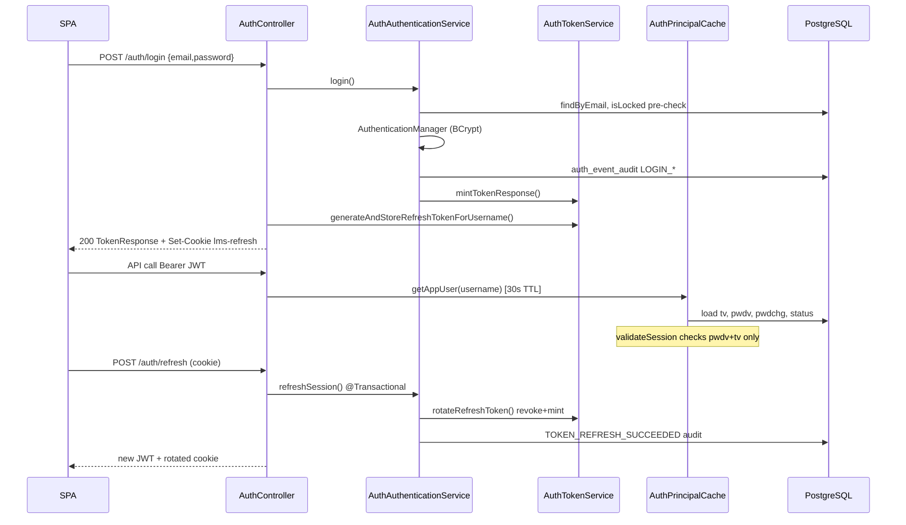

# Wave 2 Agent A4 — Internal Authentication & Sessions Audit

**Area**: `platform-setup/internal-authentication-and-sessions`  
**Implementation**: `/Users/siddhant/Desktop/lms`  
**Spec**: `/Users/siddhant/Desktop/work/ferratum-products-specs-res/areas/bhawana/platform-setup/internal-authentication-and-sessions/spec.md`  
**Mode**: Read-only, evidence-based  
**Date**: 2026-07-30

---

## 1. Exact scope reviewed

- Spec: `internal-authentication-and-sessions/spec.md` (FR-001–FR-020, NFR-001–NFR-009, UC-1–UC-5, EC-001–EC-013, G-1–G-8)
- Backend auth surface: `AuthController.java`, `AuthAuthenticationService.java`, `AuthTokenService.java`, `AuthAuditService.java`, `RefreshCookieFactory.java`, `SessionRevocationService.java`, `UserAdminService.java` (password-change path)
- Security: `JwtSecurityBeans.java`, `ManagedUserJwtPrincipalResolver.java`, `AuthPrincipalCache.java`, `SecurityFilterChainConfig.java`, `SecurityConfig.java`, `ApiClientJwtSessionValidator.java`, `RateLimitFilter.java`
- Lockout: `AlertRuleEvaluationWorker.java` (`evaluateAuthBruteForce`, `evaluateAuthBruteForceDistributed`), `AppUser.java` (`lockForBruteForce`, `isLocked`)
- Refresh domain/repo: `RefreshToken.java`, `RefreshTokenRepository.java`
- Frontend: `frontend/src/features/auth/` (all 14 files), `frontend/src/lib/api/session-storage.ts`, `http-client.ts`, `auth-api.ts`, `routes/app-root.tsx`, `routes/guards.tsx`
- Migrations: `V47`, `V54`, `V73`, `V84`, `V93`, `V94`, `V77`
- Tests: `AuthControllerTest`, `AuthControllerAuthAuditTest`, `AuthControllerRefreshFailureBodyTest`, `AuthControllerRefreshAtomicityTest`, `AuthBruteForceLockoutIntegrationTest`, `AuthBruteForceLockoutPersistenceIntegrationTest`, `Issue80SessionRevocationIntegrationTest`, `session-storage.test.ts`, `auth-service.test.ts`, `session-provider.test.tsx`
- `CONTEXT.md` principal-cache acceptance (line 61)

**Out of scope (noted only):** partner API client lifecycle beyond shared refresh mechanics; IP allowlist internals; user-admin CRUD except session-invalidating mutations.

---

## 2. Files and specifications inspected

| Category | Paths |
|----------|-------|
| Spec | `.../internal-authentication-and-sessions/spec.md` |
| REST | `backend/.../web/AuthController.java`, `RefreshCookieFactory.java` |
| Services | `AuthAuthenticationService.java`, `AuthTokenService.java`, `AuthAuditService.java`, `SessionRevocationService.java`, `UserAdminService.java`, `AlertRuleEvaluationWorker.java` |
| Security | `JwtSecurityBeans.java`, `ManagedUserJwtPrincipalResolver.java`, `AuthPrincipalCache.java`, `SecurityFilterChainConfig.java`, `SecurityConfig.java` |
| Domain/Repo | `RefreshToken.java`, `RefreshTokenRepository.java`, `AppUser.java` |
| Frontend auth | `frontend/src/features/auth/*`, `session-storage.ts`, `http-client.ts`, `auth-api.ts` |
| Migrations | `V47__refresh_token.sql`, `V54__app_user_token_version_and_audit.sql`, `V73__refresh_token_subject_fks.sql`, `V84__auth_event_audit.sql`, `V93__auth_event_audit_details_json.sql`, `V94__app_user_lockout.sql` |
| Tests | 8 backend + 3 frontend auth test files listed above |
| Docs | `CONTEXT.md:61` |

---

## 3. Feature/workflow examined

- Staff login (`POST /api/v1/auth/login`) → JWT body + `lms-refresh` HttpOnly cookie
- Brute-force lockout (scheduled worker, 5 fails / 10 min per username+IP)
- Required password change (428 gate, `POST /api/v1/auth/password`)
- Session refresh (one-time rotation, audit-transactional)
- Logout (revoke + clear cookie, idempotent 204)
- Session context (`GET /api/v1/internal/system/context`)
- Per-request `tv` / `pwdv` validation via `ManagedUserJwtPrincipalResolver`
- SPA reload bootstrap: metadata in `localStorage`, bearer only in memory, cookie refresh
- Admin/session revocation (`SessionRevocationService`, covered by Issue80 tests)

---

## 4. End-to-end execution path



**SPA reload path:** `session-provider.tsx:94–110` → `auth-service.ts:147–154` (coalesced refresh) → `auth-api.ts:37–42` → context fetch with `refreshOnUnauthorized: false` (`auth-service.ts:172`).

---

## 5. Relevant database objects

| Object | Role | Evidence |
|--------|------|----------|
| `app_user.token_version` | Session-wide invalidation bump | `V54:1–2`, `AppUser.java:188–190` |
| `app_user.password_changed_at` | JWT `pwdv` source | `AppUser.java:158–162` |
| `app_user.locked_at` / `lock_reason` | Brute-force lockout | `V94:1–3`, `AppUser.java:200–207` |
| `refresh_token` | SHA-256 hash, rotation, FK to user/client | `V47`, `V73`, `RefreshToken.java:26–27` |
| `auth_event_audit` | D9 auth audit trail | `V84`, `V93` (details_json), `V94:5–7` (login-failed index) |
| In-process `AuthPrincipalCache` | 30s snapshot TTL | `AuthPrincipalCache.java:14`, `CONTEXT.md:61` |

---

## 6. Findings (with paths and line numbers)

### W2-A4-F01 — Deactivated (`INACTIVE`) users keep valid JWT and refresh sessions

**Severity:** High (bank-bound) | **Confidence:** High

`UserAdminService.updateUser` persists `INACTIVE` status but revokes sessions only when roles change, not when status changes:

```208:217:backend/src/main/java/com/bhawana/lms/service/UserAdminService.java
        if (rolesChanged) {
            sessionRevocationService.revokeAllSessions(
                    saved,
                    actorUsername,
                    "Role change",
                    ...
            );
        }
```

Per-request JWT validation checks `pwdv` and `tv` but not `UserStatus`, despite caching status in the snapshot:

```71:93:backend/src/main/java/com/bhawana/lms/security/ManagedUserJwtPrincipalResolver.java
        OAuth2TokenValidatorResult validateSession() {
            Long tokenPasswordVersion = jwt.getClaim("pwdv");
            ...
            Long tokenSessionVersion = jwt.getClaim("tv");
            ...
            return OAuth2TokenValidatorResult.success();
        }
```

`AuthPrincipalCache.AppUserSnapshot` includes `status` (`AuthPrincipalCache.java:65–69`) but it is never enforced. `rotateRefreshToken` does not gate on user status (`AuthTokenService.java:180–188`). No integration test covers admin deactivation invalidating an outstanding session.

**Contrast:** `ApiClientJwtSessionValidator` rejects inactive clients/LSPs (`ApiClientJwtSessionValidator.java:71–75`).

---

### W2-A4-F02 — Required password change does not revoke prior refresh tokens

**Severity:** High (bank-bound) | **Confidence:** High

`completeRequiredPasswordChange` bumps `passwordChangedAt` (invalidating access JWTs via `pwdv`) and evicts principal cache (`UserAdminService.java:235–239`) but does **not** call `refreshTokenRepository.revokeAllForUser` or bump `token_version`.

`AuthController.changePassword` mints a **new** refresh cookie without revoking siblings (`AuthController.java:128–141`, `issueRefreshCookieForUsername` at `210–216`).

`AuthControllerTest.managedUserMustChangePasswordAfterAdminReset` proves old **access** tokens fail (`293–295`) but does not assert old refresh cookies fail. An attacker holding a pre-change refresh cookie can still call `POST /auth/refresh` and obtain fresh access tokens indefinitely until expiry (7 days).

---

### W2-A4-F03 — CSRF protection disabled; cookie auth relies on SameSite=Strict

**Severity:** Medium | **Confidence:** High

```56:56:backend/src/main/java/com/bhawana/lms/security/SecurityFilterChainConfig.java
                .csrf(AbstractHttpConfigurer::disable)
```

`/auth/refresh` and `/auth/logout` are `permitAll` (`74–77`) and accept cookie credentials without CSRF tokens. Mitigation is partial:

```19:26:backend/src/main/java/com/bhawana/lms/web/RefreshCookieFactory.java
        return ResponseCookie.from(COOKIE_NAME, rawToken)
                .httpOnly(true)
                .secure(securityProperties.getJwt().isSecureCookies())
                .sameSite("Strict")
                .path(COOKIE_PATH)
```

Same-site attackers (subdomain takeover, future relaxed SameSite) could forge refresh/logout POSTs. Logout CSRF is nuisance; refresh CSRF is session-continuity risk within same-site boundary.

---

### W2-A4-F04 — Distributed brute-force rule alerts only; does not lock or revoke

**Severity:** Medium | **Confidence:** High

`evaluateAuthBruteForce` locks + revokes (`AlertRuleEvaluationWorker.java:294–302`). `evaluateAuthBruteForceDistributed` creates `AUTH_BRUTE_FORCE_DISTRIBUTED` alerts only (`360–377`) — no `lockForBruteForce`, no `sessionRevocationService`.

Test explicitly documents this: `AuthBruteForceLockoutIntegrationTest.java:210–240` — 20 failures across 5 IPs fires distributed alert but `assertNull(user.getLockedAt())`.

Acceptable for prototype spec observation; insufficient for bank-bound credential-stuffing across IP farms.

---

### W2-A4-F05 — Refresh-token reuse does not cascade family revocation

**Severity:** Medium | **Confidence:** High

Reused rotated token returns `TOKEN_REVOKED` (`AuthTokenService.java:170–171`) but does not revoke sibling tokens or bump `token_version`. Spec acknowledges gap G-6. No breach-response cascade on detected reuse.

---

### W2-A4-F06 — Brute-force lockout is scheduled, not inline

**Severity:** Medium (prototype-accepted) | **Confidence:** High

Lockout runs in `AlertRuleEvaluationWorker.evaluateAuthBruteForce` on scheduler tick (`281–333`), not at login attempt N. Spec G-2 notes window between attempts and evaluation. Partially mitigated by `/auth/login` rate limit 10/min/IP (`application.yml:124–128`).

---

### W2-A4-F07 — Production crypto/identity hardening gaps (documented)

**Severity:** Medium (pre-prod) | **Confidence:** High

| Gap | Evidence |
|-----|----------|
| HS256 symmetric JWT | `JwtSecurityBeans.java:37–38`, `AuthTokenService.java:127` |
| Bootstrap default password `ChangeMe123!` | `SecurityProperties.java:17–18`, `75–78` |
| No MFA | Spec G-4 |
| Length-only password policy | Spec G-7; `@Size` on change-password request |

---

### W2-A4-F08 — Principal cache 30s TTL; eviction incomplete on deactivation

**Severity:** Low | **Confidence:** High

TTL: `AuthPrincipalCache.java:14`. Eviction on password change (`UserAdminService.java:239`), admin revoke (`SessionRevocationService.java:55`). **No eviction** on `INACTIVE` status change. `CONTEXT.md:61` accepts ≤30s stale acceptance when eviction occurs; deactivation path does not evict.

Negative cache: missing users cached as null for 30s (`AuthPrincipalCache.java:29–30`).

---

### W2-A4-F09 — No voluntary self-service password change

**Severity:** Low | **Confidence:** High

`completeRequiredPasswordChange` rejects when flag false (`UserAdminService.java:227–228`). Spec G-1.

---

### W2-A4-F10 — Spec-aligned strengths (informational)

**Severity:** Informational | **Confidence:** High

| Control | Evidence |
|---------|----------|
| Refresh at rest SHA-256 only | `AuthTokenService.java:262–266`, `146–149` |
| HttpOnly + Secure + Strict cookie, path-scoped | `RefreshCookieFactory.java:10–25` |
| Refresh rotation + transactional audit rollback | `AuthAuthenticationService.java:153–174`, `AuthControllerRefreshAtomicityTest.java:141–155` |
| Generic login failures for locked/bad creds | `AuthAuthenticationService.java:67–74` |
| 428 password-change gate | `SecurityFilterChainConfig.java:90–93`, `111–119` |
| SPA memory-only bearer; no disk token | `session-storage.ts:4–6`, `99–103`, `session-storage.test.ts:28–35` |
| Concurrent refresh coalescing | `auth-service.ts:58`, `147–154` |
| Same-origin credential guard | `http-client.ts:65–68`, `177–178` |
| Transient restore retry UX | `app-root.tsx:15–31`, `session-provider.test.tsx:47–62` |
| Auth audit coverage + tests | `AuthControllerAuthAuditTest.java` (full event matrix) |
| Admin revoke immediate 401 | `Issue80SessionRevocationIntegrationTest.java:114–129` |
| Session fixation mitigated (new tokens per login) | Each login calls `generateAndStoreRefreshTokenForUsername` (`AuthController.java:63–65`) |

---

## 7. Spec traceability (FR/NFR/SC)

| Req | Status | Evidence |
|-----|--------|----------|
| FR-001 login JWT+cookie | ✅ | `AuthController.java:53–66` |
| FR-002 locked generic reject | ✅ | `AuthAuthenticationService.java:67–74` |
| FR-003 LSP UI IP gate | ✅ | `AuthAuthenticationService.java:81–83` |
| FR-004 login audit | ✅ | `AuthAuditService` + `AuthControllerAuthAuditTest` |
| FR-005 brute-force lockout | ⚠️ Scheduled only | `AlertRuleEvaluationWorker.java:281–333` |
| FR-006 JWT claims | ✅ | `AuthTokenService.java:111–120` |
| FR-007 pwdv/tv per request | ⚠️ No status | `ManagedUserJwtPrincipalResolver.java:71–93` |
| FR-008 428 gate | ✅ | `SecurityFilterChainConfig.java:90–93` |
| FR-009 password change | ⚠️ Refresh siblings survive | `AuthController.java:122–141` |
| FR-010 refresh rotation | ✅ | `AuthTokenService.java:163–200` |
| FR-011 refresh failure codes | ✅ | `AuthController.java:185–207`, `AuthControllerRefreshFailureBodyTest` |
| FR-012 refresh SHA-256, 7d | ✅ | `AuthTokenService.java:253–258` |
| FR-013 logout idempotent | ✅ | `AuthController.java:144–178` |
| FR-014 system context | ✅ | `AuthControllerTest.java:132–139` |
| FR-015 tenant scope from JWT | ✅ (out of A4 detail) | `AuthenticationTenantScopeFilter` |
| FR-016 SPA memory token | ✅ | `session-storage.ts` |
| FR-017 same-origin client | ✅ | `http-client.ts:65–68` |
| FR-018 cache 30s + eviction | ⚠️ Gap on INACTIVE | `AuthPrincipalCache.java:14`, eviction sites |
| FR-019 coalesced refresh | ✅ | `auth-service.ts:147–154` |
| FR-020 transient restore retry | ✅ | `auth-service.ts:166`, `app-root.tsx:15–31` |
| NFR-003 HttpOnly Secure cookie | ✅ | `RefreshCookieFactory.java:21–22` |
| NFR-005 refresh audit atomicity | ✅ | `AuthControllerRefreshAtomicityTest` |
| NFR-006 revocation ≤1 request | ⚠️ Except F01/F02 paths | `SessionRevocationService.java:55` |
| SC-001–SC-007 | Mostly ✅ | Test matrix above; gaps at F01/F02 |

---

## 8. Focus-area answers

| Focus | Assessment |
|-------|------------|
| **Login/refresh/logout** | Implemented end-to-end with tests |
| **JWT vs HttpOnly cookie** | Access JWT in response body; refresh in `lms-refresh` cookie only |
| **Revocation** | Strong via `tv` bump + refresh revoke on admin/lockout/role change; **weak** on INACTIVE and password change |
| **Lockout** | Scheduled 5/10min (user+IP); distributed variant alert-only |
| **Password change** | Required flow + 428 gate works; refresh tokens not invalidated |
| **Principal cache 30s** | Matches `CONTEXT.md:61`; eviction on known mutation paths |
| **Session fixation** | New refresh token per login; no server session ID reuse |
| **CSRF on cookie refresh** | CSRF off; SameSite=Strict primary defense |
| **SPA token storage** | Bank-appropriate: memory bearer, metadata-only `localStorage`, legacy token strip |

---

## 9. Documented rationale found

| Source | Rationale |
|--------|-----------|
| `CONTEXT.md:61` | 30s principal cache accepted; eviction on revocation/password/lockout |
| `AuthAuthenticationService.java:153–156` | Refresh+audit single transaction prevents silent session loss |
| `session-storage.ts:4–6` | Memory-only token limits XSS exfiltration from `localStorage` |
| `auth-service.ts:142–145` | Coalesced refresh prevents rotating-cookie races |
| Spec G-1–G-8 | Explicit current-vs-target gaps (MFA, HS256, reuse detection, etc.) |
| `AuthBruteForceLockoutIntegrationTest.java:210–240` | Distributed rule intentionally alert-only |

---

## 10. Inferred rationale (labeled)

- **CSRF disabled:** Stateless JWT API pattern; cookie used only for refresh/logout; SameSite deemed sufficient for SPA same-origin deployment.
- **pwdv without tv bump on password change:** Access-token invalidation prioritized; refresh rotation assumed to replace cookie in happy path; sibling tokens not considered threat model.
- **INACTIVE without session revoke:** Status enforced only at login via `SecurityConfig.java:84` (`disabled(!enabled)`); ongoing sessions assumed out of scope.
- **Scheduled lockout:** Aligns with ops-alert architecture; rate limit provides inline throttle.

---

## 11. Missing/contradictory evidence

| Item | Status |
|------|--------|
| Test: deactivate user → outstanding JWT/refresh rejected | **Not found** |
| Test: password change → old refresh cookie rejected | **Not found** |
| Test: principal cache stale after deactivation | **Not found** |
| Production `APP_SECURITY_JWT_SECRET` rotation procedure | **Not in repo** |
| E2E Playwright auth/session flows | **Not reviewed** (unit/integration only) |
| Multi-replica principal cache coherence | **Inherent per-node TTL** (accepted in CONTEXT) |

---

## 12. Severity + confidence summary

| ID | Severity | Confidence |
|----|----------|------------|
| W2-A4-F01 | **High** | High |
| W2-A4-F02 | **High** | High |
| W2-A4-F03 | Medium | High |
| W2-A4-F04 | Medium | High |
| W2-A4-F05 | Medium | High |
| W2-A4-F06 | Medium | High |
| W2-A4-F07 | Medium | High |
| W2-A4-F08 | Low | High |
| W2-A4-F09 | Low | High |
| W2-A4-F10 | Info | High |

**Overall posture:** Strong prototype implementation closely matching the as-is spec. For bank-bound production, **F01** and **F02** are blocking: session termination must follow account deactivation and credential rotation, including all refresh tokens.

---

## 13. Recommended changes

1. **F01:** On `UserStatus.INACTIVE`, call `sessionRevocationService.revokeAllSessions` (or bump `token_version`) and `authPrincipalCache.evictAppUser`. Add `validateSession` check: `snapshot.status() == ACTIVE` (mirror API-client validator pattern).

2. **F02:** On `completeRequiredPasswordChange`, `revokeAllForUser` before issuing new refresh cookie. Add integration test: login → password change → old refresh cookie returns 401.

3. **F03:** Add CSRF double-submit or custom header requirement on cookie-bearing `POST /auth/refresh` and `/auth/logout`, or document explicit same-site deployment contract with HSTS + no subdomains.

4. **F04:** Extend distributed brute-force rule to lock+revoke (or lower thresholds) for bank pilot.

5. **F05:** Implement refresh-token family ID + reuse detection → revoke all tokens for user/client (spec target G-6).

6. **F07:** Remove bootstrap default password in non-local profiles; plan asymmetric JWT signing before multi-service deployment.

---

## 14. Wider context questions

1. Should admin deactivation be **immediate** (revoke all sessions) or allow graceful wind-down?
2. Is distributed brute-force (multi-IP) expected to **auto-lock** before bank pilot?
3. Will production SPA and API share **exact origin** (enabling Strict SameSite as sole CSRF defense)?
4. Is 30s principal-cache staleness acceptable under multi-replica load, or is Redis-backed revocation needed?
5. Should password change always rotate **all** refresh tokens (including other devices)?

---

## 15. Areas not reviewed

- Partner API client onboarding/credential rotation (separate spec)
- `LspSurfaceIpAllowlistService` enforcement details beyond login gate reference
- Rate-limit Redis failover behavior under outage
- Hibernate/session replication across pods
- Playwright E2E auth flows
- OpenAPI contract export for auth endpoints
- `AuthenticationTenantScopeFilter` full tenancy interaction (Wave 1 A2 scope)
- Secrets management / KMS for `APP_SECURITY_JWT_SECRET` in deployment

[REDACTED]