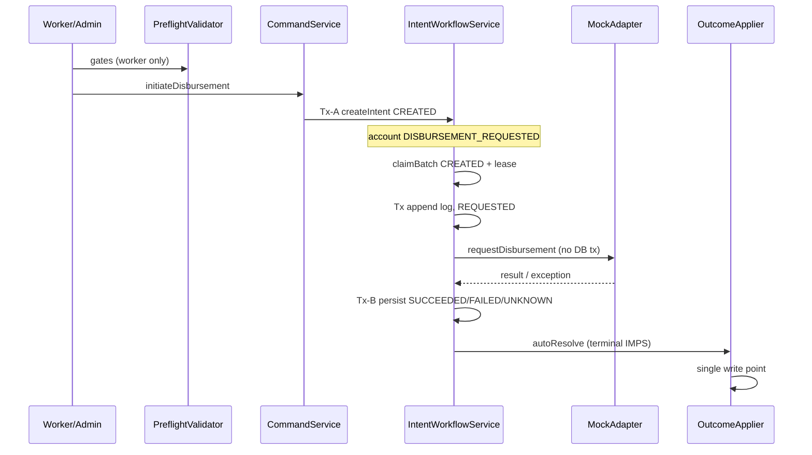

# Wave 5 Agent A13 — Disbursement / Money-Movement Audit

**Agent:** A13 (highest risk) | **Mode:** Read-only  
**Baseline:** LMS worktree + specs v1.0.1 (2026-07-20)  
**Assumptions for severity:** Pre-prod / synthetic UAT with `MockLoanDisbursementAdapter` (`MOCK_ICICI`), `app.disbursement.intent-workflow.enabled=true` (production default), worker enabled. **Critical** reserved for paths reachable under those assumptions without live ICICI.

---

## 1. Executive Summary

The disbursement stack implements a **production-shaped durable intent workflow (S3 / V111)** with correct Tx-A / out-of-transaction provider call / Tx-B separation, deterministic `tran_ref_no`, lease-based claiming, and strong **no-blind-reissue** behavior for `UNKNOWN` / `REQUESTED` intents. Integration tests (`DisbursementIntentWorkflowIntegrationTest`) substantiate intent-before-call and single-provider-call invariants.

**Material gaps** cluster around **deferred controls (S5/S6/S14)**, **admin vs worker gate parity**, and **domain-model simplification** (single composite call vs CONTEXT.md three-call debit/credit model). No live ICICI adapter exists; all money movement is in-process mock.

| Severity | Count | Theme |
|----------|-------|-------|
| **Critical** | 1 | Admin manual disburse bypasses bank/schedule gates with live beneficiary |
| **High** | 5 | S6 mock surfaces, S14 absent, retry re-initiation, intent/mock desync, glossary drift |
| **Medium** | 5 | Admin async execution, attempt-cap semantics, test/prod config skew, orphan intents |
| **Low** | 3 | Audit provenance, observability gaps, inline legacy path |

---

## 2. Scope & Methodology

**In scope:** `DisbursementIntentWorkflowService`, `LoanDisbursementWorker*`, `DisbursementOutcomeApplier`, `DisbursementPreflightValidator`, `MockLoanDisbursementAdapter`, `LoanDisbursementCommandService`, `V111__disbursement_intent.sql`, ops controller surfaces, CONTEXT.md glossary, deferred S5/S6/S14.

**Method:** Spec-to-code trace, call-path analysis, DB constraint review, integration-test cross-check. No code changes.

**Out of scope:** Real ICICI adapter (S17), ledger three-way recon, webhook delivery internals.

---

## 3. Spec Alignment Matrix

| Spec requirement | Implementation | Status |
|------------------|----------------|--------|
| FR-016 / NFR-004: Intent before provider side effect | `createIntent` Tx-A → `executeClaimedIntent` outside tx | **Met** |
| FR-018: Lease claim, REQUESTED before call | `claimBatch` + `loadProviderCallContext` → `markProviderCallStarted` | **Met** |
| FR-019: UNKNOWN, no blind retry | `isClaimable()` = CREATED only; status poll path | **Met** |
| FR-003–004: Gates before payout | Worker only; admin path partial | **Partial** |
| FR-002: Admin = same flow as worker | Admin skips `DisbursementPreflightValidator` gates | **Gap** |
| G-9 / S5: Approval-time beneficiary freeze | Live borrower at intent-create | **Deferred** |
| G-10 / S6: Mock/live exclusivity | `@Service MockLoanDisbursementAdapter` unconditional | **Deferred** |
| G-12 / S14: Maker-checker / STP caps | Single `SYSTEM_ADMIN` principal | **Deferred** |
| ICICI FR-005: No second pay on unresolved | Retry creates new intent + `tranRefNo` after technical fail | **Partial** |

---

## 4. Architecture & Control Flow



**Positive:** Provider call in `executeClaimedIntent` occurs only after `loadProviderCallContext` commits `REQUESTED` + request log — verified by `DisbursementIntentWorkflowIntegrationTest.workerPathCallsProviderOutsideTransactionWithCommittedIntent`.

---

## 5. Point-of-No-Return Analysis

**Domain (CONTEXT.md):** Once debit leg succeeds, never re-initiate; only status polling until return confirmed.

**Implementation:** Point of no return is modeled at **composite pay request** (`markProviderCallStarted` → `REQUESTED`), not separate debit/credit legs.

| State | Re-initiate blocked? | Recovery path |
|-------|---------------------|---------------|
| `DISBURSEMENT_REQUESTED` + live intent | Yes (`findLiveByLoanAccountId`, account short-circuit) | Status poll / manual status-check |
| `UNKNOWN` | Yes (not `isClaimable()`) | Status poll on existing `tranRefNo` |
| `DISBURSEMENT_FAILED` + app `DISBURSEMENT_RETRY` | **No** — new intent allowed | New `tranRefNo`, new provider call |
| `DISBURSEMENT_PENDING_RECONCILIATION` | **No** — retry eligible | New attempt after park |

**W5-A13-F05 (High):** Technical-decline retry mints a **new** `tranRefNo` and provider request without confirming prior funds returned — violates CONTEXT.md point-of-no-return semantics. Acceptable under deterministic mock; **becomes live-money Critical** when ICICI adapter ships without debit-leg status policy.

---

## 6. Intent-Before-Bank-Call (Tx-A / Tx-B)

**V111** enforces:
- `uk_disbursement_intent_tran_ref_no` (global unique reference)
- `uk_disbursement_intent_live_account` partial unique (one non-terminal intent per account)

**`DisbursementIntentWorkflowService.createIntent`** snapshots beneficiary from **live** `application.getBorrower()` at Tx-A:

```97:99:backend/src/main/java/com/bhawana/lms/service/DisbursementIntentWorkflowService.java
                application.getBorrower().getFullName(),
                application.getBorrower().getBankAccountNumber(),
                application.getBorrower().getIfscCode(),
```

**`DisbursementIntentReference.deriveTranRefNo`:** `ICI` + 13 hex chars of intent UUID — deterministic, ≤16 chars.

**Legacy inline path** (`intent-workflow.enabled=false`): `initiateDisbursementInline` calls adapter **inside** `@Transactional` — S3 violation. Disabled in test profile; **enabled by default in `application.yml`**.

---

## 7. Lease Claim & Concurrency

**Postgres claim:** `FOR UPDATE SKIP LOCKED` on `state='CREATED'` with expired/null lease — sound pattern in `DisbursementIntentRepositoryImpl`.

**Lease lifecycle:**
1. `claimBatch` stamps `lease_owner`, `lease_expires_at`, increments `attempt_count`
2. `loadProviderCallContext` validates lease ownership + expiry
3. `markProviderCallStarted` clears lease, sets `REQUESTED`

**Crash recovery:** CREATED + expired lease → reclaimable; REQUESTED/UNKNOWN → not reclaimable.

**W5-A13-F08 (Medium):** No Postgres integration test for concurrent `claimBatch` on disbursement intents (unlike `ReportRequestRepositoryPostgresTest`). Risk is low given SKIP LOCKED, but money-movement warrants parity.

**W5-A13-F09 (Low):** `CONTEXT.md` states worker claims `CREATED` **and** `UNKNOWN`; code claims **CREATED only** (`DisbursementIntentState.isClaimable()`). Documentation drift.

---

## 8. Double-Pay Prevention

| Control | Mechanism | Effectiveness |
|---------|-----------|---------------|
| Application row lock | `findByIdForUpdate` in `initiateDisbursement` | Good |
| Live intent partial unique index | V111 `uk_disbursement_intent_live_account` | Good |
| Account `DISBURSEMENT_REQUESTED` short-circuit | Worker skip + command service return | Good |
| Deterministic `tranRefNo` per intent | Reused on reclaim, not regenerated | Good |
| UNKNOWN non-reclaim | Integration test confirms single `requestDisbursement` | Good |
| Duplicate initiate | Integration test: one intent, one provider call | Good |
| Technical retry | New intent after `FAILED` terminal intent | **Gap** (see F05) |
| Mock-outcome | Requires existing request log; blocks pre-execution mock in intent mode | Partial |

**Strongest evidence:** `unknownProviderOutcomeIsReconciledWithoutReissuingThePayment` and `crashAfterProviderAcceptanceLeavesAReconciliationRecordAndNeverReissues`.

---

## 9. Mock Always-On Risk (Deferred S6)

| Surface | Location | Profile guard |
|---------|----------|---------------|
| `MockLoanDisbursementAdapter` | Unconditional `@Service` | **None** |
| `POST …/disbursement-requests/mock-outcome` | `LoanApplicationOpsController` | `SYSTEM_ADMIN` only |
| `auto-resolve-mock-outcome` | Default `true` in `application.yml` | **None** |
| Only adapter implementation | `grep implements LoanDisbursementAdapter` → mock only | N/A |

**W5-A13-F02 (High):** Per `docs/deferred-implementation.md` S6, nothing fails startup if `prod`/`staging-live` boots with mock rail. Mock-outcome can force `DISBURSED` without provider call (after request log exists). **Pre-prod:** acceptable; **go-live:** Critical deployment blocker.

**W5-A13-F03 (High):** `resolveMockDisbursementOutcome` does **not** terminalize `disbursement_intent` (no `SUCCEEDED`/`FAILED` update). After mock `DISBURSED`, intent can remain `REQUESTED`/`UNKNOWN` while account is `DISBURSED` — orphan live intent, blocks future intents on same account if status ever regresses. Unlikely double-pay in mock; **integrity/recon risk**.

---

## 10. Live Beneficiary (Deferred S5)

**Current behavior:**
- Preview: `beneficiarySource=LIVE_BORROWER` (`DisbursementPreviewService`)
- Intent snapshot at Tx-A from live borrower record
- **No** approval-time freeze; **no** `BENEFICIARY_DETAILS_CHANGED` fail-closed

**Bank update gates (`BorrowerBankDetailsService`):**
- Blocks updates when account `DISBURSEMENT_REQUESTED` or `DISBURSEMENT_PENDING_RECONCILIATION`
- **Admin** (`lspId == null`) can update bank details during `APPROVED_PENDING_DISBURSAL` / `DISBURSEMENT_RETRY` without LSP pre-disbursal gate

**W5-A13-F01 (Critical — pre-prod reachable):** `LoanDisbursementCommandService.initiateDisbursement` (admin path) **does not** call `validateWorkerDisbursementBankDetails` or `validateAutomatedDisbursement`. A `SYSTEM_ADMIN` can manually disburse without holder-name hard-match or schedule reconciliation — while beneficiary is read **live** at intent-create. Combined with S5 deferral, enables payout to bank details changed after approval and after ops preview, without re-validation.

**Worker path** runs full gates in `LoanDisbursementWorkerProcessor` — **asymmetric risk**.

---

## 11. Maker-Checker Absent (Deferred S14)

**Current:** `POST …/disbursement-requests` requires `SYSTEM_ADMIN` only. No amount cap, velocity budget, approval queue, or maker≠checker.

**W5-A13-F04 (High):** Single compromised or misused admin credential can initiate unlimited disbursements. S3 intent workflow reduces duplicate payout but **does not substitute** financial authorization. Spec G-12 and deferred S14 explicitly flag this; **must block live ICICI** per deferred register.

---

## 12. Outcome Application & State Machine

**`DisbursementOutcomeApplier`** — single write point: request log, account status + fee (ADR 0004), application transition, webhook, ops alert, outcome audit. Design is sound.

| Disposition | Account | Application | Webhook |
|-------------|---------|-------------|---------|
| SUCCESS | `DISBURSED` + fee | `DISBURSED` | `DISBURSEMENT_COMPLETED` |
| FAILED / TECHNICAL | `DISBURSEMENT_FAILED` | `DISBURSEMENT_RETRY` | `DISBURSEMENT_FAILED` |
| FAILED / BUSINESS | `DISBURSEMENT_FAILED` | `REJECTED` | `DISBURSEMENT_FAILED` + alert |
| PENDING (parked) | `DISBURSEMENT_PENDING_RECONCILIATION` | `DISBURSEMENT_RETRY` | none + alert |

**W5-A13-F10 (Medium):** Attempt cap (`countByLoanAccount_Id` on **all** request logs, default 5) is lifetime-per-account, not per retry cycle (spec G-5). Technical failures consume cap quickly; parked loans re-selected every 30s but short-circuit.

**W5-A13-F11 (Low):** All outcome audits recorded as `MOCK_OUTCOME_ENDPOINT` source regardless of worker/status-check path (spec G-7).

---

## 13. Database Invariants (V111)

```26:28:backend/src/main/resources/db/migration/V111__disbursement_intent.sql
CREATE UNIQUE INDEX uk_disbursement_intent_live_account
    ON disbursement_intent (loan_account_id)
    WHERE state NOT IN ('SUCCEEDED', 'FAILED', 'CANCELLED');
```

**Strengths:** Non-terminal states (`CREATED`, `REQUESTED`, `UNKNOWN`) hold the live slot; terminal states release it. Backfill migration for in-flight `DISBURSEMENT_REQUESTED` accounts is thoughtful.

**W5-A13-F06 (Medium):** `UNKNOWN` is non-terminal and holds live slot indefinitely until manual/status resolution — correct for safety, but no automated escalation beyond `DisbursementIntentMetrics` gauges (`unknown.count`, `oldest_age_seconds`). No reconciliation workbench (spec G-11).

---

## 14. Test Coverage Assessment

| Area | Coverage | Gap |
|------|----------|-----|
| Intent before provider call | `DisbursementIntentWorkflowIntegrationTest` | Strong |
| No reissue on UNKNOWN/crash | Same | Strong |
| Duplicate initiate idempotency | Same | Strong |
| Worker automated path | `Issue62DisbursementWorkerIntegrationTest` | Intent workflow **off** in test profile |
| Mock-outcome audit | `LoanApplicationOpsControllerMockOutcomeAuditTest` | Intent workflow **off** — inline path |
| Admin gate bypass | — | **None** |
| Postgres concurrent claim | — | **None** |
| S5 beneficiary change between preview/confirm | — | **None** |
| Admin manual + live intent async execution | — | **Partial** |

**W5-A13-F07 (Medium):** `application-test.yml` sets `intent-workflow.enabled: false` and `worker.enabled: false` — most integration tests exercise **legacy inline path**, not production-default intent workflow. Only `DisbursementIntentWorkflowIntegrationTest` explicitly enables intent workflow.

---

## 15. Findings Register

| ID | Severity | Finding | Reachability (mock + pre-prod) | Recommendation |
|----|----------|---------|-------------------------------|----------------|
| **W5-A13-F01** | **Critical** | Admin `initiateDisbursement` bypasses `DisbursementPreflightValidator` bank-detail and schedule gates; uses live beneficiary (S5 deferred) | **Today** — any `SYSTEM_ADMIN` manual trigger | Route admin through same validator as worker; block until S5 lands |
| **W5-A13-F02** | High | Mock adapter + mock-outcome endpoint always registered; no S6 startup guard | Pre-prod intentional; **go-live Critical** | Implement S6 before ICICI |
| **W5-A13-F03** | High | `resolveMockDisbursementOutcome` does not terminalize `disbursement_intent` | After worker execution + mock resolve | Terminalize intent in applier or mock path |
| **W5-A13-F04** | High | No maker-checker / STP caps (S14 deferred) | Any admin disburse | Implement S14 before live money |
| **W5-A13-F05** | High | Technical retry creates new intent/`tranRefNo` without debit-return confirmation | Mock: benign; ICICI sandbox: duplicate-pay risk | Gate retry on status inquiry of prior reference |
| **W5-A13-F06** | Medium | `UNKNOWN` intents lack operator workflow beyond metrics | Worker exception / lost response | Reconciliation UI + SLA alerts |
| **W5-A13-F07** | Medium | Test profile disables intent workflow — production path undertested in bulk | CI default | Enable intent workflow in primary integration suite |
| **W5-A13-F08** | Medium | No Postgres concurrency test for intent `claimBatch` | Theoretical race | Add test mirroring report-claim pattern |
| **W5-A13-F09** | Low | CONTEXT.md claims `UNKNOWN` is claimable; code claims `CREATED` only | Documentation | Fix CONTEXT.md |
| **W5-A13-F10** | Medium | Lifetime attempt cap counts all request logs across cycles | 5th failure parks loan permanently | Per-cycle cap or explicit manual-intervention status |
| **W5-A13-F11** | Low | Outcome audit source always `MOCK_OUTCOME_ENDPOINT` | Observability | Distinguish worker/admin/poll provenance |
| **W5-A13-F12** | Medium | Admin initiate does not execute intent; relies on worker `processClaimableIntents` | Worker disabled/misconfigured | Execute intent inline post-commit or fail if worker off |
| **W5-A13-F13** | Low | Domain model (3 bank calls: composite + debit SC + credit SC) not reflected in adapter | ICICI go-live | Extend adapter/status model per ICICI spec |

---

## Severity Calibration Note

Under **mock + pre-prod** assumptions, only **W5-A13-F01** is rated **Critical** — it is exploitable today without live rails and can cause wrong-party payout. Double-pay via intent reclaim is **not** Critical under mock (tests disprove blind reissue). **F02, F04, F05** escalate to **Critical** at live ICICI cutover unless S6/S14 and retry policy land first.

---

## Positive Controls (Acknowledged)

1. **S3 intent workflow** correctly separates Tx-A / provider / Tx-B with committed intent visible before call.
2. **V111 partial unique index** + application lock provide strong single-live-intent invariant.
3. **`UNKNOWN` / `REQUESTED` non-reclaim** prevents automatic second composite pay on ambiguous outcomes.
4. **`DisbursementOutcomeApplier`** centralizes terminal state writes — no scattered transitions.
5. **Bank-detail lock during in-flight** disbursement (`BANK_DETAILS_LOCKED_DISBURSEMENT_IN_FLIGHT`).
6. **Idempotency-Key** on admin disbursement mutations with fingerprint conflict rejection.
7. **DisbursementIntentMetrics** exposes `UNKNOWN` count and age for ops visibility.

---

**Next free Flyway (per deferred register):** V114+ for S5/S14 when resumed.

[REDACTED]